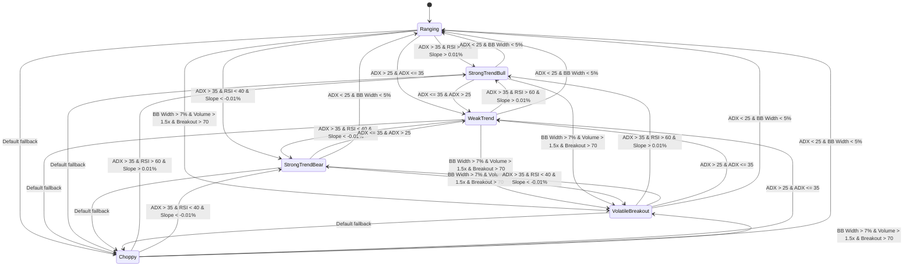

# Market Regime Detection State Machine

## Overview

The Market Regime Detection module implements a sophisticated state machine that classifies market conditions into six distinct regimes, with smooth transitions and stability controls to prevent excessive regime switching.

## State Machine Diagram



## Regime Definitions

### 1. Strong Trend Bull (STRONG_TREND_BULL)
- **ADX**: > 35 (strong trend strength)
- **RSI**: > 60 (overbought in trend context)
- **MA Slope**: > 0.01% (bullish momentum)
- **Characteristics**: Strong upward momentum with high trend strength
- **Signal Filtering**: Lower threshold (0.65) - more signals allowed
- **Expected Win Rate**: 85%

### 2. Strong Trend Bear (STRONG_TREND_BEAR)
- **ADX**: > 35 (strong trend strength)
- **RSI**: < 40 (oversold in trend context)
- **MA Slope**: < -0.01% (bearish momentum)
- **Characteristics**: Strong downward momentum with high trend strength
- **Signal Filtering**: Lower threshold (0.65) - more signals allowed
- **Expected Win Rate**: 85%

### 3. Weak Trend (WEAK_TREND)
- **ADX**: 25-35 (moderate trend strength)
- **Characteristics**: Moderate trend with lower conviction
- **Signal Filtering**: Default threshold (0.70)
- **Expected Win Rate**: 75%

### 4. Ranging (RANGING)
- **ADX**: < 25 (low trend strength)
- **BB Width**: < 5% (narrow volatility)
- **MA Slope**: < 0.01% (minimal momentum)
- **Characteristics**: Sideways movement with low volatility
- **Signal Filtering**: Default threshold (0.70)
- **Expected Win Rate**: 70%

### 5. Volatile Breakout (VOLATILE_BREAKOUT)
- **BB Width**: > 7% (high volatility)
- **Volume Ratio**: > 1.5x (high volume)
- **Breakout Strength**: > 70 (strong breakout signal)
- **Characteristics**: High volatility with potential breakout
- **Signal Filtering**: Lower threshold (0.75) - capture breakouts
- **Expected Win Rate**: 80%

### 6. Choppy (CHOPPY)
- **Default Fallback**: When no other regime conditions are met
- **Characteristics**: Unpredictable, low-quality market conditions
- **Signal Filtering**: Higher threshold (0.85) - filter most signals
- **Expected Win Rate**: 60%

## Transition Rules

### Stability Controls
1. **Minimum Duration**: Regime must persist for at least 5 candles before allowing change
2. **Hysteresis**: New regime must have 20% higher confidence than current regime
3. **Smoothing**: Kalman-like smoothing applied to prevent rapid switching

### Transition Triggers
- **Price Change**: > 1% movement
- **BB Width Spike**: > 20% increase in volatility
- **ADX Cross**: Crossing above/below 25 threshold
- **Volume Spike**: > 50% increase in volume

## Signal Filtering by Regime

| Regime | Confidence Threshold | Expected Filter Rate | Rationale |
|--------|---------------------|---------------------|-----------|
| Strong Trend Bull | 0.65 | 30-40% | High-quality trends allow more signals |
| Strong Trend Bear | 0.65 | 30-40% | High-quality trends allow more signals |
| Weak Trend | 0.70 | 40-50% | Moderate quality, standard filtering |
| Ranging | 0.70 | 50-60% | Lower quality, more conservative |
| Volatile Breakout | 0.75 | 35-45% | Capture breakouts while managing risk |
| Choppy | 0.85 | 70-80% | Filter most signals in poor conditions |

## Performance Metrics

### Accuracy Targets
- **Overall Accuracy**: > 80%
- **Regime Stability**: Average regime duration > 10 candles
- **Transition Accuracy**: > 85% correct regime changes

### Latency Requirements
- **Average Latency**: < 50ms per update
- **Maximum Latency**: < 100ms per update
- **Throughput**: > 100 updates/second

### Memory Usage
- **Memory Increase**: < 100MB after 10,000 updates
- **Rolling Buffers**: Fixed size (10-50 candles)
- **State Persistence**: Redis with 1-hour TTL

## Integration with AlphaPulse

### Real-Time Integration
```python
# Example usage in AlphaPulse
detector = MarketRegimeDetector(symbol='BTC/USDT', timeframe='15m')
regime_state = detector.update_regime(indicators, candlestick)

# Signal filtering based on regime
if detector.should_filter_signal(signal_confidence):
    # Skip signal generation
    pass
else:
    # Generate signal
    signal = generate_trading_signal()
```

### Multi-Timeframe Alignment
- **1m**: 10% weight
- **5m**: 20% weight  
- **15m**: 40% weight (primary)
- **1h**: 30% weight

### Redis State Persistence
```json
{
  "regime": "strong_trend_bull",
  "confidence": 0.85,
  "duration": 12,
  "last_change": "2024-01-15T10:30:00Z",
  "stability_score": 0.78,
  "timestamp": "2024-01-15T10:35:00Z"
}
```

## ML Model Integration

### Feature Set
1. **ADX**: Trend strength indicator
2. **MA Slope**: Price momentum
3. **BB Width**: Volatility measure
4. **ATR**: Average True Range
5. **RSI**: Relative Strength Index
6. **Volume Ratio**: Volume vs. SMA
7. **Breakout Strength**: Composite breakout metric
8. **Price Momentum**: Price change rate
9. **Volatility Score**: ATR normalized by price

### Model Performance
- **Training Data**: 10+ years historical data
- **Validation Accuracy**: > 85%
- **Model Type**: Random Forest Classifier
- **Auto-tuning**: Optuna optimization

## Backtesting Framework

### Evaluation Metrics
1. **Accuracy**: Regime classification accuracy
2. **Stability**: Average regime duration
3. **Signal Filter Rate**: Percentage of filtered signals
4. **Win Rate**: Simulated trading performance
5. **Latency**: Processing time per update

### Optimization Targets
- **ADX Thresholds**: 20-40 range
- **Slope Thresholds**: 0.005-0.02%
- **BB Width Thresholds**: 0.03-0.07
- **Volume Thresholds**: 1.2-2.0x
- **Breakout Thresholds**: 60-80

## Error Handling

### Graceful Degradation
- **ML Model Failure**: Fallback to rule-based classification
- **Redis Connection Loss**: Continue without persistence
- **Invalid Data**: Return current regime state
- **Performance Degradation**: Log warnings, continue operation

### Monitoring
- **Regime Change Frequency**: Alert if > 30% per session
- **Accuracy Drop**: Alert if < 70%
- **Latency Spike**: Alert if > 100ms
- **Memory Leak**: Alert if > 100MB increase

## Future Enhancements

### Planned Features
1. **Reinforcement Learning**: Dynamic threshold adjustment
2. **Multi-Asset Correlation**: Cross-asset regime detection
3. **News Sentiment Integration**: Sentiment-based regime classification
4. **Advanced Smoothing**: Kalman filter implementation
5. **Real-Time Learning**: Online model updates

### Research Areas
1. **Regime Prediction**: Forecast regime changes
2. **Regime Clustering**: Unsupervised regime discovery
3. **Regime Impact Analysis**: Quantify regime effects on signals
4. **Adaptive Thresholds**: Market condition-based thresholds
