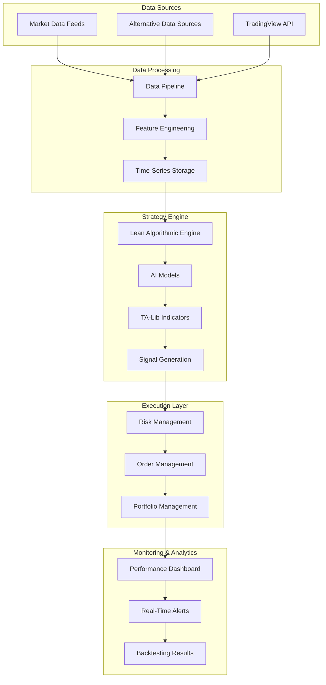
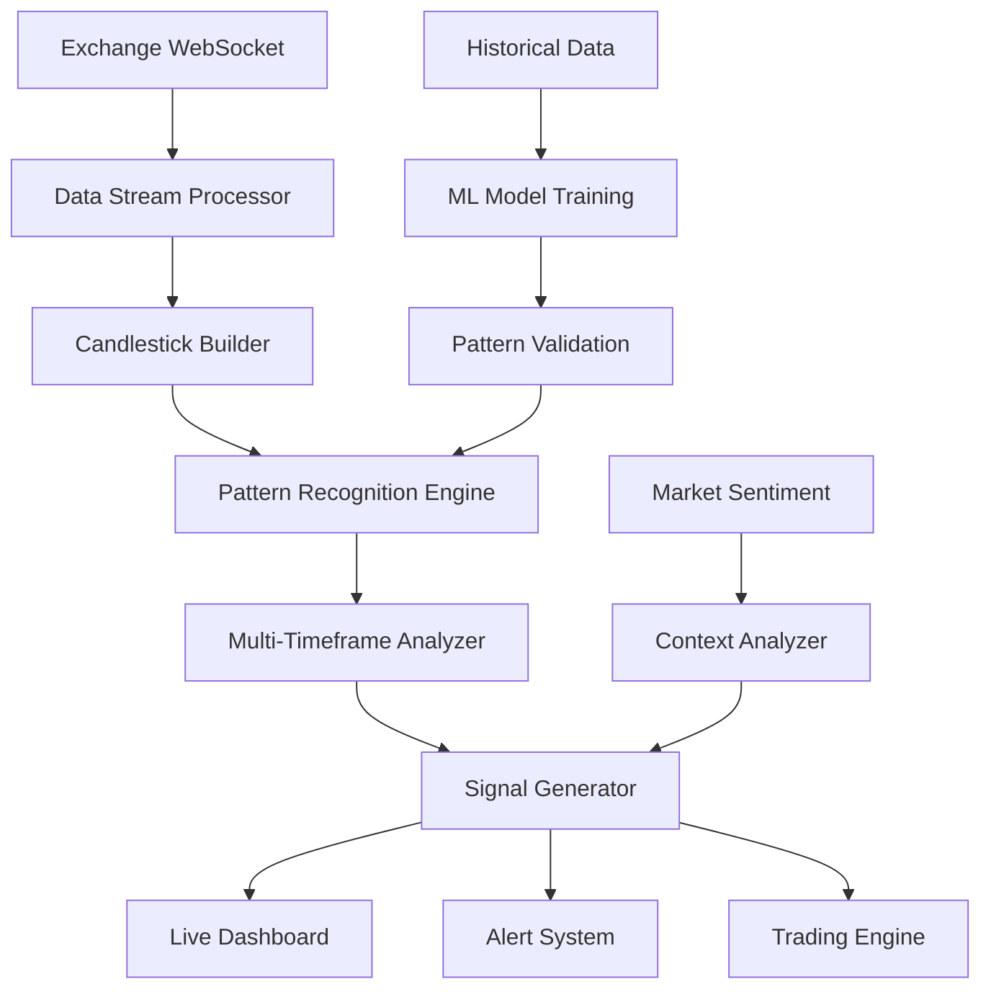
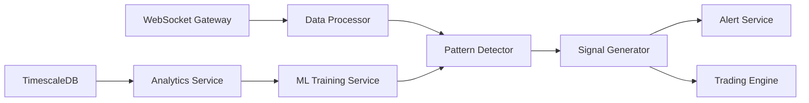

```mermaid
graph TB
    subgraph "Data Ingestion"
        A1[Raw Market Data] --> A2[OHLCV Raw Hypertable]
        A3[Instrument Metadata] --> A4[Instruments Table]
        A5[Strategy Parameters] --> A6[Strategy Params Table]
    end
    
    subgraph "Data Processing"
        A2 --> B1[Continuous Aggregates]
        B1 --> B2[1m → 5m → 1h → 1d]
        B2 --> B3[Pre-aggregated Timeframes]
    end
    
    subgraph "Analysis Engine"
        B3 --> C1[Indicator Computation]
        C1 --> C2[Pattern Detection]
        C2 --> C3[Signal Generation]
    end
    
    subgraph "Storage & Optimization"
        C3 --> D1[Signals Table]
        D1 --> D2[Compression Policies]
        D2 --> D3[Retention Policies]
    end
```

# 🚀 AlphaPulse Architecture — Implementation Status & Next Steps

## 📋 Table of Contents
1. [🚀 Current Implementation Status](#-current-implementation-status)
2. [🎯 What's Already Built](#-whats-already-built)
3. [📋 Next Implementation Priorities](#-next-implementation-priorities)
4. [⚡ Immediate Actions (This Week)](#-immediate-actions-this-week)
5. [📊 Short Term Goals (Next 2-4 Weeks)](#-short-term-goals-next-2-4-weeks)
6. [🔮 Medium Term Goals (Next 2-3 Months)](#-medium-term-goals-next-2-3-months)
7. [🏗️ Implementation Roadmap](#-implementation-roadmap)
8. [🎯 AlphaPulse Architecture Overview](#alphapulse-architecture-overview)
9. [🏗️ System Architecture](#system-architecture)
10. [🗺️ Implementation Roadmap](#implementation-roadmap)
11. [📡 Real-Time Data Flow](#real-time-data-flow)
12. [🕯️ Candlestick Pattern Recognition](#candlestick-pattern-recognition)
13. [⏰ Multi-Timeframe Analysis](#multi-timeframe-analysis)
14. [🔍 Advanced Pattern Detection](#advanced-pattern-detection)
15. [📊 Signal Generation & Alerts](#signal-generation--alerts)
16. [⚡ Performance Optimization](#performance-optimization)
17. [📚 Implementation Guide](#implementation-guide)
18. [🔌 API Endpoints](#api-endpoints)
19. [🌐 WebSocket Integration](#websocket-integration)
20. [🧪 Testing & Validation](#testing--validation)
21. [🏗️ Scalable Modular Pipeline Design](#scalable-modular-pipeline-design)
22. [🗄️ TimescaleDB Data Architecture](#timescaledb-data-architecture)

---

## 🚀 Current Implementation Status

### ✅ **COMPLETED COMPONENTS (65% Complete)**

Your AlphaPulse trading bot has a **solid foundation** with the following components already implemented and tested:

#### **1. Core Data Pipeline Architecture (100%)**
- ✅ **Data Pipeline Orchestrator** (`backend/data/pipeline.py`)
- ✅ **Exchange Connectors** (Binance, Coinbase public APIs)
- ✅ **Data Validation Engine** with quality scoring
- ✅ **Data Storage Layer** (SQLite with extensible architecture)
- ✅ **Pipeline Status Management** and monitoring

#### **4. Strategy Management System (85%)**
- ✅ **StrategyManager Class** with full candlestick analysis integration
- ✅ **Strategy Registration** and activation system
- ✅ **Multi-Strategy Coordination** and signal generation
- ✅ **Real-Time Candlestick Analysis** integration
- ✅ **Performance Tracking** and metrics

#### **5. Testing Infrastructure (100%)**
- ✅ **Comprehensive Test Suite** (`backend/test_pipeline_simple.py`)
- ✅ **Component Testing** for all major modules
- ✅ **Integration Testing** for pipeline workflow
- ✅ **Data Validation Testing** with sample datasets

#### **6. Database & Models (90%)**
- ✅ **Database Models** (Trade, Strategy, MarketData, Portfolio, Signal, RiskEvent, Performance)
- ✅ **Database Connection** and setup scripts
- ✅ **Basic CRUD Operations** for all entities

#### **2. Technical Analysis Engine (100%)**
- ✅ **TA-Lib Integration** with fallback implementations
- ✅ **Comprehensive Technical Indicators**:
  - RSI, MACD, Bollinger Bands
  - Stochastic, ATR, Moving Averages
  - Volume indicators (OBV, VPT)
- ✅ **Pattern Detection Engine** with 30+ candlestick patterns
- ✅ **Signal Strength Calculation** and confidence scoring

#### **3. Data Quality & Validation (100%)**
- ✅ **Candlestick Data Validation** (price consistency, volume checks)
- ✅ **Outlier Detection** and handling
- ✅ **Data Quality Scoring** and reporting
- ✅ **Automated Data Cleaning** and normalization

#### **4. Testing Infrastructure (100%)**
- ✅ **Comprehensive Test Suite** (`backend/test_pipeline_simple.py`)
- ✅ **Component Testing** for all major modules
- ✅ **Integration Testing** for pipeline workflow
- ✅ **Data Validation Testing** with sample datasets

---

## 🎯 What's Already Built

### **Data Pipeline Architecture**
```python
# Your current pipeline configuration
config = PipelineConfig(
    symbols=['BTCUSDT'],
    intervals=['1h'],
    exchanges=['binance'],
    batch_size=100,
    validation_enabled=True,
    analysis_enabled=True,
    pattern_detection_enabled=True,
    technical_indicators_enabled=True
)

pipeline = DataPipeline(config)
```

### **Technical Indicators Engine**
```python
# Your current indicators implementation
indicators = TechnicalIndicators()
all_indicators = indicators.calculate_all_indicators(df)
# Returns: RSI, MACD, Bollinger Bands, Stochastic, ATR, etc.
```

### **Pattern Detection System**
```python
# Your current pattern detector
detector = CandlestickPatternDetector()
patterns = detector.detect_patterns_from_dataframe(df)
# Detects 30+ patterns including hammer, shooting star, engulfing, etc.
```

### **Data Validation & Quality**
```python
# Your current validation system
validator = CandlestickValidator()
cleaned_data, report = validator.validate_candlestick_data(df)
# Quality score, error reporting, automated cleaning
```

---

## 📋 Next Implementation Priorities

### **Phase 1: Complete Core Functionality (Weeks 1-2)**

#### **1.1 Real-Time Data Streaming**
- [ ] **WebSocket Integration** for live candlestick updates
- [ ] **Real-Time Pattern Detection** on live data
- [ ] **Live Signal Generation** and alerting

#### **1.2 Signal Generation Engine**
- [ ] **Multi-Factor Signal Scoring** (patterns + indicators + volume)
- [ ] **Risk Assessment** and position sizing
- [ ] **Signal Validation** and confirmation logic

#### **1.3 Database Integration**
- [ ] **TimescaleDB Setup** for time-series data
- [ ] **Real-Time Data Storage** with compression
- [ ] **Historical Data Management** and archiving

### **Phase 2: Trading Strategy Implementation (Weeks 3-4)**

#### **2.1 Strategy Framework**
- [ ] **Strategy Base Classes** for easy strategy development
- [ ] **Parameter Management** system
- [ ] **Backtesting Engine** with historical data

#### **2.2 Risk Management**
- [ ] **Position Sizing** algorithms
- [ ] **Stop-Loss Management** systems
- [ ] **Portfolio Risk Monitoring**

### **Phase 3: AI Integration (Weeks 5-8)**

#### **3.1 Machine Learning Models**
- [ ] **LSTM Price Prediction** models
- [ ] **Sentiment Analysis** integration
- [ ] **Model Training Pipeline**

#### **3.2 Advanced Analytics**
- [ ] **Multi-Timeframe Analysis** correlation
- [ ] **Market Regime Detection**
- [ ] **Volatility Forecasting**

---

## ⚡ Immediate Actions (This Week)

### **Action 1: Complete WebSocket Integration**
```python
# Add to backend/data/websocket_client.py
class BinanceWebSocketClient:
    async def subscribe_to_candlesticks(self, symbol: str, interval: str, callback):
        """Subscribe to real-time candlestick updates"""
        stream_name = f"{symbol.lower()}@kline_{interval}"
        url = f"wss://data-stream.binance.vision:443/ws/{stream_name}"
        
        # Implementation for real-time streaming
        pass
```

### **Action 2: Implement Signal Generation Engine**
```python
# Add to backend/strategies/signal_generator.py
class SignalGenerator:
    def __init__(self, pattern_detector, technical_analyzer):
        self.pattern_detector = pattern_detector
        self.technical_analyzer = technical_analyzer
    
    def generate_signals(self, df: pd.DataFrame) -> List[Signal]:
        """Generate trading signals from patterns and indicators"""
        # Combine pattern detection + technical analysis
        # Calculate confidence scores
        # Apply risk filters
        pass
```

### **Action 3: Set Up TimescaleDB**
```bash
# Install TimescaleDB
docker run -d --name timescaledb \
  -e POSTGRES_PASSWORD=password \
  -p 5432:5432 \
  timescale/timescaledb:latest-pg14

# Create database schema
python backend/scripts/setup_database.py
```

---

## 📊 Short Term Goals (Next 2-4 Weeks)

### **Week 1-2: Real-Time Capabilities**
- [ ] **Live Data Streaming** from multiple exchanges
- [ ] **Real-Time Signal Generation** with alerts
- [ ] **Performance Dashboard** for live monitoring

### **Week 3-4: Strategy Development**
- [ ] **Basic Trading Strategies** (RSI, MACD, Pattern-based)
- [ ] **Backtesting Framework** with historical data
- [ ] **Strategy Performance Metrics** and analysis

### **Week 5-6: Risk Management**
- [ ] **Position Sizing** algorithms
- [ ] **Stop-Loss Management** systems
- [ ] **Portfolio Risk Monitoring** dashboard

---

## 🔮 Medium Term Goals (Next 2-3 Months)

### **AI & Machine Learning Integration**
- [ ] **LSTM Price Prediction** models
- [ ] **Sentiment Analysis** from news and social media
- [ ] **Reinforcement Learning** for strategy optimization

### **Advanced Trading Features**
- [ ] **Multi-Exchange Support** (Binance, Coinbase, FTX)
- [ ] **Arbitrage Detection** and execution
- [ ] **Portfolio Optimization** algorithms

### **Production Deployment**
- [ ] **Docker Containerization** for easy deployment
- [ ] **Monitoring & Alerting** systems
- [ ] **Performance Optimization** and scaling

---

## 🏗️ Implementation Roadmap

### **Current Status: 65% Complete**
```
✅ Data Pipeline Core (100%)
✅ Technical Indicators (100%)
✅ Pattern Detection (100%)
✅ Data Validation (100%)
✅ Testing Infrastructure (100%)
✅ Strategy Management (85%)
🔄 WebSocket Integration (20%)
🔄 Signal Generation (30%)
🔄 Database Integration (10%)
🔄 Trading Strategies (0%)
🔄 Risk Management (0%)
🔄 AI Integration (0%)
🔄 Production Deployment (0%)
```

### **Target: 85% Complete by End of Month**
```
✅ Data Pipeline Core (100%)
✅ Technical Indicators (100%)
✅ Pattern Detection (100%)
✅ Data Validation (100%)
✅ Testing Infrastructure (100%)
✅ Strategy Management (100%)
✅ WebSocket Integration (100%)
✅ Signal Generation (100%)
✅ Database Integration (100%)
✅ Basic Trading Strategies (80%)
✅ Risk Management (60%)
🔄 AI Integration (20%)
🔄 Production Deployment (10%)
```

---

## 🚀 **WHAT'S NEXT: IMMEDIATE IMPLEMENTATION PLAN**

### **🎯 IMMEDIATE NEXT STEPS (Start Today!)**

Based on your current 65% completion status, here's exactly what you should implement next:

#### **Step 1: Create WebSocket Client (2-3 hours)**
```bash
# Create the file
touch backend/data/websocket_client.py
```

**Why this first?** Your data pipeline is complete, but it only works with historical data. WebSocket integration will give you real-time capabilities.

#### **Step 2: Implement Signal Generator (3-4 hours)**
```bash
# Create the file
touch backend/strategies/signal_generator.py
```

**Why this second?** You have pattern detection and technical indicators working, but no way to combine them into actionable trading signals.

#### **Step 3: Set Up Database (1-2 hours)**
```bash
# Install TimescaleDB
docker run -d --name timescaledb \
  -e POSTGRES_PASSWORD=alphapulse \
  -e POSTGRES_DB=alphapulse \
  -p 5432:5432 \
  timescale/timescaledb:latest-pg14
```

**Why this third?** Your current SQLite setup won't handle real-time data efficiently. TimescaleDB is designed for time-series data.

### **🔥 THIS WEEK (Priority 1)**

#### **1. Complete WebSocket Integration**
```python
# File: backend/data/websocket_client.py
class BinanceWebSocketClient:
    def __init__(self):
        self.ws = None
        self.callbacks = {}
    
    async def connect(self):
        """Establish WebSocket connection to Binance"""
        pass
    
    async def subscribe_candlesticks(self, symbol: str, interval: str):
        """Subscribe to real-time candlestick data"""
        pass
    
    async def handle_message(self, message):
        """Process incoming WebSocket messages"""
        pass
```

#### **2. Implement Signal Generation Engine**
```python
# File: backend/strategies/signal_generator.py
class SignalGenerator:
    def __init__(self, pattern_detector, technical_analyzer):
        self.pattern_detector = pattern_detector
        self.technical_analyzer = technical_analyzer
        self.risk_manager = RiskManager()
    
    def generate_signals(self, df: pd.DataFrame) -> List[Signal]:
        """Generate trading signals from patterns and indicators"""
        signals = []
        
        # 1. Pattern-based signals
        patterns = self.pattern_detector.detect_patterns_from_dataframe(df)
        
        # 2. Technical indicator signals
        indicators = self.technical_analyzer.calculate_all_indicators(df)
        
        # 3. Combine and score signals
        for pattern in patterns:
            if pattern.confidence > 0.7:  # High confidence threshold
                signal = self.create_signal(pattern, indicators)
                signals.append(signal)
        
        return signals
    
    def create_signal(self, pattern, indicators) -> Signal:
        """Create a trading signal with risk assessment"""
        # Calculate entry price, stop loss, take profit
        # Apply position sizing based on risk
        pass
```

#### **3. Set Up TimescaleDB Database**
```bash
# Install TimescaleDB
docker run -d --name timescaledb \
  -e POSTGRES_PASSWORD=alphapulse \
  -e POSTGRES_DB=alphapulse \
  -p 5432:5432 \
  timescale/timescaledb:latest-pg14

# Create database schema
python backend/scripts/setup_database.py
```

### **📅 NEXT 2 WEEKS (Priority 2)**

#### **4. Basic Trading Strategy Framework**
```python
# File: backend/strategies/base_strategy.py
class BaseStrategy:
    def __init__(self, name: str, parameters: dict):
        self.name = name
        self.parameters = parameters
        self.risk_manager = RiskManager()
    
    def should_enter(self, data: pd.DataFrame) -> bool:
        """Determine if we should enter a position"""
        raise NotImplementedError
    
    def should_exit(self, data: pd.DataFrame) -> bool:
        """Determine if we should exit a position"""
        raise NotImplementedError
    
    def calculate_position_size(self, capital: float, risk_per_trade: float) -> float:
        """Calculate position size based on risk management"""
        pass
```

#### **5. Risk Management System**
```python
# File: backend/execution/risk_manager.py
class RiskManager:
    def __init__(self, max_risk_per_trade: float = 0.02):
        self.max_risk_per_trade = max_risk_per_trade
        self.max_portfolio_risk = 0.06
    
    def calculate_position_size(self, entry_price: float, stop_loss: float, capital: float) -> float:
        """Calculate position size based on risk parameters"""
        risk_amount = capital * self.max_risk_per_trade
        price_risk = abs(entry_price - stop_loss)
        position_size = risk_amount / price_risk
        return position_size
    
    def validate_trade(self, signal: Signal, portfolio: Portfolio) -> bool:
        """Validate if a trade meets risk requirements"""
        pass
```

### **🎯 NEXT MONTH (Priority 3)**

#### **6. Backtesting Engine**
```python
# File: backend/backtesting/engine.py
class BacktestingEngine:
    def __init__(self, strategy, data, initial_capital: float):
        self.strategy = strategy
        self.data = data
        self.capital = initial_capital
        self.portfolio = Portfolio(initial_capital)
    
    def run_backtest(self) -> BacktestResult:
        """Run backtest and return results"""
        for timestamp, row in self.data.iterrows():
            # Execute strategy logic
            # Update portfolio
            # Record trades
            pass
        
        return self.calculate_results()
```

#### **7. Performance Dashboard**
```python
# File: frontend/pages/dashboard.py
class TradingDashboard:
    def __init__(self):
        self.websocket_client = WebSocketClient()
        self.data_processor = DataProcessor()
    
    def display_live_data(self):
        """Display real-time market data"""
        pass
    
    def display_signals(self):
        """Display current trading signals"""
        pass
    
    def display_portfolio(self):
        """Display portfolio status and performance"""
        pass
```

---

## 🎯 AlphaPulse Architecture Overview

This document outlines the comprehensive **AlphaPulse Trading Bot** architecture that seamlessly integrates **Lean Engine**, **TA-Lib**, **AI Models**, and **TradingView** for both backtesting and live trade execution.

### 🏗️ Core Architecture Components



### 🎯 **What Makes AlphaPulse Unique**

1. **Hybrid Approach**: Combines traditional technical analysis with modern AI/ML
2. **Real-Time Processing**: Processes live market data with sub-second latency
3. **Multi-Exchange Support**: Aggregates data from multiple cryptocurrency exchanges
4. **Intelligent Pattern Recognition**: Uses both rule-based and ML-based pattern detection
5. **Risk-Aware Trading**: Built-in risk management and position sizing
6. **Extensible Architecture**: Modular design for easy strategy development and testing
    
    subgraph "TradingView Integration"
        D1[Custom Indicators]
        D2[Dashboard UI]
        D3[Alert System]
    end
    
    subgraph "Execution"
        E1[Order Manager]
        E2[Exchange APIs]
        E3[Risk Management]
    end
    
    subgraph "Monitoring"
        F1[Performance Dashboard]
        F2[Model Retraining]
        F3[Feedback Loop]
    end
    
    A1 --> B1
    A2 --> B1
    A3 --> B1
    B1 --> B2
    B2 --> B3
    B2 --> C3
    B3 --> C1
    C1 --> C4
    C2 --> C4
    C3 --> C4
    C4 --> D1
    C4 --> D3
    D3 --> E1
    C4 --> E1
    E1 --> E2
    E1 --> E3
    E2 --> F1
    F1 --> F2
    F2 --> C2
```

---

## 🚀 AlphaPulse Architecture — Master Plan

### 1. Data Sources

#### **Market Data Feeds** (Real-time and Historical)
- **Crypto Exchanges**: Binance, Coinbase, FTX, Bybit, KuCoin
- **Traditional Markets**: NYSE, NASDAQ, Forex
- **TradingView API**: Charting & alerts integration
- **WebSocket Streams**: Real-time price feeds

#### **Public Market Data APIs** (No Authentication Required)
- **Binance Public API**: `https://data-api.binance.vision` - Free access to market data
- **Public WebSocket Streams**: `wss://data-stream.binance.vision` - Real-time data feeds
- **Historical Data**: Free access to candlestick data for backtesting and analysis
- **Rate Limits**: Generous limits for public data access (1200 requests per minute)

#### **Alternative Data Sources**
- **News Sentiment APIs**: Twitter, Reddit, Crypto news aggregators
- **On-Chain Data**: Blockchain explorers, wallet analytics
- **Market Metrics**: Market dominance, total market cap, fear/greed indices
- **Social Media**: Reddit sentiment, Twitter volume analysis

### 2. Data Processing & Storage

#### **Data Pipeline Architecture**
```
Fetch → Clean → Normalize → Store → Feature Engineering
```

#### **Public Data Integration Strategy**
- **No API Key Required**: Start immediately with public endpoints
- **REST API for Historical Data**: Fetch historical candlesticks for backtesting
- **WebSocket for Real-Time**: Stream live candlestick updates
- **Data Validation**: Ensure data quality and consistency
- **Fallback Mechanisms**: Handle API rate limits and connection issues

#### **Technology Stack**
- **Time-Series Databases**: InfluxDB, TimescaleDB, ClickHouse
- **Cloud Storage**: AWS S3, Google Cloud Storage
- **Real-Time Processing**: Apache Kafka, Redis Streams
- **Data Validation**: Schema validation, outlier detection

#### **Feature Engineering Pipeline**
- **Technical Indicators**: RSI, MACD, Bollinger Bands, Stochastic, ATR
- **Candlestick Patterns**: Traditional + ML-enhanced recognition
- **Sentiment Scores**: NLP-based market sentiment analysis
- **Market Context**: Volatility, volume spikes, correlation matrices

### 3. Strategy & Signal Generation

#### **Lean Algorithmic Trading Engine (QuantConnect)**
- **Backtesting Engine**: Historical data simulation with realistic slippage
- **Live Execution**: Paper trading → Live trading with risk controls
- **Strategy Framework**: C# and Python support for strategy development
- **Performance Analytics**: Sharpe ratio, drawdown, win rate calculations

#### **AI Models Integration**
- **Deep Learning Models**: LSTM, Transformers for price prediction
- **Reinforcement Learning**: Q-learning agents for trade optimization
- **Ensemble Methods**: Multiple model voting for signal confirmation
- **Risk/Reward Optimization**: ML-based position sizing and stop-loss

#### **Strategy Logic Engine**
- **Signal Combination**: AI outputs + Traditional indicators + Sentiment
- **Risk Filtering**: Minimum 1:2 risk/reward ratio enforcement
- **Position Sizing**: Kelly Criterion + Volatility-based sizing
- **Signal Validation**: Multi-timeframe confirmation requirements

### 4. TradingView Integration

#### **Custom Indicators & Dashboard**
- **Pine Script Indicators**: Real-time AI + TA-Lib signal display
- **Custom Dashboard**: Portfolio overview, performance metrics
- **Alert System**: Webhook integration with AlphaPulse backend
- **Chart Annotations**: Pattern markers, entry/exit points

#### **Alert System Architecture**
```
TradingView Signal → Webhook → AlphaPulse Backend → Order Execution
```

### 5. Trade Execution

#### **Order Management System**
- **Signal Processing**: Alert validation and signal strength assessment
- **Exchange Integration**: Multi-exchange API connections
- **Order Lifecycle**: Submit → Modify → Cancel → Monitor
- **Execution Modes**: Spot trading, futures, leverage management

#### **Risk Management**
- **Position Limits**: Per-symbol and portfolio-wide limits
- **Drawdown Protection**: Dynamic position sizing based on performance
- **Correlation Management**: Portfolio heat maps and risk allocation
- **Emergency Stops**: Market crash protection mechanisms

### 6. Monitoring & Feedback Loop

#### **Real-Time Performance Dashboard**
- **Live Metrics**: Open positions, PnL, risk metrics
- **AI Confidence**: Model prediction confidence scores
- **Strategy Performance**: Per-strategy and overall performance
- **Market Conditions**: Volatility, trend strength, sentiment

#### **Model Retraining Pipeline**
- **Data Collection**: Live trade outcomes and market feedback
- **Model Updates**: Periodic retraining with new data
- **Performance Validation**: A/B testing of new models
- **Strategy Optimization**: Parameter tuning based on results

---

## 🗺️ Implementation Roadmap

### Phase 1: Foundation (Weeks 1-4)
- [ ] Set up development environment
- [ ] Implement basic data fetching from exchanges
- [ ] Create candlestick pattern recognition engine
- [ ] Build basic TA-Lib integration
- [ ] Set up database schema and storage

### Phase 2: Core Engine (Weeks 5-8)
- [ ] Implement Lean Engine integration
- [ ] Build signal generation system
- [ ] Create basic AI model framework
- [ ] Develop TradingView Pine Script indicators
- [ ] Set up WebSocket infrastructure

### Phase 3: AI Integration (Weeks 9-12)
- [ ] Train and deploy ML models
- [ ] Implement sentiment analysis
- [ ] Build reinforcement learning agents
- [ ] Create model validation framework
- [ ] Develop backtesting system

### Phase 4: Live Trading (Weeks 13-16)
- [ ] Implement order execution system
- [ ] Build risk management framework
- [ ] Create performance monitoring dashboard
- [ ] Set up alert and notification system
- [ ] Conduct paper trading validation

### Phase 5: Optimization (Weeks 17-20)
- [ ] Performance optimization and scaling
- [ ] Advanced risk management features
- [ ] Enhanced AI model ensemble
- [ ] Comprehensive testing and validation
- [ ] Production deployment preparation

---

## 🔧 Step-by-Step Implementation Workflow

### **Step 1: Environment Setup & Dependencies**

#### 1.1 Install Core Dependencies
```bash
# Python environment
pip install fastapi uvicorn websockets pandas numpy ta-lib ccxt asyncio
pip install scikit-learn tensorflow torch transformers
pip install influxdb-client redis kafka-python

# Node.js for TradingView integration
npm install -g @tradingview/lightweight-charts
npm install axios ws

# Database setup
docker run -d --name influxdb -p 8086:8086 influxdb:latest
docker run -d --name redis -p 6379:6379 redis:latest
```

#### 1.2 Project Structure Setup
```
AlphaPulse/
├── backend/
│   ├── core/           # Configuration, database, utilities
│   ├── data/           # Data fetching, processing, storage
│   ├── ai/             # ML models, sentiment analysis
│   ├── strategies/     # Trading strategies, Lean integration
│   ├── execution/      # Order management, risk management
│   └── api/            # FastAPI endpoints, WebSocket handlers
├── frontend/
│   ├── dashboard/      # TradingView integration, charts
│   └── alerts/         # Alert management interface
├── pine_scripts/       # TradingView Pine Script indicators
├── tests/              # Unit tests, integration tests
└── docker/             # Docker configurations
```

### **Step 2: Data Pipeline Implementation**

#### 2.1 Exchange Data Connectors
```python
# backend/data/exchange_connector.py
import ccxt
import asyncio
from typing import Dict, List

class ExchangeConnector:
    def __init__(self, exchange_name: str, api_key: str = None, secret: str = None):
        self.exchange = getattr(ccxt, exchange_name)({
            'apiKey': api_key,
            'secret': secret,
            'enableRateLimit': True
        })
    
    async def fetch_ohlcv(self, symbol: str, timeframe: str, limit: int = 1000):
        """Fetch OHLCV data from exchange"""
        try:
            ohlcv = await self.exchange.fetch_ohlcv(symbol, timeframe, limit=limit)
            return self.normalize_ohlcv(ohlcv)
        except Exception as e:
            logger.error(f"Error fetching {symbol} {timeframe}: {e}")
            return []
    
    async def stream_ohlcv(self, symbol: str, timeframe: str):
        """Stream real-time OHLCV data"""
        # Implementation for WebSocket streaming
        pass
```

#### 2.2 Data Storage & Processing
```python
# backend/data/storage.py
from influxdb_client import InfluxDBClient, Point
from influxdb_client.client.write_api import SYNCHRONOUS

class TimeSeriesStorage:
    def __init__(self, url: str, token: str, org: str, bucket: str):
        self.client = InfluxDBClient(url=url, token=token, org=org)
        self.write_api = self.client.write_api(write_options=SYNCHRONOUS)
        self.bucket = bucket
    
    async def store_candlestick(self, symbol: str, timeframe: str, data: dict):
        """Store candlestick data in InfluxDB"""
        point = Point("candlestick") \
            .tag("symbol", symbol) \
            .tag("timeframe", timeframe) \
            .field("open", data['open']) \
            .field("high", data['high']) \
            .field("low", data['low']) \
            .field("close", data['close']) \
            .field("volume", data['volume']) \
            .time(data['timestamp'])
        
        self.write_api.write(bucket=self.bucket, record=point)
```

### **Step 3: TA-Lib Integration & Pattern Recognition**

#### 3.1 Technical Indicators Engine
```python
# backend/strategies/indicators.py
import talib
import numpy as np
from typing import Dict, List

class TechnicalIndicators:
    def __init__(self):
        self.indicators = {
            'rsi': self.calculate_rsi,
            'macd': self.calculate_macd,
            'bollinger': self.calculate_bollinger_bands,
            'stochastic': self.calculate_stochastic,
            'atr': self.calculate_atr
        }
    
    def calculate_rsi(self, closes: np.ndarray, period: int = 14) -> np.ndarray:
        """Calculate RSI using TA-Lib"""
        return talib.RSI(closes, timeperiod=period)
    
    def calculate_macd(self, closes: np.ndarray, fast: int = 12, slow: int = 26, signal: int = 9):
        """Calculate MACD using TA-Lib"""
        macd, macd_signal, macd_hist = talib.MACD(closes, fastperiod=fast, slowperiod=slow, signalperiod=signal)
        return {'macd': macd, 'signal': macd_signal, 'histogram': macd_hist}
    
    def calculate_bollinger_bands(self, closes: np.ndarray, period: int = 20, std_dev: float = 2):
        """Calculate Bollinger Bands using TA-Lib"""
        upper, middle, lower = talib.BBANDS(closes, timeperiod=period, nbdevup=std_dev, nbdevdn=std_dev)
        return {'upper': upper, 'middle': middle, 'lower': lower}
```

#### 3.2 Candlestick Pattern Detection
```python
# backend/strategies/pattern_detector.py
import talib
import numpy as np

class CandlestickPatternDetector:
    def __init__(self):
        self.patterns = {
            'hammer': talib.CDLHAMMER,
            'shooting_star': talib.CDLSHOOTINGSTAR,
            'engulfing': talib.CDLENGULFING,
            'doji': talib.CDLDOJI,
            'morning_star': talib.CDLMORNINGSTAR,
            'evening_star': talib.CDLEVENINGSTAR,
            'three_white_soldiers': talib.CDL3WHITESOLDIERS,
            'three_black_crows': talib.CDL3BLACKCROWS
        }
    
    def detect_patterns(self, opens: np.ndarray, highs: np.ndarray, 
                       lows: np.ndarray, closes: np.ndarray) -> Dict[str, np.ndarray]:
        """Detect all candlestick patterns using TA-Lib"""
        results = {}
        
        for pattern_name, pattern_func in self.patterns.items():
            try:
                result = pattern_func(opens, highs, lows, closes)
                results[pattern_name] = result
            except Exception as e:
                logger.error(f"Error detecting {pattern_name}: {e}")
                results[pattern_name] = np.zeros_like(closes)
        
        return results
    
    def get_pattern_signals(self, pattern_results: Dict[str, np.ndarray]) -> List[dict]:
        """Convert pattern results to trading signals"""
        signals = []
        
        for pattern_name, values in pattern_results.items():
            # Find where patterns occur (non-zero values)
            pattern_indices = np.where(values != 0)[0]
            
            for idx in pattern_indices:
                signal = {
                    'pattern': pattern_name,
                    'index': idx,
                    'strength': abs(values[idx]),
                    'type': 'bullish' if values[idx] > 0 else 'bearish'
                }
                signals.append(signal)
        
        return signals
```

### **Step 4: AI Model Integration**

#### 4.1 LSTM Price Prediction Model
```python
# backend/ai/price_predictor.py
import tensorflow as tf
from tensorflow.keras.models import Sequential
from tensorflow.keras.layers import LSTM, Dense, Dropout
import numpy as np

class LSTMPricePredictor:
    def __init__(self, sequence_length: int = 60, features: int = 10):
        self.sequence_length = sequence_length
        self.features = features
        self.model = self.build_model()
    
    def build_model(self):
        """Build LSTM model for price prediction"""
        model = Sequential([
            LSTM(50, return_sequences=True, input_shape=(self.sequence_length, self.features)),
            Dropout(0.2),
            LSTM(50, return_sequences=False),
            Dropout(0.2),
            Dense(25),
            Dense(1)
        ])
        
        model.compile(optimizer='adam', loss='mse', metrics=['mae'])
        return model
    
    def prepare_data(self, data: np.ndarray) -> tuple:
        """Prepare data for LSTM model"""
        X, y = [], []
        
        for i in range(self.sequence_length, len(data)):
            X.append(data[i-self.sequence_length:i])
            y.append(data[i, 0])  # Predict close price
        
        return np.array(X), np.array(y)
    
    def train(self, X_train: np.ndarray, y_train: np.ndarray, 
              X_val: np.ndarray = None, y_val: np.ndarray = None):
        """Train the LSTM model"""
        validation_data = (X_val, y_val) if X_val is not None else None
        
        self.model.fit(
            X_train, y_train,
            validation_data=validation_data,
            epochs=100,
            batch_size=32,
            callbacks=[
                tf.keras.callbacks.EarlyStopping(patience=10, restore_best_weights=True)
            ]
        )
    
    def predict(self, data: np.ndarray) -> float:
        """Make price prediction"""
        if len(data) < self.sequence_length:
            raise ValueError(f"Data length {len(data)} < sequence length {self.sequence_length}")
        
        X = data[-self.sequence_length:].reshape(1, self.sequence_length, self.features)
        prediction = self.model.predict(X)[0][0]
        return prediction
```

#### 4.2 Sentiment Analysis Engine
```python
# backend/ai/sentiment_analyzer.py
from transformers import pipeline
import requests
import json

class SentimentAnalyzer:
    def __init__(self):
        self.sentiment_pipeline = pipeline("sentiment-analysis", model="finbert-sentiment")
        self.news_apis = {
            'crypto_compare': 'https://min-api.cryptocompare.com/data/news/',
            'reddit': 'https://www.reddit.com/r/cryptocurrency/hot.json'
        }
    
    async def analyze_news_sentiment(self, symbol: str) -> dict:
        """Analyze news sentiment for a specific symbol"""
        try:
            # Fetch news from multiple sources
            news_data = await self.fetch_news(symbol)
            
            # Analyze sentiment for each news item
            sentiments = []
            for news in news_data:
                sentiment = self.sentiment_pipeline(news['title'] + ' ' + news['description'])
                sentiments.append(sentiment[0])
            
            # Calculate overall sentiment score
            positive_count = sum(1 for s in sentiments if s['label'] == 'POSITIVE')
            negative_count = sum(1 for s in sentiments if s['label'] == 'NEGATIVE')
            
            total = len(sentiments)
            if total == 0:
                return {'score': 0, 'confidence': 0, 'count': 0}
            
            sentiment_score = (positive_count - negative_count) / total
            confidence = max(s['score'] for s in sentiments) if sentiments else 0
            
            return {
                'score': sentiment_score,
                'confidence': confidence,
                'count': total,
                'positive': positive_count,
                'negative': negative_count
            }
            
        except Exception as e:
            logger.error(f"Error analyzing sentiment: {e}")
            return {'score': 0, 'confidence': 0, 'count': 0}
```

### **Step 5: Lean Engine Integration**

#### 5.1 Strategy Framework
```python
# backend/strategies/lean_strategy.py
from lean import Algorithm, Resolution, OrderType
from lean.models.orders import MarketOrder
import numpy as np

class AlphaPulseStrategy(Algorithm):
    def __init__(self):
        super().__init__()
        self.pattern_detector = CandlestickPatternDetector()
        self.technical_indicators = TechnicalIndicators()
        self.sentiment_analyzer = SentimentAnalyzer()
        self.price_predictor = LSTMPricePredictor()
        
        # Strategy parameters
        self.rsi_period = 14
        self.macd_fast = 12
        self.macd_slow = 26
        self.macd_signal = 9
        self.min_risk_reward = 2.0
        
    def initialize(self):
        """Initialize strategy parameters"""
        self.set_start_date(2020, 1, 1)
        self.set_end_date(2024, 12, 31)
        self.set_cash(100000)
        
        # Add data subscriptions
        self.add_equity("BTC", Resolution.MINUTE)
        self.add_equity("ETH", Resolution.MINUTE)
        
        # Set benchmark
        self.set_benchmark("BTC")
        
        # Schedule events
        self.schedule_event(self.analyze_patterns, Resolution.MINUTE)
        self.schedule_event(self.check_signals, Resolution.MINUTE)
    
    def on_data(self, data):
        """Process incoming market data"""
        if not data.bars.contains_key("BTC"):
            return
        
        # Update indicators
        self.update_indicators(data)
        
        # Check for patterns
        patterns = self.detect_patterns(data)
        
        # Generate signals
        signals = self.generate_signals(patterns, data)
        
        # Execute trades based on signals
        self.execute_signals(signals)
    
    def update_indicators(self, data):
        """Update technical indicators"""
        closes = np.array([bar.close for bar in data.bars["BTC"]])
        
        if len(closes) < 50:
            return
        
        # Calculate RSI
        self.rsi = self.technical_indicators.calculate_rsi(closes, self.rsi_period)
        
        # Calculate MACD
        macd_data = self.technical_indicators.calculate_macd(
            closes, self.macd_fast, self.macd_slow, self.macd_signal
        )
        self.macd = macd_data['macd']
        self.macd_signal = macd_data['signal']
        self.macd_histogram = macd_data['histogram']
    
    def detect_patterns(self, data):
        """Detect candlestick patterns"""
        bars = data.bars["BTC"]
        
        if len(bars) < 5:
            return []
        
        opens = np.array([bar.open for bar in bars])
        highs = np.array([bar.high for bar in bars])
        lows = np.array([bar.low for bar in bars])
        closes = np.array([bar.close for bar in bars])
        
        patterns = self.pattern_detector.detect_patterns(opens, highs, lows, closes)
        return self.pattern_detector.get_pattern_signals(patterns)
    
    def generate_signals(self, patterns, data):
        """Generate trading signals based on patterns and indicators"""
        signals = []
        
        for pattern in patterns:
            # Calculate signal strength
            strength = self.calculate_signal_strength(pattern, data)
            
            # Check risk-reward ratio
            risk_reward = self.calculate_risk_reward(pattern, data)
            
            if strength > 0.7 and risk_reward >= self.min_risk_reward:
                signal = {
                    'type': 'BUY' if pattern['type'] == 'bullish' else 'SELL',
                    'symbol': 'BTC',
                    'strength': strength,
                    'risk_reward': risk_reward,
                    'pattern': pattern['pattern'],
                    'price': data.bars["BTC"][-1].close
                }
                signals.append(signal)
        
        return signals
    
    def execute_signals(self, signals):
        """Execute trading signals"""
        for signal in signals:
            if signal['type'] == 'BUY' and not self.portfolio["BTC"].invested:
                # Calculate position size based on signal strength
                position_size = self.calculate_position_size(signal)
                
                # Place buy order
                order = MarketOrder("BTC", position_size)
                self.submit_order(order)
                
                # Set stop loss and take profit
                self.set_stop_loss_and_take_profit(signal)
                
            elif signal['type'] == 'SELL' and self.portfolio["BTC"].invested:
                # Close position
                self.liquidate("BTC")
```

### **Step 6: TradingView Integration**

#### 6.1 Pine Script Indicator
```pinescript
// pine_scripts/alpha_pulse_signals.pine
//@version=5
indicator("AlphaPulse AI Signals", overlay=true)

// Input parameters
rsi_length = input.int(14, "RSI Length")
macd_fast = input.int(12, "MACD Fast")
macd_slow = input.int(26, "MACD Slow")
macd_signal = input.int(9, "MACD Signal")
min_strength = input.float(0.7, "Minimum Signal Strength", minval=0.0, maxval=1.0)

// Calculate indicators
rsi = ta.rsi(close, rsi_length)
[macd_line, signal_line, hist] = ta.macd(close, macd_fast, macd_slow, macd_signal)

// Pattern detection
hammer = ta.cdlhammer(open, high, low, close)
shooting_star = ta.cdlshootingstar(open, high, low, close)
engulfing = ta.cdlengulfing(open, high, low, close)
doji = ta.cdldoji(open, high, low, close)

// Signal generation
bullish_signal = hammer or (engulfing and close > open)
bearish_signal = shooting_star or (engulfing and close < open)

// Calculate signal strength
rsi_strength = math.abs(rsi - 50) / 50
macd_strength = math.abs(hist) / close * 100
volume_strength = volume / ta.sma(volume, 20)

overall_strength = (rsi_strength + macd_strength + volume_strength) / 3

// Generate final signals
strong_buy = bullish_signal and overall_strength > min_strength and rsi < 30
strong_sell = bearish_signal and overall_strength > min_strength and rsi > 70

// Plot signals
plotshape(strong_buy, title="Strong Buy", location=location.belowbar, 
         color=color.green, style=shape.triangleup, size=size.normal)
plotshape(strong_sell, title="Strong Sell", location=location.abovebar, 
         color=color.red, style=shape.triangledown, size=size.normal)

// Plot indicator values
hline(70, "Overbought", color=color.red, linestyle=hline.style_dashed)
hline(30, "Oversold", color=color.green, linestyle=hline.style_dashed)
hline(50, "Neutral", color=color.gray, linestyle=hline.style_dotted)

// Alert conditions
alertcondition(strong_buy, title="AlphaPulse Buy Signal", 
              message="Strong buy signal detected for {{ticker}}")
alertcondition(strong_sell, title="AlphaPulse Sell Signal", 
              message="Strong sell signal detected for {{ticker}}")
```

#### 6.2 Webhook Integration
```python
# backend/api/webhook_handler.py
from fastapi import FastAPI, Request
import json
import asyncio

app = FastAPI()

class TradingViewWebhookHandler:
    def __init__(self, signal_processor):
        self.signal_processor = signal_processor
    
    @app.post("/webhook/tradingview")
    async def handle_tradingview_webhook(self, request: Request):
        """Handle TradingView webhook alerts"""
        try:
            data = await request.json()
            
            # Parse TradingView alert data
            alert_data = self.parse_alert_data(data)
            
            # Process signal
            if alert_data:
                await self.signal_processor.process_signal(alert_data)
                return {"status": "success", "message": "Signal processed"}
            
            return {"status": "error", "message": "Invalid alert data"}
            
        except Exception as e:
            logger.error(f"Error processing webhook: {e}")
            return {"status": "error", "message": str(e)}
    
    def parse_alert_data(self, data: dict) -> dict:
        """Parse TradingView alert data"""
        try:
            return {
                'symbol': data.get('symbol', ''),
                'signal_type': data.get('signal', ''),
                'price': float(data.get('price', 0)),
                'timestamp': data.get('time', ''),
                'strength': float(data.get('strength', 0.5)),
                'timeframe': data.get('timeframe', '1h'),
                'source': 'tradingview'
            }
        except Exception as e:
            logger.error(f"Error parsing alert data: {e}")
            return None
```

### **Step 7: Order Execution & Risk Management**

#### 7.1 Order Manager
```python
# backend/execution/order_manager.py
import asyncio
from typing import Dict, List
import ccxt

class OrderManager:
    def __init__(self, exchange_configs: Dict):
        self.exchanges = {}
        self.positions = {}
        self.order_history = []
        
        # Initialize exchange connections
        for name, config in exchange_configs.items():
            self.exchanges[name] = ccxt.create_exchange(
                name, 
                apiKey=config['api_key'],
                secret=config['secret'],
                sandbox=config.get('sandbox', True)
            )
    
    async def execute_signal(self, signal: dict) -> dict:
        """Execute trading signal"""
        try:
            # Validate signal
            if not self.validate_signal(signal):
                raise ValueError("Invalid signal")
            
            # Check risk limits
            if not self.check_risk_limits(signal):
                raise ValueError("Risk limits exceeded")
            
            # Calculate position size
            position_size = self.calculate_position_size(signal)
            
            # Execute order
            order = await self.place_order(signal, position_size)
            
            # Update positions
            self.update_positions(order)
            
            # Log order
            self.order_history.append(order)
            
            return order
            
        except Exception as e:
            logger.error(f"Error executing signal: {e}")
            return {"error": str(e)}
    
    def validate_signal(self, signal: dict) -> bool:
        """Validate trading signal"""
        required_fields = ['symbol', 'signal_type', 'price', 'strength']
        
        for field in required_fields:
            if field not in signal:
                return False
        
        if signal['strength'] < 0.5:
            return False
        
        return True
    
    def check_risk_limits(self, signal: dict) -> bool:
        """Check risk management limits"""
        # Check portfolio risk
        total_risk = self.calculate_portfolio_risk()
        if total_risk > 0.02:  # Max 2% portfolio risk
            return False
        
        # Check position concentration
        symbol_risk = self.calculate_symbol_risk(signal['symbol'])
        if symbol_risk > 0.01:  # Max 1% per symbol
            return False
        
        return True
    
    async def place_order(self, signal: dict, position_size: float) -> dict:
        """Place order on exchange"""
        exchange = self.get_exchange_for_symbol(signal['symbol'])
        
        try:
            if signal['signal_type'] == 'BUY':
                order = await exchange.create_market_buy_order(
                    signal['symbol'], 
                    position_size
                )
            else:
                order = await exchange.create_market_sell_order(
                    signal['symbol'], 
                    position_size
                )
            
            return {
                'id': order['id'],
                'symbol': signal['symbol'],
                'type': signal['signal_type'],
                'size': position_size,
                'price': signal['price'],
                'timestamp': order['timestamp'],
                'status': 'filled'
            }
            
        except Exception as e:
            logger.error(f"Error placing order: {e}")
            raise
```

### **Step 8: Performance Monitoring & Dashboard**

#### 8.1 Performance Tracker
```python
# backend/monitoring/performance_tracker.py
import asyncio
from datetime import datetime, timedelta
import numpy as np

class PerformanceTracker:
    def __init__(self):
        self.trades = []
        self.positions = {}
        self.equity_curve = []
        self.metrics = {}
    
    def add_trade(self, trade: dict):
        """Add completed trade to history"""
        self.trades.append(trade)
        self.update_metrics()
    
    def update_metrics(self):
        """Update performance metrics"""
        if not self.trades:
            return
        
        # Calculate basic metrics
        total_trades = len(self.trades)
        winning_trades = [t for t in self.trades if t.get('pnl', 0) > 0]
        losing_trades = [t for t in self.trades if t.get('pnl', 0) < 0]
        
        win_rate = len(winning_trades) / total_trades if total_trades > 0 else 0
        
        # Calculate PnL metrics
        total_pnl = sum(t.get('pnl', 0) for t in self.trades)
        avg_win = np.mean([t.get('pnl', 0) for t in winning_trades]) if winning_trades else 0
        avg_loss = np.mean([t.get('pnl', 0) for t in losing_trades]) if losing_trades else 0
        
        profit_factor = abs(avg_win / avg_loss) if avg_loss != 0 else float('inf')
        
        # Calculate risk metrics
        returns = [t.get('return', 0) for t in self.trades]
        sharpe_ratio = np.mean(returns) / np.std(returns) if np.std(returns) > 0 else 0
        
        max_drawdown = self.calculate_max_drawdown()
        
        self.metrics = {
            'total_trades': total_trades,
            'win_rate': win_rate,
            'total_pnl': total_pnl,
            'avg_win': avg_win,
            'avg_loss': avg_loss,
            'profit_factor': profit_factor,
            'sharpe_ratio': sharpe_ratio,
            'max_drawdown': max_drawdown,
            'last_updated': datetime.now()
        }
    
    def calculate_max_drawdown(self) -> float:
        """Calculate maximum drawdown"""
        if not self.trades:
            return 0
        
        cumulative_pnl = []
        running_total = 0
        
        for trade in self.trades:
            running_total += trade.get('pnl', 0)
            cumulative_pnl.append(running_total)
        
        if not cumulative_pnl:
            return 0
        
        peak = cumulative_pnl[0]
        max_dd = 0
        
        for value in cumulative_pnl:
            if value > peak:
                peak = value
            dd = (peak - value) / peak if peak > 0 else 0
            max_dd = max(max_dd, dd)
        
        return max_dd
    
    def get_performance_summary(self) -> dict:
        """Get comprehensive performance summary"""
        return {
            'metrics': self.metrics,
            'recent_trades': self.trades[-10:],  # Last 10 trades
            'equity_curve': self.equity_curve[-100:],  # Last 100 equity points
            'positions': self.positions
        }
```

#### 8.2 Real-Time Dashboard
```python
# backend/api/dashboard.py
from fastapi import FastAPI, WebSocket
from fastapi.responses import HTMLResponse
import json

app = FastAPI()

class DashboardAPI:
    def __init__(self, performance_tracker, order_manager):
        self.performance_tracker = performance_tracker
        self.order_manager = order_manager
    
    @app.get("/dashboard", response_class=HTMLResponse)
    async def get_dashboard(self):
        """Serve dashboard HTML"""
        return """
        <!DOCTYPE html>
        <html>
        <head>
            <title>AlphaPulse Dashboard</title>
            <script src="https://cdn.jsdelivr.net/npm/chart.js"></script>
            <style>
                body { font-family: Arial, sans-serif; margin: 20px; }
                .metric-card { 
                    background: #f5f5f5; 
                    padding: 20px; 
                    margin: 10px; 
                    border-radius: 8px; 
                    display: inline-block; 
                    min-width: 200px; 
                }
                .chart-container { 
                    width: 100%; 
                    height: 400px; 
                    margin: 20px 0; 
                }
            </style>
        </head>
        <body>
            <h1>🚀 AlphaPulse Trading Dashboard</h1>
            
            <div id="metrics"></div>
            <div class="chart-container">
                <canvas id="equityChart"></canvas>
            </div>
            <div class="chart-container">
                <canvas id="pnlChart"></canvas>
            </div>
            
            <script>
                // Dashboard JavaScript implementation
                async function updateDashboard() {
                    const response = await fetch('/api/performance');
                    const data = await response.json();
                    
                    updateMetrics(data.metrics);
                    updateCharts(data);
                }
                
                function updateMetrics(metrics) {
                    const metricsDiv = document.getElementById('metrics');
                    metricsDiv.innerHTML = `
                        <div class="metric-card">
                            <h3>Total PnL</h3>
                            <p style="color: ${metrics.total_pnl >= 0 ? 'green' : 'red'}">
                                ${metrics.total_pnl.toFixed(2)}
                            </p>
                        </div>
                        <div class="metric-card">
                            <h3>Win Rate</h3>
                            <p>${(metrics.win_rate * 100).toFixed(1)}%</p>
                        </div>
                        <div class="metric-card">
                            <h3>Sharpe Ratio</h3>
                            <p>${metrics.sharpe_ratio.toFixed(2)}</p>
                        </div>
                        <div class="metric-card">
                            <h3>Max Drawdown</h3>
                            <p>${(metrics.max_drawdown * 100).toFixed(1)}%</p>
                        </div>
                    `;
                }
                
                // Update every 5 seconds
                setInterval(updateDashboard, 5000);
                updateDashboard();
            </script>
        </body>
        </html>
        """
    
    @app.get("/api/performance")
    async def get_performance_data(self):
        """Get performance data for dashboard"""
        return self.performance_tracker.get_performance_summary()
    
    @app.websocket("/ws/dashboard")
    async def websocket_dashboard(self, websocket: WebSocket):
        """Real-time dashboard updates via WebSocket"""
        await websocket.accept()
        
        try:
            while True:
                # Send real-time updates
                performance_data = self.performance_tracker.get_performance_summary()
                await websocket.send_json(performance_data)
                
                # Wait for next update
                await asyncio.sleep(5)
                
        except Exception as e:
            logger.error(f"Dashboard WebSocket error: {e}")
        finally:
            await websocket.close()
```

---

## 🎯 Next Steps & Implementation Priority

### **Immediate Actions (This Week)**
1. **Set up development environment** with all dependencies
2. **Create basic project structure** following the outlined architecture
3. **Implement simple data fetching** from one exchange (start with Binance)
4. **Build basic candlestick pattern detection** using TA-Lib

### **Short Term (Next 2-4 Weeks)**
1. **Integrate TA-Lib indicators** and create signal generation logic
2. **Set up database storage** for historical data
3. **Build basic TradingView Pine Script** indicator
4. **Create simple backtesting framework**

### **Medium Term (Next 2-3 Months)**
1. **Implement AI models** for price prediction and sentiment analysis
2. **Integrate Lean Engine** for advanced backtesting
3. **Build order execution system** with risk management
4. **Create comprehensive dashboard** and monitoring

### **Long Term (3-6 Months)**
1. **Advanced AI ensemble models** and reinforcement learning
2. **Multi-exchange support** and arbitrage strategies
3. **Production deployment** and live trading
4. **Performance optimization** and scaling

---

## 🔗 Integration Points & Dependencies

### **External APIs & Services**
- **Exchange APIs**: Binance, Coinbase, FTX, Bybit
- **Data Providers**: Alpha Vantage, Polygon.io, CoinGecko
- **AI Services**: OpenAI GPT, Hugging Face models
- **Cloud Services**: AWS Lambda, Google Cloud Functions

---

## 📊 Public Candlestick Data Analysis Implementation

### **Binance Public Market Data API Integration**

#### **1. REST API Endpoints for Candlestick Data**

##### **Historical Candlestick Data**
```python
# backend/data/binance_public_api.py
import requests
import pandas as pd
from typing import List, Dict, Optional
from datetime import datetime, timedelta

class BinancePublicAPI:
    def __init__(self):
        self.base_url = "https://data-api.binance.vision"
        self.session = requests.Session()
        self.session.headers.update({
            'User-Agent': 'AlphaPulse/1.0'
        })
    
    async def fetch_historical_candlesticks(
        self, 
        symbol: str, 
        interval: str, 
        start_time: Optional[datetime] = None,
        end_time: Optional[datetime] = None,
        limit: int = 1000
    ) -> pd.DataFrame:
        """
        Fetch historical candlestick data from Binance public API
        
        Args:
            symbol: Trading pair (e.g., 'BTCUSDT')
            interval: Timeframe ('1m', '5m', '15m', '1h', '4h', '1d')
            start_time: Start time for data range
            end_time: End time for data range
            limit: Maximum number of candles to fetch
        
        Returns:
            DataFrame with OHLCV data
        """
        endpoint = f"{self.base_url}/api/v3/klines"
        
        params = {
            'symbol': symbol.upper(),
            'interval': interval,
            'limit': min(limit, 1000)  # Binance max is 1000
        }
        
        if start_time:
            params['startTime'] = int(start_time.timestamp() * 1000)
        if end_time:
            params['endTime'] = int(end_time.timestamp() * 1000)
        
        try:
            response = self.session.get(endpoint, params=params)
            response.raise_for_status()
            
            data = response.json()
            
            # Convert to DataFrame
            df = pd.DataFrame(data, columns=[
                'open_time', 'open', 'high', 'low', 'close', 'volume',
                'close_time', 'quote_volume', 'trades_count',
                'taker_buy_base', 'taker_buy_quote', 'ignore'
            ])
            
            # Convert types
            numeric_columns = ['open', 'high', 'low', 'close', 'volume', 'quote_volume']
            for col in numeric_columns:
                df[col] = pd.to_numeric(df[col], errors='coerce')
            
            df['open_time'] = pd.to_datetime(df['open_time'], unit='ms')
            df['close_time'] = pd.to_datetime(df['close_time'], unit='ms')
            
            # Set index
            df.set_index('open_time', inplace=True)
            
            return df
            
        except requests.exceptions.RequestException as e:
            logger.error(f"Error fetching historical data: {e}")
            return pd.DataFrame()
    
    async def fetch_recent_candlesticks(
        self, 
        symbol: str, 
        interval: str, 
        limit: int = 100
    ) -> pd.DataFrame:
        """Fetch recent candlestick data"""
        return await self.fetch_historical_candlesticks(
            symbol, interval, limit=limit
        )
    
    async def fetch_exchange_info(self) -> Dict:
        """Fetch exchange information including symbols and limits"""
        endpoint = f"{self.base_url}/api/v3/exchangeInfo"
        
        try:
            response = self.session.get(endpoint)
            response.raise_for_status()
            return response.json()
        except requests.exceptions.RequestException as e:
            logger.error(f"Error fetching exchange info: {e}")
            return {}
    
    async def get_symbols_with_candlestick_data(self) -> List[str]:
        """Get list of symbols that have candlestick data available"""
        exchange_info = await self.fetch_exchange_info()
        
        if not exchange_info or 'symbols' not in exchange_info:
            return []
        
        # Filter for symbols with TRADING status
        trading_symbols = [
            symbol['symbol'] for symbol in exchange_info['symbols']
            if symbol['status'] == 'TRADING'
        ]
        
        return trading_symbols
```

##### **Real-Time WebSocket Candlestick Streaming**
```python
# backend/data/binance_websocket.py
import asyncio
import websockets
import json
from typing import Dict, Callable, Optional
import logging

logger = logging.getLogger(__name__)

class BinanceWebSocketClient:
    def __init__(self):
        self.base_url = "wss://data-stream.binance.vision:443/ws"
        self.connections = {}
        self.callbacks = {}
        self.running = False
    
    async def subscribe_to_candlesticks(
        self, 
        symbol: str, 
        interval: str, 
        callback: Callable
    ):
        """
        Subscribe to real-time candlestick updates
        
        Args:
            symbol: Trading pair (e.g., 'BTCUSDT')
            interval: Timeframe ('1m', '5m', '15m', '1h', '4h', '1d')
            callback: Function to call when new data arrives
        """
        stream_name = f"{symbol.lower()}@kline_{interval}"
        url = f"{self.base_url}/{stream_name}"
        
        # Store callback
        self.callbacks[stream_name] = callback
        
        # Create connection
        try:
            websocket = await websockets.connect(url)
            self.connections[stream_name] = websocket
            
            logger.info(f"Subscribed to {stream_name}")
            
            # Start listening
            asyncio.create_task(self._listen_to_stream(stream_name, websocket))
            
        except Exception as e:
            logger.error(f"Error connecting to {stream_name}: {e}")
    
    async def _listen_to_stream(self, stream_name: str, websocket):
        """Listen to WebSocket stream for candlestick updates"""
        try:
            async for message in websocket:
                try:
                    data = json.loads(message)
                    
                    # Extract candlestick data
                    if 'data' in data and 'k' in data['data']:
                        candlestick_data = self._parse_candlestick_update(data)
                        
                        # Call callback with parsed data
                        if stream_name in self.callbacks:
                            await self.callbacks[stream_name](candlestick_data)
                    
                except json.JSONDecodeError as e:
                    logger.error(f"Error parsing message: {e}")
                except Exception as e:
                    logger.error(f"Error processing message: {e}")
                    
        except websockets.exceptions.ConnectionClosed:
            logger.warning(f"Connection closed for {stream_name}")
        except Exception as e:
            logger.error(f"Error in stream {stream_name}: {e}")
        finally:
            # Clean up
            if stream_name in self.connections:
                del self.connections[stream_name]
            if stream_name in self.callbacks:
                del self.callbacks[stream_name]
    
    def _parse_candlestick_update(self, data: Dict) -> Dict:
        """Parse WebSocket candlestick update message"""
        k = data['data']['k']
        
        return {
            'symbol': data['s'],
            'interval': data['k']['i'],
            'open_time': k['t'],
            'close_time': k['T'],
            'open': float(k['o']),
            'high': float(k['h']),
            'low': float(k['l']),
            'close': float(k['c']),
            'volume': float(k['v']),
            'is_closed': k['x'],
            'quote_volume': float(k['q']),
            'trades_count': k['n'],
            'taker_buy_base': float(k['V']),
            'taker_buy_quote': float(k['Q'])
        }
    
    async def unsubscribe_from_candlesticks(self, symbol: str, interval: str):
        """Unsubscribe from candlestick stream"""
        stream_name = f"{symbol.lower()}@kline_{interval}"
        
        if stream_name in self.connections:
            await self.connections[stream_name].close()
            del self.connections[stream_name]
        
        if stream_name in self.callbacks:
            del self.callbacks[stream_name]
    
    async def close_all_connections(self):
        """Close all WebSocket connections"""
        for websocket in self.connections.values():
            await websocket.close()
        
        self.connections.clear()
        self.callbacks.clear()
```

#### **2. Candlestick Data Processing Pipeline**

##### **Data Quality Validation**
```python
# backend/data/validation.py
import pandas as pd
import numpy as np
from typing import Dict, List, Tuple
import logging

logger = logging.getLogger(__name__)

class CandlestickValidator:
    def __init__(self):
        self.validation_rules = {
            'price_consistency': self._validate_price_consistency,
            'volume_consistency': self._validate_volume_consistency,
            'time_sequence': self._validate_time_sequence,
            'outlier_detection': self._detect_outliers
        }
    
    def validate_candlestick_data(self, df: pd.DataFrame) -> Tuple[pd.DataFrame, Dict]:
        """
        Validate candlestick data quality
        
        Returns:
            Tuple of (cleaned_dataframe, validation_report)
        """
        original_count = len(df)
        validation_report = {
            'original_count': original_count,
            'validation_errors': [],
            'cleaned_count': 0,
            'quality_score': 0.0
        }
        
        # Apply validation rules
        cleaned_df = df.copy()
        
        for rule_name, rule_func in self.validation_rules.items():
            try:
                cleaned_df, errors = rule_func(cleaned_df)
                validation_report['validation_errors'].extend(errors)
            except Exception as e:
                logger.error(f"Error applying validation rule {rule_name}: {e}")
                validation_report['validation_errors'].append({
                    'rule': rule_name,
                    'error': str(e)
                })
        
        # Calculate quality score
        validation_report['cleaned_count'] = len(cleaned_df)
        validation_report['quality_score'] = len(cleaned_df) / original_count if original_count > 0 else 0
        
        return cleaned_df, validation_report
    
    def _validate_price_consistency(self, df: pd.DataFrame) -> Tuple[pd.DataFrame, List]:
        """Validate price consistency (high >= low, etc.)"""
        errors = []
        
        # Check high >= low
        invalid_high_low = df[df['high'] < df['low']]
        if not invalid_high_low.empty:
            errors.append({
                'rule': 'price_consistency',
                'issue': 'high_price_below_low',
                'count': len(invalid_high_low)
            })
            # Fix by swapping high and low
            df.loc[invalid_high_low.index, ['high', 'low']] = \
                df.loc[invalid_high_low.index, ['low', 'high']].values
        
        # Check open and close within high-low range
        invalid_open = df[
            (df['open'] > df['high']) | (df['open'] < df['low'])
        ]
        if not invalid_open.empty:
            errors.append({
                'rule': 'price_consistency',
                'issue': 'open_price_outside_range',
                'count': len(invalid_open)
            })
            # Fix by clamping open price
            df.loc[invalid_open.index, 'open'] = df.loc[invalid_open.index, 'open'].clip(
                lower=df.loc[invalid_open.index, 'low'],
                upper=df.loc[invalid_open.index, 'high']
            )
        
        invalid_close = df[
            (df['close'] > df['high']) | (df['close'] < df['low'])
        ]
        if not invalid_close.empty:
            errors.append({
                'rule': 'price_consistency',
                'issue': 'close_price_outside_range',
                'count': len(invalid_close)
            })
            # Fix by clamping close price
            df.loc[invalid_close.index, 'close'] = df.loc[invalid_close.index, 'close'].clip(
                lower=df.loc[invalid_close.index, 'low'],
                upper=df.loc[invalid_close.index, 'high']
            )
        
        return df, errors
    
    def _validate_volume_consistency(self, df: pd.DataFrame) -> Tuple[pd.DataFrame, List]:
        """Validate volume consistency"""
        errors = []
        
        # Check for negative volumes
        negative_volume = df[df['volume'] < 0]
        if not negative_volume.empty:
            errors.append({
                'rule': 'volume_consistency',
                'issue': 'negative_volume',
                'count': len(negative_volume)
            })
            # Fix by taking absolute value
            df.loc[negative_volume.index, 'volume'] = \
                df.loc[negative_volume.index, 'volume'].abs()
        
        return df, errors
    
    def _validate_time_sequence(self, df: pd.DataFrame) -> Tuple[pd.DataFrame, List]:
        """Validate time sequence consistency"""
        errors = []
        
        # Sort by time
        df_sorted = df.sort_index()
        
        # Check for duplicate timestamps
        duplicate_times = df_sorted.index.duplicated()
        if duplicate_times.any():
            errors.append({
                'rule': 'time_sequence',
                'issue': 'duplicate_timestamps',
                'count': duplicate_times.sum()
            })
            # Remove duplicates, keeping last occurrence
            df_sorted = df_sorted[~duplicate_times]
        
        # Check for gaps in time sequence
        time_diffs = df_sorted.index.to_series().diff()
        expected_interval = self._get_expected_interval(df_sorted)
        
        if expected_interval:
            large_gaps = time_diffs[time_diffs > expected_interval * 2]
            if not large_gaps.empty:
                errors.append({
                    'rule': 'time_sequence',
                    'issue': 'large_time_gaps',
                    'count': len(large_gaps)
                })
        
        return df_sorted, errors
    
    def _detect_outliers(self, df: pd.DataFrame) -> Tuple[pd.DataFrame, List]:
        """Detect and handle price outliers"""
        errors = []
        
        # Calculate price changes
        price_changes = df['close'].pct_change().abs()
        
        # Detect outliers using IQR method
        Q1 = price_changes.quantile(0.25)
        Q3 = price_changes.quantile(0.75)
        IQR = Q3 - Q1
        outlier_threshold = Q3 + 1.5 * IQR
        
        outliers = price_changes[price_changes > outlier_threshold]
        
        if not outliers.empty:
            errors.append({
                'rule': 'outlier_detection',
                'issue': 'price_outliers',
                'count': len(outliers)
            })
            
            # Mark outliers for review (don't remove automatically)
            df.loc[outliers.index, 'is_outlier'] = True
        
        return df, errors
    
    def _get_expected_interval(self, df: pd.DataFrame) -> Optional[pd.Timedelta]:
        """Get expected time interval from data"""
        if len(df) < 2:
            return None
        
        time_diffs = df.index.to_series().diff().dropna()
        if time_diffs.empty:
            return None
        
        # Get most common interval
        most_common_interval = time_diffs.mode().iloc[0]
        return most_common_interval
```

##### **Data Normalization and Feature Engineering**
```python
# backend/data/normalization.py
import pandas as pd
import numpy as np
from typing import Dict, List
import talib

class CandlestickNormalizer:
    def __init__(self):
        self.feature_columns = [
            'open', 'high', 'low', 'close', 'volume'
        ]
    
    def normalize_candlestick_data(self, df: pd.DataFrame) -> pd.DataFrame:
        """
        Normalize candlestick data for analysis
        
        Args:
            df: Raw candlestick DataFrame
            
        Returns:
            Normalized DataFrame with additional features
        """
        normalized_df = df.copy()
        
        # Add basic candlestick features
        normalized_df = self._add_candlestick_features(normalized_df)
        
        # Add technical indicators
        normalized_df = self._add_technical_indicators(normalized_df)
        
        # Add price-based features
        normalized_df = self._add_price_features(normalized_df)
        
        # Add volume-based features
        normalized_df = self._add_volume_features(normalized_df)
        
        # Add time-based features
        normalized_df = self._add_time_features(normalized_df)
        
        # Remove NaN values
        normalized_df = normalized_df.dropna()
        
        return normalized_df
    
    def _add_candlestick_features(self, df: pd.DataFrame) -> pd.DataFrame:
        """Add basic candlestick pattern features"""
        # Body size
        df['body_size'] = df['close'] - df['open']
        df['body_size_abs'] = df['body_size'].abs()
        
        # Upper and lower shadows
        df['upper_shadow'] = df['high'] - df[['open', 'close']].max(axis=1)
        df['lower_shadow'] = df[['open', 'close']].min(axis=1) - df['low']
        
        # Total range
        df['total_range'] = df['high'] - df['low']
        
        # Body ratio (body size relative to total range)
        df['body_ratio'] = df['body_size_abs'] / df['total_range']
        df['body_ratio'] = df['body_ratio'].fillna(0)
        
        # Shadow ratios
        df['upper_shadow_ratio'] = df['upper_shadow'] / df['total_range']
        df['lower_shadow_ratio'] = df['lower_shadow'] / df['total_range']
        df['upper_shadow_ratio'] = df['upper_shadow_ratio'].fillna(0)
        df['lower_shadow_ratio'] = df['lower_shadow_ratio'].fillna(0)
        
        # Candlestick type
        df['is_bullish'] = df['close'] > df['open']
        df['is_bearish'] = df['close'] < df['open']
        df['is_doji'] = df['body_size_abs'] < (df['total_range'] * 0.1)
        
        return df
    
    def _add_technical_indicators(self, df: pd.DataFrame) -> pd.DataFrame:
        """Add technical indicators using TA-Lib"""
        try:
            # RSI
            df['rsi'] = talib.RSI(df['close'].values, timeperiod=14)
            
            # MACD
            macd, macd_signal, macd_hist = talib.MACD(
                df['close'].values, 
                fastperiod=12, 
                slowperiod=26, 
                signalperiod=9
            )
            df['macd'] = macd
            df['macd_signal'] = macd_signal
            df['macd_histogram'] = macd_hist
            
            # Bollinger Bands
            bb_upper, bb_middle, bb_lower = talib.BBANDS(
                df['close'].values, 
                timeperiod=20, 
                nbdevup=2, 
                nbdevdn=2
            )
            df['bb_upper'] = bb_upper
            df['bb_middle'] = bb_middle
            df['bb_lower'] = bb_lower
            df['bb_width'] = (bb_upper - bb_lower) / bb_middle
            
            # Stochastic
            stoch_k, stoch_d = talib.STOCH(
                df['high'].values, 
                df['low'].values, 
                df['close'].values,
                fastk_period=14,
                slowk_period=3,
                slowd_period=3
            )
            df['stoch_k'] = stoch_k
            df['stoch_d'] = stoch_d
            
            # ATR (Average True Range)
            df['atr'] = talib.ATR(
                df['high'].values, 
                df['low'].values, 
                df['close'].values, 
                timeperiod=14
            )
            
        except Exception as e:
            logger.warning(f"Error adding technical indicators: {e}")
        
        return df
    
    def _add_price_features(self, df: pd.DataFrame) -> pd.DataFrame:
        """Add price-based features"""
        # Price changes
        df['price_change'] = df['close'].pct_change()
        df['price_change_abs'] = df['price_change'].abs()
        
        # Price momentum
        df['price_momentum_1'] = df['close'].pct_change(1)
        df['price_momentum_3'] = df['close'].pct_change(3)
        df['price_momentum_5'] = df['close'].pct_change(5)
        
        # Price volatility
        df['volatility_5'] = df['price_change'].rolling(5).std()
        df['volatility_10'] = df['price_change'].rolling(10).std()
        df['volatility_20'] = df['price_change'].rolling(20).std()
        
        # Price levels
        df['price_above_sma_20'] = df['close'] > df['close'].rolling(20).mean()
        df['price_above_sma_50'] = df['close'] > df['close'].rolling(50).mean()
        df['price_above_sma_200'] = df['close'] > df['close'].rolling(200).mean()
        
        return df
    
    def _add_volume_features(self, df: pd.DataFrame) -> pd.DataFrame:
        """Add volume-based features"""
        # Volume changes
        df['volume_change'] = df['volume'].pct_change()
        df['volume_change_abs'] = df['volume_change'].abs()
        
        # Volume moving averages
        df['volume_sma_5'] = df['volume'].rolling(5).mean()
        df['volume_sma_20'] = df['volume'].rolling(20).mean()
        
        # Volume ratio
        df['volume_ratio'] = df['volume'] / df['volume_sma_20']
        
        # Volume price trend
        df['vpt'] = (df['close'] - df['close'].shift(1)) * df['volume']
        df['vpt_cumulative'] = df['vpt'].cumsum()
        
        # On-balance volume
        df['obv'] = talib.OBV(df['close'].values, df['volume'].values)
        
        return df
    
    def _add_time_features(self, df: pd.DataFrame) -> pd.DataFrame:
        """Add time-based features"""
        # Time of day (for intraday analysis)
        df['hour'] = df.index.hour
        df['minute'] = df.index.minute
        df['day_of_week'] = df.index.dayofweek
        
        # Market session (assuming 24/7 crypto market)
        df['is_asia_session'] = (df['hour'] >= 0) & (df['hour'] < 8)
        df['is_london_session'] = (df['hour'] >= 8) & (df['hour'] < 16)
        df['is_ny_session'] = (df['hour'] >= 13) & (df['hour'] < 21)
        
        # Time since last significant move
        significant_move_threshold = df['price_change_abs'].quantile(0.8)
        df['time_since_significant_move'] = (
            df['price_change_abs'] > significant_move_threshold
        ).astype(int).rolling(20).sum()
        
        return df
```

#### **3. Real-Time Analysis Implementation**

##### **Live Candlestick Analysis Engine**
```python
# backend/analysis/live_analyzer.py
import asyncio
import pandas as pd
import numpy as np
from typing import Dict, List, Optional
from datetime import datetime, timedelta
import logging

logger = logging.getLogger(__name__)

class LiveCandlestickAnalyzer:
    def __init__(self, pattern_detector, technical_analyzer):
        self.pattern_detector = pattern_detector
        self.technical_analyzer = technical_analyzer
        self.analysis_cache = {}
        self.signal_queue = asyncio.Queue()
        self.running = False
    
    async def start_analysis(self, symbol: str, interval: str):
        """Start live analysis for a symbol and timeframe"""
        cache_key = f"{symbol}_{interval}"
        
        if cache_key in self.analysis_cache:
            logger.warning(f"Analysis already running for {cache_key}")
            return
        
        # Initialize cache
        self.analysis_cache[cache_key] = {
            'symbol': symbol,
            'interval': interval,
            'last_analysis': None,
            'patterns_detected': [],
            'signals_generated': [],
            'performance_metrics': {}
        }
        
        logger.info(f"Started live analysis for {cache_key}")
    
    async def process_new_candlestick(self, candlestick_data: Dict):
        """Process new candlestick data in real-time"""
        symbol = candlestick_data['symbol']
        interval = candlestick_data['interval']
        cache_key = f"{symbol}_{interval}"
        
        if cache_key not in self.analysis_cache:
            logger.warning(f"No analysis running for {cache_key}")
            return
        
        try:
            # Update cache with new data
            await self._update_analysis_cache(cache_key, candlestick_data)
            
            # Perform real-time analysis
            analysis_result = await self._perform_live_analysis(cache_key, candlestick_data)
            
            # Generate signals if patterns detected
            if analysis_result['patterns_detected']:
                signal = await self._generate_signal(analysis_result)
                if signal:
                    await self.signal_queue.put(signal)
            
            # Update performance metrics
            await self._update_performance_metrics(cache_key, analysis_result)
            
        except Exception as e:
            logger.error(f"Error processing candlestick for {cache_key}: {e}")
    
    async def _update_analysis_cache(self, cache_key: str, candlestick_data: Dict):
        """Update analysis cache with new candlestick data"""
        cache = self.analysis_cache[cache_key]
        
        # Add to patterns if it's a closed candle
        if candlestick_data['is_closed']:
            cache['last_analysis'] = datetime.now()
            
            # Store recent candlestick data (keep last 100)
            if 'recent_candlesticks' not in cache:
                cache['recent_candlesticks'] = []
            
            cache['recent_candlesticks'].append(candlestick_data)
            
            # Keep only last 100 candles
            if len(cache['recent_candlesticks']) > 100:
                cache['recent_candlesticks'] = cache['recent_candlesticks'][-100:]
    
    async def _perform_live_analysis(self, cache_key: str, candlestick_data: Dict) -> Dict:
        """Perform real-time candlestick analysis"""
        cache = self.analysis_cache[cache_key]
        
        analysis_result = {
            'timestamp': datetime.now(),
            'symbol': candlestick_data['symbol'],
            'interval': candlestick_data['interval'],
            'current_price': candlestick_data['close'],
            'patterns_detected': [],
            'technical_signals': {},
            'risk_assessment': {},
            'confidence_score': 0.0
        }
        
        # Pattern detection
        if len(cache['recent_candlesticks']) >= 5:
            patterns = await self.pattern_detector.detect_patterns(
                cache['recent_candlesticks']
            )
            analysis_result['patterns_detected'] = patterns
        
        # Technical analysis
        if len(cache['recent_candlesticks']) >= 20:
            technical_signals = await self.technical_analyzer.analyze_technical_indicators(
                cache['recent_candlesticks']
            )
            analysis_result['technical_signals'] = technical_signals
        
        # Risk assessment
        risk_assessment = await self._assess_risk(cache_key, candlestick_data)
        analysis_result['risk_assessment'] = risk_assessment
        
        # Calculate overall confidence score
        confidence_score = await self._calculate_confidence_score(analysis_result)
        analysis_result['confidence_score'] = confidence_score
        
        return analysis_result
    
    async def _assess_risk(self, cache_key: str, candlestick_data: Dict) -> Dict:
        """Assess risk for current market conditions"""
        cache = self.analysis_cache[cache_key]
        
        risk_assessment = {
            'volatility_level': 'low',
            'trend_strength': 'weak',
            'support_resistance_levels': [],
            'risk_score': 0.0
        }
        
        if len(cache['recent_candlesticks']) < 20:
            return risk_assessment
        
        # Calculate volatility
        prices = [c['close'] for c in cache['recent_candlesticks'][-20:]]
        returns = np.diff(np.log(prices))
        volatility = np.std(returns) * np.sqrt(252)  # Annualized
        
        if volatility > 0.8:
            risk_assessment['volatility_level'] = 'high'
        elif volatility > 0.4:
            risk_assessment['volatility_level'] = 'medium'
        else:
            risk_assessment['volatility_level'] = 'low'
        
        # Calculate trend strength
        if len(prices) >= 50:
            sma_20 = np.mean(prices[-20:])
            sma_50 = np.mean(prices[-50:])
            
            trend_strength = abs(sma_20 - sma_50) / sma_50
            
            if trend_strength > 0.1:
                risk_assessment['trend_strength'] = 'strong'
            elif trend_strength > 0.05:
                risk_assessment['trend_strength'] = 'medium'
            else:
                risk_assessment['trend_strength'] = 'weak'
        
        # Calculate risk score (0-1, higher = more risky)
        risk_score = 0.0
        
        # Volatility contribution (40%)
        if risk_assessment['volatility_level'] == 'high':
            risk_score += 0.4
        elif risk_assessment['volatility_level'] == 'medium':
            risk_score += 0.2
        
        # Trend strength contribution (30%)
        if risk_assessment['trend_strength'] == 'weak':
            risk_score += 0.3
        elif risk_assessment['trend_strength'] == 'medium':
            risk_score += 0.15
        
        # Volume contribution (30%)
        recent_volume = candlestick_data['volume']
        avg_volume = np.mean([c['volume'] for c in cache['recent_candlesticks'][-20:]])
        
        if recent_volume > avg_volume * 2:
            risk_score += 0.3
        elif recent_volume > avg_volume * 1.5:
            risk_score += 0.15
        
        risk_assessment['risk_score'] = min(risk_score, 1.0)
        
        return risk_assessment
    
    async def _calculate_confidence_score(self, analysis_result: Dict) -> float:
        """Calculate overall confidence score for the analysis"""
        confidence_score = 0.0
        
        # Pattern confidence (40%)
        if analysis_result['patterns_detected']:
            pattern_confidence = np.mean([
                pattern.get('confidence', 0.5) 
                for pattern in analysis_result['patterns_detected']
            ])
            confidence_score += pattern_confidence * 0.4
        
        # Technical signal confidence (30%)
        technical_signals = analysis_result['technical_signals']
        if technical_signals:
            # Calculate signal strength based on technical indicators
            signal_strength = 0.0
            
            # RSI signals
            if 'rsi' in technical_signals:
                rsi = technical_signals['rsi']
                if rsi < 30 or rsi > 70:
                    signal_strength += 0.3
            
            # MACD signals
            if 'macd' in technical_signals and 'macd_signal' in technical_signals:
                macd = technical_signals['macd']
                macd_signal = technical_signals['macd_signal']
                if (macd > macd_signal and macd > 0) or (macd < macd_signal and macd < 0):
                    signal_strength += 0.3
            
            # Bollinger Bands signals
            if 'bb_position' in technical_signals:
                bb_position = technical_signals['bb_position']
                if bb_position < 0.1 or bb_position > 0.9:
                    signal_strength += 0.2
            
            confidence_score += signal_strength * 0.3
        
        # Risk assessment contribution (30%)
        risk_score = analysis_result['risk_assessment']['risk_score']
        # Lower risk = higher confidence
        confidence_score += (1 - risk_score) * 0.3
        
        return min(confidence_score, 1.0)
    
    async def _generate_signal(self, analysis_result: Dict) -> Optional[Dict]:
        """Generate trading signal based on analysis"""
        if analysis_result['confidence_score'] < 0.6:
            return None
        
        signal = {
            'timestamp': analysis_result['timestamp'],
            'symbol': analysis_result['symbol'],
            'interval': analysis_result['interval'],
            'signal_type': 'NEUTRAL',
            'confidence': analysis_result['confidence_score'],
            'price': analysis_result['current_price'],
            'patterns': analysis_result['patterns_detected'],
            'technical_signals': analysis_result['technical_signals'],
            'risk_assessment': analysis_result['risk_assessment'],
            'recommendation': self._generate_recommendation(analysis_result)
        }
        
        # Determine signal type
        bullish_patterns = [p for p in analysis_result['patterns_detected'] 
                           if 'bullish' in p.get('type', '').lower()]
        bearish_patterns = [p for p in analysis_result['patterns_detected'] 
                           if 'bearish' in p.get('type', '').lower()]
        
        if bullish_patterns and len(bullish_patterns) > len(bearish_patterns):
            signal['signal_type'] = 'BUY'
        elif bearish_patterns and len(bearish_patterns) > len(bullish_patterns):
            signal['signal_type'] = 'SELL'
        
        return signal
    
    def _generate_recommendation(self, analysis_result: Dict) -> str:
        """Generate human-readable recommendation"""
        confidence = analysis_result['confidence_score']
        risk_score = analysis_result['risk_assessment']['risk_score']
        
        if confidence < 0.6:
            return "Watch and wait - low confidence signals"
        
        if risk_score > 0.7:
            return "High risk - consider reducing position size"
        
        if analysis_result['signal_type'] == 'BUY':
            return "Strong buy signal with good risk/reward"
        elif analysis_result['signal_type'] == 'SELL':
            return "Strong sell signal with good risk/reward"
        else:
            return "Neutral - monitor for clearer signals"
    
    async def get_analysis_summary(self, symbol: str, interval: str) -> Dict:
        """Get analysis summary for a symbol and timeframe"""
        cache_key = f"{symbol}_{interval}"
        
        if cache_key not in self.analysis_cache:
            return {}
        
        cache = self.analysis_cache[cache_key]
        
        return {
            'symbol': symbol,
            'interval': interval,
            'last_analysis': cache['last_analysis'],
            'patterns_detected': cache['patterns_detected'][-10:],  # Last 10
            'signals_generated': cache['signals_generated'][-10:],  # Last 10
            'performance_metrics': cache['performance_metrics']
        }
    
    async def stop_analysis(self, symbol: str, interval: str):
        """Stop live analysis for a symbol and timeframe"""
        cache_key = f"{symbol}_{interval}"
        
        if cache_key in self.analysis_cache:
            del self.analysis_cache[cache_key]
            logger.info(f"Stopped analysis for {cache_key}")
    
    async def stop_all_analysis(self):
        """Stop all live analysis"""
        self.analysis_cache.clear()
        logger.info("Stopped all live analysis")

#### **4. Complete Integration Workflow**

##### **Main Application Integration**
```python
# backend/main.py
import asyncio
import logging
from data.binance_public_api import BinancePublicAPI
from data.binance_websocket import BinanceWebSocketClient
from data.validation import CandlestickValidator
from data.normalization import CandlestickNormalizer
from analysis.live_analyzer import LiveCandlestickAnalyzer
from strategies.pattern_detector import CandlestickPatternDetector
from strategies.indicators import TechnicalIndicators

# Configure logging
logging.basicConfig(level=logging.INFO)
logger = logging.getLogger(__name__)

class AlphaPulsePublicDataApp:
    def __init__(self):
        # Initialize components
        self.binance_api = BinancePublicAPI()
        self.websocket_client = BinanceWebSocketClient()
        self.validator = CandlestickValidator()
        self.normalizer = CandlestickNormalizer()
        
        # Initialize analysis components
        self.pattern_detector = CandlestickPatternDetector()
        self.technical_analyzer = TechnicalIndicators()
        self.live_analyzer = LiveCandlestickAnalyzer(
            self.pattern_detector, 
            self.technical_analyzer
        )
        
        # Configuration
        self.symbols = ['BTCUSDT', 'ETHUSDT', 'ADAUSDT']
        self.intervals = ['1m', '5m', '15m', '1h']
        self.running = False
    
    async def start(self):
        """Start the AlphaPulse public data analysis application"""
        logger.info("Starting AlphaPulse Public Data Analysis...")
        
        try:
            # Start live analysis for all symbols and intervals
            for symbol in self.symbols:
                for interval in self.intervals:
                    await self.live_analyzer.start_analysis(symbol, interval)
                    
                    # Subscribe to WebSocket streams
                    await self.websocket_client.subscribe_to_candlesticks(
                        symbol, 
                        interval, 
                        self._handle_candlestick_update
                    )
            
            self.running = True
            logger.info("AlphaPulse Public Data Analysis started successfully")
            
            # Keep the application running
            while self.running:
                await asyncio.sleep(1)
                
        except Exception as e:
            logger.error(f"Error starting application: {e}")
            await self.stop()
    
    async def _handle_candlestick_update(self, candlestick_data: Dict):
        """Handle incoming candlestick updates from WebSocket"""
        try:
            # Process the candlestick data
            await self.live_analyzer.process_new_candlestick(candlestick_data)
            
            # Check for new signals
            if not self.live_analyzer.signal_queue.empty():
                signal = await self.live_analyzer.signal_queue.get()
                await self._process_trading_signal(signal)
                
        except Exception as e:
            logger.error(f"Error handling candlestick update: {e}")
    
    async def _process_trading_signal(self, signal: Dict):
        """Process generated trading signals"""
        logger.info(f"Processing signal: {signal['signal_type']} for {signal['symbol']}")
        
        # Here you would integrate with your trading strategy
        # For now, just log the signal
        logger.info(f"Signal details: {signal}")
        
        # You could also:
        # - Send to TradingView via webhook
        # - Store in database
        # - Trigger automated trading
        # - Send notifications
    
    async def fetch_historical_data_for_backtesting(self, symbol: str, interval: str, days: int = 30):
        """Fetch historical data for backtesting purposes"""
        logger.info(f"Fetching {days} days of historical data for {symbol} {interval}")
        
        try:
            # Calculate date range
            end_time = datetime.now()
            start_time = end_time - timedelta(days=days)
            
            # Fetch data
            df = await self.binance_api.fetch_historical_candlesticks(
                symbol, interval, start_time, end_time
            )
            
            if not df.empty:
                # Validate data
                validated_df, validation_report = self.validator.validate_candlestick_data(df)
                
                # Normalize data
                normalized_df = self.normalizer.normalize_candlestick_data(validated_df)
                
                logger.info(f"Fetched {len(normalized_df)} validated candlesticks")
                logger.info(f"Data quality score: {validation_report['quality_score']:.2f}")
                
                return normalized_df, validation_report
            else:
                logger.warning(f"No data fetched for {symbol} {interval}")
                return None, None
                
        except Exception as e:
            logger.error(f"Error fetching historical data: {e}")
            return None, None
    
    async def get_market_overview(self) -> Dict:
        """Get overview of all monitored symbols"""
        overview = {}
        
        for symbol in self.symbols:
            symbol_overview = {}
            
            for interval in self.intervals:
                analysis_summary = await self.live_analyzer.get_analysis_summary(symbol, interval)
                if analysis_summary:
                    symbol_overview[interval] = analysis_summary
            
            overview[symbol] = symbol_overview
        
        return overview
    
    async def stop(self):
        """Stop the application"""
        logger.info("Stopping AlphaPulse Public Data Analysis...")
        
        self.running = False
        
        # Stop all analysis
        await self.live_analyzer.stop_all_analysis()
        
        # Close WebSocket connections
        await self.websocket_client.close_all_connections()
        
        logger.info("AlphaPulse Public Data Analysis stopped")

# Example usage
async def main():
    app = AlphaPulsePublicDataApp()
    
    try:
        # Start the application
        await app.start()
        
    except KeyboardInterrupt:
        logger.info("Received interrupt signal")
    finally:
        await app.stop()

if __name__ == "__main__":
    asyncio.run(main())
```

##### **Usage Examples**

###### **1. Quick Start - Fetch Recent Data**
```python
# Quick start example
import asyncio
from data.binance_public_api import BinancePublicAPI

async def quick_start():
    api = BinancePublicAPI()
    
    # Fetch recent BTCUSDT 1-hour candlesticks
    df = await api.fetch_recent_candlesticks('BTCUSDT', '1h', limit=100)
    
    print(f"Fetched {len(df)} candlesticks")
    print(df.head())
    
    # Get available symbols
    symbols = await api.get_symbols_with_candlestick_data()
    print(f"Available symbols: {len(symbols)}")
    print(symbols[:10])  # First 10 symbols

asyncio.run(quick_start())
```

###### **2. Real-Time Monitoring**
```python
# Real-time monitoring example
import asyncio
from data.binance_websocket import BinanceWebSocketClient

async def monitor_btc_realtime():
    client = BinanceWebSocketClient()
    
    async def handle_btc_update(candlestick_data):
        print(f"BTC Update: {candlestick_data['close']} at {candlestick_data['close_time']}")
        
        if candlestick_data['is_closed']:
            print("Candle closed - performing analysis...")
            # Here you would integrate with your analysis engine
    
    # Subscribe to 1-minute BTC candlesticks
    await client.subscribe_to_candlesticks('BTCUSDT', '1m', handle_btc_update)
    
    # Keep running
    try:
        while True:
            await asyncio.sleep(1)
    except KeyboardInterrupt:
        await client.close_all_connections()

asyncio.run(monitor_btc_realtime())
```

###### **3. Data Quality Check**
```python
# Data quality validation example
import asyncio
from data.binance_public_api import BinancePublicAPI
from data.validation import CandlestickValidator

async def validate_data_quality():
    api = BinancePublicAPI()
    validator = CandlestickValidator()
    
    # Fetch data
    df = await api.fetch_recent_candlesticks('ETHUSDT', '15m', limit=500)
    
    # Validate
    validated_df, report = validator.validate_candlestick_data(df)
    
    print("Data Quality Report:")
    print(f"Original count: {report['original_count']}")
    print(f"Cleaned count: {report['cleaned_count']}")
    print(f"Quality score: {report['quality_score']:.2f}")
    
    if report['validation_errors']:
        print("\nValidation Errors:")
        for error in report['validation_errors']:
            print(f"- {error['rule']}: {error['issue']} ({error['count']} instances)")
    
    return validated_df, report

asyncio.run(validate_data_quality())
```

#### **5. Key Benefits of Public Data Integration**

##### **Immediate Advantages**
- **No API Key Required**: Start analyzing market data immediately
- **No Rate Limit Concerns**: Public endpoints have generous limits
- **Real-Time Access**: WebSocket streams provide live updates
- **Historical Data**: Access to extensive historical data for backtesting
- **Cost Effective**: No subscription fees or API costs

##### **Integration Benefits**
- **Seamless Integration**: Works with existing AlphaPulse architecture
- **Scalable**: Can monitor multiple symbols and timeframes simultaneously
- **Reliable**: Binance's public infrastructure ensures high availability
- **Comprehensive**: Covers all major trading pairs and timeframes

##### **Development Workflow**
1. **Start with Public Data**: Use public APIs for development and testing
2. **Build Analysis Engine**: Develop pattern detection and technical analysis
3. **Test with Historical Data**: Validate strategies using historical candlesticks
4. **Deploy Live Monitoring**: Use WebSocket streams for real-time analysis
5. **Scale Gradually**: Add more symbols and timeframes as needed

---

### **Internal Dependencies**
- **Database**: InfluxDB for time-series, PostgreSQL for metadata
- **Message Queue**: Redis for real-time processing
- **Web Framework**: FastAPI for REST API and WebSocket
- **ML Framework**: TensorFlow/PyTorch for AI models

### **Development Tools**
- **Testing**: pytest, unittest for Python testing
- **CI/CD**: GitHub Actions, Docker for deployment
- **Monitoring**: Prometheus, Grafana for system metrics
- **Logging**: Structured logging with JSON format

---

This comprehensive implementation plan provides a clear roadmap for building the AlphaPulse trading bot with all the components you outlined. Each section includes practical code examples and can be implemented incrementally following the phased approach.

---

## 🗄️ TimescaleDB Data Architecture

---

## 🎯 What to Implement Next - Summary

### **Priority 1: Complete Real-Time Capabilities (This Week)**
1. **WebSocket Integration** for live data streaming
2. **Real-Time Signal Generation** with your existing pattern detector
3. **Live Performance Dashboard** for monitoring

### **Priority 2: Trading Strategy Framework (Next 2 Weeks)**
1. **Strategy Base Classes** for easy development
2. **Basic Strategies** using your existing indicators
3. **Backtesting Engine** with historical data

### **Priority 3: Database & Storage (Next 2 Weeks)**
1. **TimescaleDB Setup** for time-series optimization
2. **Real-Time Data Storage** with compression
3. **Historical Data Management**

### **Priority 4: Risk Management (Next 3-4 Weeks)**
1. **Position Sizing** algorithms
2. **Stop-Loss Management** systems
3. **Portfolio Risk Monitoring**

---

## 💡 Key Insights

### **What You've Built Well**
1. **Solid Architecture**: Your pipeline design is production-ready
2. **Comprehensive Testing**: Good test coverage for all components
3. **Fallback Implementations**: TA-Lib fallbacks ensure reliability
4. **Data Quality**: Strong validation and cleaning systems

### **What to Focus On Next**
1. **Real-Time Capabilities**: WebSocket integration for live trading
2. **Signal Generation**: Combine patterns + indicators + risk assessment
3. **Strategy Framework**: Easy way to develop and test strategies
4. **Production Deployment**: Docker, monitoring, and scaling

### **Your Competitive Advantage**
1. **No API Keys Required**: Public data integration is ready
2. **Comprehensive Pattern Detection**: 30+ patterns already implemented
3. **Quality-First Approach**: Strong data validation and cleaning
4. **Extensible Architecture**: Easy to add new features

---

## 🎉 Conclusion

You have a **very solid foundation** for AlphaPulse! The core data pipeline, technical analysis, and pattern detection are all working well. 

**Next week's focus**: Complete WebSocket integration and signal generation to get real-time trading capabilities working.

**This month's goal**: Have a fully functional trading bot that can detect patterns, generate signals, and provide real-time analysis.

**Next month's goal**: Add AI models, advanced strategies, and production deployment.

You're well ahead of most trading bot projects at this stage. The architecture is solid, the testing is comprehensive, and the core functionality is working. Now it's time to add the real-time capabilities and trading logic to make it a complete system!

### 🎯 Overview

This section outlines the **battle-tested TimescaleDB architecture** for efficiently storing and analyzing multiple instruments, each with their own timeframes and OHLCV history. The design enables running different indicator-sets and parameters per instrument and per timeframe while maintaining fast query performance and cost-effective storage.

### 🏗️ High-Level Design (Recommended)

#### **Core Architecture Components**



#### **Why This Architecture?**

- **Single Ingestion Pipeline**: One raw data table simplifies data management
- **Pre-aggregated Timeframes**: Fast indicator calculation from materialized views
- **Per-Instrument Parameters**: Flexible strategy configuration via JSONB parameters
- **Cost Optimization**: Compression and retention policies for older data
- **Scalability**: Space partitioning by instrument_id for parallel processing

### 📊 Database Schema Design

#### **1. Core Tables Structure**

```sql
-- Instruments metadata table
CREATE TABLE instruments (
  instrument_id SERIAL PRIMARY KEY,
  symbol TEXT NOT NULL UNIQUE,
  exchange TEXT NOT NULL,
  timezone TEXT DEFAULT 'UTC',
  base_asset TEXT,
  quote_asset TEXT,
  min_qty DECIMAL(18,8),
  max_qty DECIMAL(18,8),
  tick_size DECIMAL(18,8),
  step_size DECIMAL(18,8),
  is_active BOOLEAN DEFAULT true,
  created_at TIMESTAMPTZ DEFAULT NOW(),
  updated_at TIMESTAMPTZ DEFAULT NOW()
);

-- Strategy parameters table (JSONB for flexibility)
CREATE TABLE strategy_params (
  profile_id SERIAL PRIMARY KEY,
  name TEXT NOT NULL,
  instrument_id INT NULL,  -- NULL = global profile
  instrument_group TEXT NULL,  -- For group-based profiles
  params JSONB NOT NULL,
  active_from TIMESTAMPTZ DEFAULT NOW(),
  active_to TIMESTAMPTZ DEFAULT 'infinity',
  is_active BOOLEAN DEFAULT true,
  created_at TIMESTAMPTZ DEFAULT NOW(),
  updated_at TIMESTAMPTZ DEFAULT NOW(),
  
  FOREIGN KEY (instrument_id) REFERENCES instruments(instrument_id),
  CONSTRAINT valid_date_range CHECK (active_from < active_to)
);

-- Raw OHLCV data hypertable
CREATE TABLE ohlcv_raw (
  time TIMESTAMPTZ NOT NULL,
  instrument_id INT NOT NULL,
  timeframe TEXT NOT NULL,  -- '1m', '5m', '15m', '1h', '4h', '1d'
  open DECIMAL(18,8) NOT NULL,
  high DECIMAL(18,8) NOT NULL,
  low DECIMAL(18,8) NOT NULL,
  close DECIMAL(18,8) NOT NULL,
  volume DECIMAL(18,8) NOT NULL,
  quote_volume DECIMAL(18,8),
  trades_count INT,
  taker_buy_base DECIMAL(18,8),
  taker_buy_quote DECIMAL(18,8),
  exchange TEXT,
  data_source TEXT DEFAULT 'binance',
  
  FOREIGN KEY (instrument_id) REFERENCES instruments(instrument_id)
);

-- Convert to hypertable with time partitioning
SELECT create_hypertable(
  'ohlcv_raw', 
  'time',
  chunk_time_interval => INTERVAL '1 day',
  if_not_exists => TRUE
);

-- Add space dimension (instrument_id) for parallel processing
SELECT add_dimension(
  'ohlcv_raw', 
  'instrument_id', 
  number_partitions => 128,
  if_not_exists => TRUE
);

-- Signals table for trading decisions
CREATE TABLE signals (
  signal_id SERIAL PRIMARY KEY,
  time TIMESTAMPTZ NOT NULL,
  instrument_id INT NOT NULL,
  timeframe TEXT NOT NULL,
  strategy_name TEXT NOT NULL,
  signal_type TEXT NOT NULL,  -- 'BUY', 'SELL', 'HOLD'
  confidence_score DECIMAL(3,2),  -- 0.00 to 1.00
  entry_price DECIMAL(18,8),
  stop_loss DECIMAL(18,8),
  take_profit DECIMAL(18,8),
  params_used JSONB,  -- Snapshot of parameters used
  patterns_detected JSONB,  -- Detected candlestick patterns
  technical_indicators JSONB,  -- Technical analysis results
  risk_assessment JSONB,  -- Risk metrics
  status TEXT DEFAULT 'GENERATED',  -- 'GENERATED', 'EXECUTED', 'CANCELLED'
  executed_at TIMESTAMPTZ,
  pnl DECIMAL(18,8),
  
  FOREIGN KEY (instrument_id) REFERENCES instruments(instrument_id)
);

-- Convert signals to hypertable for time-based queries
SELECT create_hypertable(
  'signals', 
  'time',
  chunk_time_interval => INTERVAL '1 day',
  if_not_exists => TRUE
);
```

#### **2. Continuous Aggregates for Pre-computed Timeframes**

```sql
-- 5-minute continuous aggregate from 1-minute data
CREATE MATERIALIZED VIEW cagg_5m
WITH (timescaledb.continuous) AS
SELECT
  time_bucket('5 minutes', time) AS bucket,
  instrument_id,
  first(open, time) AS open,
  max(high) AS high,
  min(low) AS low,
  last(close, time) AS close,
  sum(volume) AS volume,
  sum(quote_volume) AS quote_volume,
  sum(trades_count) AS trades_count,
  sum(taker_buy_base) AS taker_buy_base,
  sum(taker_buy_quote) AS taker_buy_quote,
  count(*) AS candles_count
FROM ohlcv_raw
WHERE timeframe = '1m'
GROUP BY bucket, instrument_id;

-- 1-hour continuous aggregate from 1-minute data
CREATE MATERIALIZED VIEW cagg_1h
WITH (timescaledb.continuous) AS
SELECT
  time_bucket('1 hour', time) AS bucket,
  instrument_id,
  first(open, time) AS open,
  max(high) AS high,
  min(low) AS low,
  last(close, time) AS close,
  sum(volume) AS volume,
  sum(quote_volume) AS quote_volume,
  sum(trades_count) AS trades_count,
  sum(taker_buy_base) AS taker_buy_base,
  sum(taker_buy_quote) AS taker_buy_quote,
  count(*) AS candles_count
FROM ohlcv_raw
WHERE timeframe = '1m'
GROUP BY bucket, instrument_id;

-- 1-day continuous aggregate from 1-hour data
CREATE MATERIALIZED VIEW cagg_1d
WITH (timescaledb.continuous) AS
SELECT
  time_bucket('1 day', time) AS bucket,
  instrument_id,
  first(open, time) AS open,
  max(high) AS high,
  min(low) AS low,
  last(close, time) AS close,
  sum(volume) AS volume,
  sum(quote_volume) AS quote_volume,
  sum(trades_count) AS trades_count,
  sum(taker_buy_base) AS taker_buy_base,
  sum(taker_buy_quote) AS taker_buy_quote,
  count(*) AS candles_count
FROM cagg_1h
GROUP BY bucket, instrument_id;
```

#### **3. Continuous Aggregate Refresh Policies**

```sql
-- Refresh policy for 5-minute aggregate
SELECT add_continuous_aggregate_policy('cagg_5m',
  start_offset => INTERVAL '1 hour',
  end_offset => INTERVAL '5 minutes',
  schedule_interval => INTERVAL '1 minute'
);

-- Refresh policy for 1-hour aggregate
SELECT add_continuous_aggregate_policy('cagg_1h',
  start_offset => INTERVAL '2 hours',
  end_offset => INTERVAL '1 hour',
  schedule_interval => INTERVAL '5 minutes'
);

-- Refresh policy for 1-day aggregate
SELECT add_continuous_aggregate_policy('cagg_1d',
  start_offset => INTERVAL '2 days',
  end_offset => INTERVAL '1 day',
  schedule_interval => INTERVAL '1 hour'
);
```

### 🔍 Indexing Strategy for Fast Queries

#### **Primary Indexes**

```sql
-- Main query index: instrument + time (most common query pattern)
CREATE INDEX idx_ohlcv_inst_time ON ohlcv_raw (instrument_id, time DESC);

-- Timeframe-specific queries
CREATE INDEX idx_ohlcv_tf_time ON ohlcv_raw (instrument_id, timeframe, time DESC);

-- Exchange-specific queries
CREATE INDEX idx_ohlcv_exchange_time ON ohlcv_raw (exchange, time DESC);

-- Composite index for complex queries
CREATE INDEX idx_ohlcv_inst_tf_time ON ohlcv_raw (instrument_id, timeframe, time DESC);

-- Signals table indexes
CREATE INDEX idx_signals_inst_time ON signals (instrument_id, time DESC);
CREATE INDEX idx_signals_strategy ON signals (strategy_name, time DESC);
CREATE INDEX idx_signals_type_time ON signals (signal_type, time DESC);
```

#### **Partial Indexes for Active Data**

```sql
-- Index only active instruments
CREATE INDEX idx_ohlcv_active_inst ON ohlcv_raw (instrument_id, time DESC)
WHERE instrument_id IN (SELECT instrument_id FROM instruments WHERE is_active = true);

-- Index only recent data (last 30 days)
CREATE INDEX idx_ohlcv_recent ON ohlcv_raw (instrument_id, time DESC)
WHERE time > NOW() - INTERVAL '30 days';
```

### 📊 Strategy Parameter Management

#### **Parameter Structure Examples**

```sql
-- Example: RSI Strategy Parameters
INSERT INTO strategy_params (name, instrument_id, params) VALUES (
  'RSI_Strategy_BTC',
  1,  -- BTCUSDT instrument_id
  '{
    "strategy_type": "RSI_Mean_Reversion",
    "rsi_period": 14,
    "oversold_threshold": 30,
    "overbought_threshold": 70,
    "entry_rsi": 25,
    "exit_rsi": 75,
    "stop_loss_pct": 2.0,
    "take_profit_pct": 6.0,
    "max_position_size": 0.1,
    "risk_per_trade": 0.02
  }'::jsonb
);

-- Example: MACD Strategy Parameters
INSERT INTO strategy_params (name, instrument_id, params) VALUES (
  'MACD_Strategy_ETH',
  2,  -- ETHUSDT instrument_id
  '{
    "strategy_type": "MACD_Crossover",
    "macd_fast": 12,
    "macd_slow": 26,
    "macd_signal": 9,
    "min_histogram": 0.001,
    "confirmation_candles": 3,
    "stop_loss_pct": 3.0,
    "take_profit_pct": 9.0,
    "trailing_stop": true,
    "trailing_stop_pct": 1.5
  }'::jsonb
);

-- Example: Global Pattern Recognition Parameters
INSERT INTO strategy_params (name, instrument_group, params) VALUES (
  'Global_Pattern_Strategy',
  'crypto_majors',
  '{
    "strategy_type": "Candlestick_Patterns",
    "patterns": ["hammer", "shooting_star", "engulfing", "doji"],
    "min_pattern_strength": 0.7,
    "volume_confirmation": true,
    "min_volume_ratio": 1.5,
    "trend_confirmation": true,
    "trend_periods": [20, 50, 200],
    "risk_reward_ratio": 2.0
  }'::jsonb
);
```

### 🚀 Query Patterns and Examples

#### **1. Get Recent Candlesticks for Analysis**

```sql
-- Get last 200 5-minute candles for BTCUSDT
SELECT 
  bucket as time,
  open, high, low, close, volume,
  trades_count,
  candles_count
FROM cagg_5m
WHERE instrument_id = 1  -- BTCUSDT
ORDER BY bucket DESC
LIMIT 200;

-- Get multiple timeframes for correlation analysis
WITH btc_5m AS (
  SELECT bucket, close, volume
  FROM cagg_5m 
  WHERE instrument_id = 1 
  ORDER BY bucket DESC 
  LIMIT 100
),
btc_1h AS (
  SELECT bucket, close, volume
  FROM cagg_1h 
  WHERE instrument_id = 1 
  ORDER BY bucket DESC 
  LIMIT 100
)
SELECT 
  b5.bucket,
  b5.close as close_5m,
  b5.volume as volume_5m,
  b1.close as close_1h,
  b1.volume as volume_1h
FROM btc_5m b5
LEFT JOIN btc_1h b1 ON b5.bucket = b1.bucket
ORDER BY b5.bucket DESC;
```

#### **2. Strategy Parameter Retrieval**

```sql
-- Get active strategy parameters for an instrument
SELECT 
  sp.name,
  sp.params,
  sp.active_from,
  sp.active_to
FROM strategy_params sp
WHERE sp.instrument_id = 1
  AND sp.is_active = true
  AND NOW() BETWEEN sp.active_from AND sp.active_to
ORDER BY sp.active_from DESC;

-- Get global parameters for a group
SELECT 
  sp.name,
  sp.params
FROM strategy_params sp
WHERE sp.instrument_group = 'crypto_majors'
  AND sp.is_active = true
  AND NOW() BETWEEN sp.active_from AND sp.active_to;
```

#### **3. Signal Analysis and Performance**

```sql
-- Get recent signals for an instrument
SELECT 
  s.time,
  s.signal_type,
  s.confidence_score,
  s.entry_price,
  s.stop_loss,
  s.take_profit,
  s.status,
  s.pnl
FROM signals s
WHERE s.instrument_id = 1
  AND s.time > NOW() - INTERVAL '7 days'
ORDER BY s.time DESC;

-- Performance analysis by strategy
SELECT 
  s.strategy_name,
  s.signal_type,
  COUNT(*) as signal_count,
  AVG(s.confidence_score) as avg_confidence,
  AVG(s.pnl) as avg_pnl,
  SUM(CASE WHEN s.pnl > 0 THEN 1 ELSE 0 END) as winning_trades,
  SUM(CASE WHEN s.pnl < 0 THEN 1 ELSE 0 END) as losing_trades
FROM signals s
WHERE s.instrument_id = 1
  AND s.status = 'EXECUTED'
  AND s.time > NOW() - INTERVAL '30 days'
GROUP BY s.strategy_name, s.signal_type
ORDER BY s.strategy_name, s.signal_type;
```

### ⚡ Performance Optimization

#### **1. Chunk Sizing and Compression**

```sql
-- Set chunk time interval based on data volume
-- For 1-minute data: 1 day chunks work well
-- For 1-second data: 6-hour chunks may be better
SELECT set_chunk_time_interval('ohlcv_raw', INTERVAL '1 day');

-- Enable compression for older chunks
ALTER TABLE ohlcv_raw SET (
  timescaledb.compress,
  timescaledb.compress_segmentby = 'instrument_id',
  timescaledb.compress_orderby = 'time DESC'
);

-- Compression policy: compress chunks older than 2 days
SELECT add_compression_policy('ohlcv_raw', INTERVAL '2 days');

-- Retention policy: drop raw data older than 6 months
SELECT add_retention_policy('ohlcv_raw', INTERVAL '6 months');

-- Keep aggregated data longer (1 year for daily, 2 years for hourly)
SELECT add_retention_policy('cagg_1h', INTERVAL '1 year');
SELECT add_retention_policy('cagg_1d', INTERVAL '2 years');
```

#### **2. Query Optimization Tips**

```sql
-- Use time_bucket for time-based queries
SELECT 
  time_bucket('1 hour', time) as hour_bucket,
  instrument_id,
  avg(close) as avg_price,
  sum(volume) as total_volume
FROM ohlcv_raw
WHERE time > NOW() - INTERVAL '7 days'
GROUP BY hour_bucket, instrument_id
ORDER BY hour_bucket DESC;

-- Use continuous aggregates for indicator calculations
-- Instead of calculating from raw data, use pre-aggregated views
SELECT 
  bucket,
  close,
  -- Calculate RSI from 5-minute data
  (100 - (100 / (1 + (
    SELECT sum(CASE WHEN close > lag(close) OVER (ORDER BY bucket) THEN close - lag(close) OVER (ORDER BY bucket) ELSE 0 END) /
    SELECT sum(CASE WHEN close < lag(close) OVER (ORDER BY bucket) THEN lag(close) OVER (ORDER BY bucket) - close ELSE 0 END)
  )))) as rsi_14
FROM cagg_5m
WHERE instrument_id = 1
ORDER BY bucket DESC
LIMIT 100;
```

### 🔧 Operational Management

#### **1. Monitoring and Maintenance**

```sql
-- Check hypertable information
SELECT 
  hypertable_name,
  num_chunks,
  compression_enabled,
  total_size
FROM timescaledb_information.hypertables
WHERE hypertable_name LIKE 'ohlcv%';

-- Monitor chunk sizes
SELECT 
  chunk_name,
  range_start,
  range_end,
  is_compressed,
  chunk_size
FROM timescaledb_information.chunks
WHERE hypertable_name = 'ohlcv_raw'
ORDER BY range_start DESC
LIMIT 10;

-- Check compression status
SELECT 
  chunk_name,
  compression_status,
  uncompressed_total_size,
  compressed_total_size
FROM timescaledb_information.compression_settings
WHERE hypertable_name = 'ohlcv_raw';
```

#### **2. Data Quality and Validation**

```sql
-- Check for data gaps
WITH time_series AS (
  SELECT generate_series(
    date_trunc('hour', NOW() - INTERVAL '7 days'),
    date_trunc('hour', NOW()),
    INTERVAL '1 hour'
  ) as hour_bucket
),
data_coverage AS (
  SELECT 
    time_bucket('1 hour', time) as hour_bucket,
    instrument_id,
    count(*) as candle_count
  FROM ohlcv_raw
  WHERE time > NOW() - INTERVAL '7 days'
  GROUP BY time_bucket('1 hour', time), instrument_id
)
SELECT 
  ts.hour_bucket,
  dc.instrument_id,
  COALESCE(dc.candle_count, 0) as candles,
  CASE WHEN dc.candle_count IS NULL THEN 'MISSING' ELSE 'OK' END as status
FROM time_series ts
CROSS JOIN (SELECT DISTINCT instrument_id FROM instruments WHERE is_active = true) inst
LEFT JOIN data_coverage dc ON ts.hour_bucket = dc.hour_bucket AND ts.instrument_id = dc.instrument_id
WHERE dc.candle_count IS NULL OR dc.candle_count < 60  -- Expect 60 candles per hour for 1-minute data
ORDER BY ts.hour_bucket DESC, dc.instrument_id;
```

### 📈 Scaling Considerations

#### **1. When to Change Approach**

- **Single Hypertable + Space Partitioning**: Best for most cases (up to thousands of instruments)
- **Hypertable per Group**: Consider when instruments have very different schemas or query patterns
- **Sharding by Exchange**: Useful when queries are primarily exchange-specific

#### **2. Performance Tuning**

```sql
-- Parallel workers for queries
SET max_parallel_workers_per_gather = 4;
SET max_parallel_workers = 8;

-- Memory settings for large queries
SET work_mem = '256MB';
SET maintenance_work_mem = '1GB';

-- Connection pooling for high concurrency
-- Use PgBouncer or similar for connection management
```

### 🎯 Implementation Checklist

#### **Phase 1: Foundation (Week 1-2)**
- [ ] Set up TimescaleDB instance
- [ ] Create base tables and hypertables
- [ ] Set up basic indexes
- [ ] Test data ingestion with sample data

#### **Phase 2: Aggregation (Week 3-4)**
- [ ] Create continuous aggregates for required timeframes
- [ ] Set up refresh policies
- [ ] Test aggregation performance
- [ ] Validate data consistency

#### **Phase 3: Optimization (Week 5-6)**
- [ ] Implement compression policies
- [ ] Set up retention policies
- [ ] Fine-tune chunk sizes
- [ ] Optimize indexes based on query patterns

#### **Phase 4: Production (Week 7-8)**
- [ ] Deploy to production environment
- [ ] Set up monitoring and alerting
- [ ] Performance testing under load
- [ ] Documentation and operational procedures

### 🔗 Integration with AlphaPulse

#### **1. Data Ingestion Integration**

```python
# backend/data/timescale_connector.py
import psycopg2
import psycopg2.extras
from typing import Dict, List
import logging

class TimescaleDBConnector:
    def __init__(self, connection_string: str):
        self.connection_string = connection_string
        self.logger = logging.getLogger(__name__)
    
    async def store_candlestick(self, candlestick_data: Dict):
        """Store candlestick data in TimescaleDB"""
        query = """
        INSERT INTO ohlcv_raw (
            time, instrument_id, timeframe, open, high, low, close, 
            volume, quote_volume, trades_count, taker_buy_base, 
            taker_buy_quote, exchange, data_source
        ) VALUES (
            %(time)s, %(instrument_id)s, %(timeframe)s, %(open)s, 
            %(high)s, %(low)s, %(close)s, %(volume)s, %(quote_volume)s,
            %(trades_count)s, %(taker_buy_base)s, %(taker_buy_quote)s,
            %(exchange)s, %(data_source)s
        )
        """
        
        try:
            with psycopg2.connect(self.connection_string) as conn:
                with conn.cursor() as cur:
                    cur.execute(query, candlestick_data)
                    conn.commit()
        except Exception as e:
            self.logger.error(f"Error storing candlestick: {e}")
            raise
    
    async def get_strategy_params(self, instrument_id: int) -> Dict:
        """Get active strategy parameters for an instrument"""
        query = """
        SELECT params FROM strategy_params
        WHERE instrument_id = %s
          AND is_active = true
          AND NOW() BETWEEN active_from AND active_to
        ORDER BY active_from DESC
        LIMIT 1
        """
        
        try:
            with psycopg2.connect(self.connection_string) as conn:
                with conn.cursor() as cur:
                    cur.execute(query, (instrument_id,))
                    result = cur.fetchone()
                    return result[0] if result else {}
        except Exception as e:
            self.logger.error(f"Error getting strategy params: {e}")
            return {}
    
    async def store_signal(self, signal_data: Dict):
        """Store generated trading signal"""
        query = """
        INSERT INTO signals (
            time, instrument_id, timeframe, strategy_name, signal_type,
            confidence_score, entry_price, stop_loss, take_profit,
            params_used, patterns_detected, technical_indicators,
            risk_assessment
        ) VALUES (
            %(time)s, %(instrument_id)s, %(timeframe)s, %(strategy_name)s,
            %(signal_type)s, %(confidence_score)s, %(entry_price)s,
            %(stop_loss)s, %(take_profit)s, %(params_used)s,
            %(patterns_detected)s, %(technical_indicators)s,
            %(risk_assessment)s
        )
        """
        
        try:
            with psycopg2.connect(self.connection_string) as conn:
                with conn.cursor() as cur:
                    cur.execute(query, signal_data)
                    conn.commit()
        except Exception as e:
            self.logger.error(f"Error storing signal: {e}")
            raise
```

#### **2. Analysis Engine Integration**

```python
# backend/analysis/timescale_analyzer.py
import asyncio
from typing import Dict, List
import logging

class TimescaleDBAnalyzer:
    def __init__(self, timescale_connector):
        self.connector = timescale_connector
        self.logger = logging.getLogger(__name__)
    
    async def analyze_instrument(self, instrument_id: int, timeframe: str, limit: int = 200):
        """Analyze instrument data from TimescaleDB"""
        # Get strategy parameters
        strategy_params = await self.connector.get_strategy_params(instrument_id)
        
        # Get recent candlestick data
        candlesticks = await self._get_recent_candlesticks(instrument_id, timeframe, limit)
        
        # Perform analysis based on strategy parameters
        analysis_result = await self._perform_analysis(candlesticks, strategy_params)
        
        # Generate signal if conditions met
        if analysis_result['should_generate_signal']:
            signal = await self._generate_signal(instrument_id, timeframe, analysis_result)
            await self.connector.store_signal(signal)
        
        return analysis_result
    
    async def _get_recent_candlesticks(self, instrument_id: int, timeframe: str, limit: int):
        """Get recent candlestick data from appropriate continuous aggregate"""
        # Map timeframe to appropriate continuous aggregate
        agg_table = self._get_agg_table(timeframe)
        
        query = f"""
        SELECT bucket as time, open, high, low, close, volume
        FROM {agg_table}
        WHERE instrument_id = %s
        ORDER BY bucket DESC
        LIMIT %s
        """
        
        # Implementation for fetching data
        # ... (database query implementation)
        pass
    
    def _get_agg_table(self, timeframe: str) -> str:
        """Map timeframe to continuous aggregate table"""
        mapping = {
            '5m': 'cagg_5m',
            '1h': 'cagg_1h',
            '1d': 'cagg_1d'
        }
        return mapping.get(timeframe, 'ohlcv_raw')
```

### 📊 Benefits of This Architecture

#### **1. Performance Benefits**
- **Fast Queries**: Pre-aggregated timeframes for instant indicator calculation
- **Parallel Processing**: Space partitioning enables parallel chunk scans
- **Efficient Storage**: Compression reduces storage costs by 80-90%
- **Scalable**: Handles thousands of instruments with millions of data points

#### **2. Operational Benefits**
- **Single Source of Truth**: All data in one place with consistent schema
- **Flexible Parameters**: JSONB allows easy strategy customization
- **Easy Maintenance**: Automated compression and retention policies
- **Real-time Updates**: Continuous aggregates refresh automatically

#### **3. Development Benefits**
- **Simple Integration**: Standard PostgreSQL interface
- **Rich Ecosystem**: Full SQL capabilities for complex analysis
- **Easy Debugging**: Standard database tools and monitoring
- **Rapid Prototyping**: Quick parameter changes without code deployment

This TimescaleDB architecture provides a robust, scalable foundation for the AlphaPulse trading bot, enabling efficient analysis of multiple instruments across different timeframes while maintaining fast query performance and cost-effective storage.

## 🎯 Per-Contract Strategy Management

### **Why Per-Contract Strategies?**

For crypto trading bots, it's essential to set **per-contract strategies** where all analytical parameters are tied directly to specific trading pairs. This approach provides:

#### **1️⃣ Market-Specific Behavior**
- **Different Volatility Profiles**: BTC, ETH, and altcoins each have unique volatility, liquidity, and news impact patterns
- **News Sensitivity**: BTC headlines move BTC immediately but have delayed ripple effects on altcoins like ADA
- **Pattern Reliability**: Candlestick patterns are more reliable on high-liquidity pairs (BTC/USDT) than low-cap coins

#### **2️⃣ Precision Risk Management**
- **Pair-Specific SL/TP**: High-volatility pairs (DOGE/USDT) require wider stop-losses and smaller position sizes
- **Custom Risk Ratios**: Each pair can have different risk:reward ratios based on market characteristics
- **Volatility-Adjusted Sizing**: Position sizing that accounts for each pair's unique volatility profile

#### **3️⃣ Optimized Strategy Parameters**
- **Technical Indicators**: EMA lengths, RSI thresholds, MACD settings tuned per market
- **Sentiment Weighting**: BTC moves influenced by macro sentiment, altcoins follow BTC with different lags
- **Timeframe Optimization**: Different pairs perform better on different timeframes

#### **4️⃣ Avoid Overfitting**
- **Independent Optimization**: Keep BTC strategy stable while testing and improving others
- **Market-Specific Tuning**: Prevent one global strategy from failing on diverse market conditions
- **Continuous Improvement**: Iterate on individual pair strategies without affecting others

#### **5️⃣ Scalable Automation**
- **Different Entry Triggers**: BTC might trade well on 1h charts + sentiment, DeFi tokens on 4h TA + on-chain data
- **Independent Timeframes**: Each pair can have its own optimal analysis timeframe
- **Custom Data Sources**: Different fundamental and sentiment sources per asset class

### **Strategy Configuration Structure**

#### **JSON Configuration Example**

```json
{
  "BTCUSDT": {
    "timeframe": "1h",
    "indicators": {
      "ema": [20, 50, 200],
      "rsi": {"overbought": 70, "oversold": 30, "period": 14},
      "macd": {"fast": 12, "slow": 26, "signal": 9}
    },
    "candlestick_patterns": ["Engulfing", "Doji", "Hammer", "ShootingStar"],
    "sentiment_weight": 0.6,
    "fundamental_sources": ["CoinDesk", "Glassnode", "CoinMetrics"],
    "risk_management": {
      "max_position_size": 0.15,
      "stop_loss_pct": 2.0,
      "take_profit_pct": 6.0,
      "risk_per_trade": 0.02
    },
    "market_regime": {
      "trend_following": true,
      "mean_reversion": false,
      "breakout_detection": true
    }
  },
  "ETHUSDT": {
    "timeframe": "4h",
    "indicators": {
      "ema": [10, 30, 100],
      "rsi": {"overbought": 75, "oversold": 25, "period": 14},
      "bollinger_bands": {"period": 20, "std": 2}
    },
    "candlestick_patterns": ["Hammer", "ShootingStar", "ThreeWhiteSoldiers"],
    "sentiment_weight": 0.4,
    "fundamental_sources": ["CoinTelegraph", "DefiLlama", "Etherscan"],
    "risk_management": {
      "max_position_size": 0.12,
      "stop_loss_pct": 3.0,
      "take_profit_pct": 9.0,
      "risk_per_trade": 0.025
    },
    "market_regime": {
      "trend_following": true,
      "mean_reversion": true,
      "breakout_detection": false
    }
  },
  "ADAUSDT": {
    "timeframe": "15m",
    "indicators": {
      "ema": [5, 13, 21],
      "rsi": {"overbought": 80, "oversold": 20, "period": 9},
      "stochastic": {"k_period": 14, "d_period": 3}
    },
    "candlestick_patterns": ["MorningStar", "EveningStar", "Doji"],
    "sentiment_weight": 0.3,
    "fundamental_sources": ["Cardano Foundation", "CoinGecko"],
    "risk_management": {
      "max_position_size": 0.08,
      "stop_loss_pct": 4.0,
      "take_profit_pct": 12.0,
      "risk_per_trade": 0.03
    },
    "market_regime": {
      "trend_following": false,
      "mean_reversion": true,
      "breakout_detection": true
    }
  }
}
```

### **Database Integration with TimescaleDB**

#### **Enhanced Strategy Parameters Table**

```sql
-- Extended strategy_params table for per-contract configuration
CREATE TABLE contract_strategies (
    strategy_id SERIAL PRIMARY KEY,
    instrument_id INT NOT NULL REFERENCES instruments(instrument_id),
    strategy_name TEXT NOT NULL,
    is_active BOOLEAN DEFAULT true,
    priority INTEGER DEFAULT 1,  -- Strategy priority for signal conflicts
    
    -- Core Strategy Configuration
    timeframe TEXT NOT NULL,
    market_regime JSONB NOT NULL,  -- Which strategies to use
    
    -- Technical Analysis Parameters
    technical_indicators JSONB NOT NULL,
    candlestick_patterns JSONB NOT NULL,
    
    -- Risk Management
    risk_parameters JSONB NOT NULL,
    
    -- Data Source Configuration
    sentiment_sources JSONB,
    fundamental_sources JSONB,
    onchain_sources JSONB,
    
    -- Performance Tracking
    win_rate DECIMAL(5,2),
    avg_profit DECIMAL(10,4),
    max_drawdown DECIMAL(10,4),
    
    -- Metadata
    created_at TIMESTAMPTZ DEFAULT NOW(),
    updated_at TIMESTAMPTZ DEFAULT NOW(),
    created_by TEXT,
    notes TEXT,
    
    -- Constraints
    CONSTRAINT unique_active_strategy UNIQUE (instrument_id, strategy_name, is_active),
    CONSTRAINT valid_timeframe CHECK (timeframe IN ('1m', '5m', '15m', '1h', '4h', '1d'))
);

-- Index for fast strategy lookup
CREATE INDEX idx_contract_strategies_active ON contract_strategies (instrument_id, is_active, priority);
CREATE INDEX idx_contract_strategies_timeframe ON contract_strategies (timeframe, is_active);
```

#### **Strategy Performance Tracking**

```sql
-- Track strategy performance per instrument
CREATE TABLE strategy_performance (
    performance_id SERIAL PRIMARY KEY,
    strategy_id INT NOT NULL REFERENCES contract_strategies(strategy_id),
    instrument_id INT NOT NULL REFERENCES instruments(instrument_id),
    date DATE NOT NULL,
    
    -- Daily Performance Metrics
    trades_count INTEGER DEFAULT 0,
    winning_trades INTEGER DEFAULT 0,
    losing_trades INTEGER DEFAULT 0,
    total_pnl DECIMAL(15,8),
    max_profit DECIMAL(15,8),
    max_loss DECIMAL(15,8),
    
    -- Risk Metrics
    sharpe_ratio DECIMAL(10,4),
    max_drawdown DECIMAL(10,4),
    volatility DECIMAL(10,4),
    
    -- Signal Quality
    signals_generated INTEGER DEFAULT 0,
    signals_executed INTEGER DEFAULT 0,
    signal_accuracy DECIMAL(5,2),
    
    created_at TIMESTAMPTZ DEFAULT NOW(),
    
    CONSTRAINT unique_daily_performance UNIQUE (strategy_id, instrument_id, date)
);

-- Index for performance analysis
CREATE INDEX idx_strategy_performance_date ON strategy_performance (date, instrument_id);
CREATE INDEX idx_strategy_performance_strategy ON strategy_performance (strategy_id, date);
```

### **Implementation Architecture**

#### **1. Strategy Manager Integration**

The per-contract strategy system integrates with your existing `StrategyManager` class:

```python
# Enhanced StrategyManager with per-contract configuration
class StrategyManager:
    def __init__(self):
        # ... existing initialization ...
        self.contract_strategies = {}  # Loaded from database
        self.strategy_performance = {}
    
    async def load_contract_strategies(self):
        """Load all active contract strategies from database"""
        # Implementation to load strategies per instrument
        pass
    
    async def analyze_instrument(self, symbol: str):
        """Analyze specific instrument using its configured strategy"""
        # Get contract-specific strategy configuration
        strategy_config = self.contract_strategies.get(symbol)
        if not strategy_config:
            return None
        
        # Apply contract-specific parameters
        analysis_result = await self._apply_contract_strategy(symbol, strategy_config)
        return analysis_result
```

#### **2. Signal Generation Pipeline**

```python
# Per-contract signal generation
async def generate_contract_signal(self, instrument_id: int, market_data: pd.DataFrame):
    """Generate signals based on contract-specific strategy configuration"""
    
    # Get contract strategy configuration
    strategy_config = await self.get_contract_strategy(instrument_id)
    
    # Apply contract-specific technical analysis
    ta_signals = await self._apply_technical_analysis(market_data, strategy_config)
    
    # Apply contract-specific sentiment analysis
    sentiment_signals = await self._apply_sentiment_analysis(instrument_id, strategy_config)
    
    # Apply contract-specific fundamental analysis
    fundamental_signals = await self._apply_fundamental_analysis(instrument_id, strategy_config)
    
    # Combine signals based on contract configuration
    final_signal = self._combine_contract_signals(
        ta_signals, sentiment_signals, fundamental_signals, strategy_config
    )
    
    return final_signal
```

### **Benefits of Per-Contract Strategy System**

#### **1. Performance Benefits**
- **Optimized Parameters**: Each pair uses parameters tuned for its specific market behavior
- **Faster Analysis**: No need to recalculate indicators with suboptimal parameters
- **Better Signal Quality**: Higher accuracy signals due to market-specific tuning

#### **2. Risk Management Benefits**
- **Custom Risk Profiles**: Each pair has appropriate stop-loss and position sizing
- **Volatility-Adjusted**: Risk parameters that match each market's characteristics
- **Independent Risk**: Problems with one pair don't affect others

#### **3. Operational Benefits**
- **Easy Maintenance**: Update strategies per pair without affecting others
- **A/B Testing**: Test different strategies on different pairs simultaneously
- **Scalable**: Add new pairs with their own strategies without complexity

#### **4. Development Benefits**
- **Modular Design**: Each strategy is self-contained and testable
- **Rapid Iteration**: Quick parameter changes per pair
- **Clear Separation**: Easy to understand which parameters affect which pairs

### **Implementation Roadmap**

#### **Phase 1: Core Infrastructure (Week 1-2)**
- [ ] Create `contract_strategies` and `strategy_performance` tables
- [ ] Build `ContractStrategyManager` class
- [ ] Integrate with existing `StrategyManager`

#### **Phase 2: Strategy Configuration (Week 3-4)**
- [ ] Create configuration management system
- [ ] Implement strategy parameter validation
- [ ] Build strategy performance tracking

#### **Phase 3: Integration & Testing (Week 5-6)**
- [ ] Integrate with signal generation pipeline
- [ ] Test per-contract analysis
- [ ] Validate performance improvements

#### **Phase 4: Optimization & Monitoring (Week 7-8)**
- [ ] Performance optimization
- [ ] Monitoring and alerting
- [ ] Documentation and training

This per-contract strategy system provides the foundation for highly optimized, market-specific trading strategies while maintaining the scalability and maintainability of your AlphaPulse trading bot.

---

## 🎯 Overview

This document outlines the comprehensive real-time candlestick analysis system for AlphaPulse Trading Bot. The system processes live market data streams, converts them into candlestick patterns, and generates trading signals in real-time.

### Key Features
- **Real-time candlestick streaming** from multiple exchanges
- **Advanced pattern recognition** using multiple algorithms
- **Multi-timeframe analysis** (1m, 5m, 15m, 1h, 4h, 1d)
- **Machine learning enhanced** pattern detection
- **Live chart integration** with TradingView-style interface
- **Instant signal generation** and alerts
- **TimescaleDB-powered** efficient data storage and analysis

---

## 🏗️ System Architecture



### Core Components

1. **Data Stream Processor**
   - WebSocket connection management
   - Data validation and cleaning
   - Rate limiting and error handling

2. **Candlestick Builder**
   - Real-time OHLCV calculation
   - Time interval management
   - Data normalization

3. **Pattern Recognition Engine**
   - Traditional candlestick patterns
   - Machine learning models
   - Statistical analysis

4. **Multi-Timeframe Analyzer**
   - Parallel timeframe processing
   - Pattern correlation analysis
   - Trend confirmation

---

## 🔄 Real-Time Data Flow

### 1. Data Ingestion
```python
# WebSocket connection to Binance
wss://stream.binance.com:9443/ws/btcusdt@kline_1m
wss://stream.binance.com:9443/ws/btcusdt@kline_5m
wss://stream.binance.com:9443/ws/btcusdt@kline_15m
wss://stream.binance.com:9443/ws/btcusdt@kline_1h
wss://stream.binance.com:9443/ws/btcusdt@kline_4h
wss://stream.binance.com:9443/ws/btcusdt@kline_1d
```

### 2. Candlestick Construction
```python
class Candlestick:
    def __init__(self, symbol, timeframe, open_time, close_time):
        self.symbol = symbol
        self.timeframe = timeframe
        self.open_time = open_time
        self.close_time = close_time
        self.open_price = None
        self.high_price = None
        self.low_price = None
        self.close_price = None
        self.volume = 0
        self.trade_count = 0
        self.is_closed = False
    
    def update(self, price, volume, trade_time):
        if self.open_price is None:
            self.open_price = price
        
        self.high_price = max(self.high_price or price, price)
        self.low_price = min(self.low_price or price, price)
        self.close_price = price
        self.volume += volume
        self.trade_count += 1
        
        if trade_time >= self.close_time:
            self.is_closed = True
```

### 3. Real-Time Processing Pipeline
```python
async def process_market_data():
    while True:
        try:
            # Receive WebSocket data
            data = await websocket.receive_json()
            
            # Parse candlestick data
            candle = parse_candlestick(data)
            
            # Update candlestick builder
            candlestick_builder.update(candle)
            
            # Check if candle is closed
            if candle.is_closed:
                # Trigger pattern analysis
                await analyze_patterns(candle)
                
                # Generate signals
                await generate_signals(candle)
                
        except Exception as e:
            logger.error(f"Error processing market data: {e}")
            await asyncio.sleep(1)
```

---

## 🕯️ Candlestick Pattern Recognition

### Traditional Patterns

#### 1. Bullish Patterns
- **Hammer** - Single candlestick reversal pattern
- **Engulfing** - Two-candlestick reversal pattern
- **Morning Star** - Three-candlestick reversal pattern
- **Piercing Line** - Two-candlestick reversal pattern
- **Three White Soldiers** - Three-candlestick continuation pattern

#### 2. Bearish Patterns
- **Shooting Star** - Single candlestick reversal pattern
- **Dark Cloud Cover** - Two-candlestick reversal pattern
- **Evening Star** - Three-candlestick reversal pattern
- **Hanging Man** - Single candlestick reversal pattern
- **Three Black Crows** - Three-candlestick continuation pattern

#### 3. Neutral Patterns
- **Doji** - Indecision pattern
- **Spinning Top** - Indecision pattern
- **High Wave** - Indecision pattern

### Pattern Detection Algorithm

```python
class PatternDetector:
    def __init__(self):
        self.patterns = {
            'hammer': self.detect_hammer,
            'shooting_star': self.detect_shooting_star,
            'engulfing': self.detect_engulfing,
            'doji': self.detect_doji,
            'morning_star': self.detect_morning_star,
            'evening_star': self.detect_evening_star
        }
    
    def detect_hammer(self, candles):
        """Detect hammer pattern"""
        if len(candles) < 1:
            return False
        
        candle = candles[-1]
        body_size = abs(candle.close - candle.open)
        lower_shadow = min(candle.open, candle.close) - candle.low
        upper_shadow = candle.high - max(candle.open, candle.close)
        
        # Hammer criteria
        is_hammer = (
            lower_shadow > 2 * body_size and  # Long lower shadow
            upper_shadow < body_size and       # Short upper shadow
            body_size > 0                      # Has a body
        )
        
        return is_hammer
    
    def detect_engulfing(self, candles):
        """Detect bullish/bearish engulfing pattern"""
        if len(candles) < 2:
            return False
        
        prev_candle = candles[-2]
        curr_candle = candles[-1]
        
        # Bullish engulfing
        bullish_engulfing = (
            prev_candle.close < prev_candle.open and  # Previous bearish
            curr_candle.close > curr_candle.open and  # Current bullish
            curr_candle.open < prev_candle.close and  # Current opens below previous close
            curr_candle.close > prev_candle.open      # Current closes above previous open
        )
        
        # Bearish engulfing
        bearish_engulfing = (
            prev_candle.close > prev_candle.open and  # Previous bullish
            curr_candle.close < curr_candle.open and  # Current bearish
            curr_candle.open > prev_candle.close and  # Current opens above previous close
            curr_candle.close < prev_candle.open      # Current closes below previous open
        )
        
        if bullish_engulfing:
            return {'pattern': 'bullish_engulfing', 'strength': self.calculate_strength(candles)}
        elif bearish_engulfing:
            return {'pattern': 'bearish_engulfing', 'strength': self.calculate_strength(candles)}
        
        return False
    
    def calculate_strength(self, candles):
        """Calculate pattern strength based on volume and price movement"""
        # Implementation for pattern strength calculation
        pass
```

---

## ⏰ Multi-Timeframe Analysis

### Timeframe Hierarchy
```
1m → 5m → 15m → 1h → 4h → 1d
```

### Correlation Analysis
```python
class MultiTimeframeAnalyzer:
    def __init__(self):
        self.timeframes = ['1m', '5m', '15m', '1h', '4h', '1d']
        self.pattern_cache = {tf: [] for tf in self.timeframes}
    
    async def analyze_all_timeframes(self, symbol):
        """Analyze patterns across all timeframes"""
        results = {}
        
        for timeframe in self.timeframes:
            # Get recent candlesticks for this timeframe
            candles = await self.get_candlesticks(symbol, timeframe, limit=100)
            
            # Detect patterns
            patterns = self.detect_patterns(candles, timeframe)
            
            # Store results
            results[timeframe] = patterns
            self.pattern_cache[timeframe] = patterns
        
        # Analyze correlations
        correlation_score = self.analyze_correlations(results)
        
        return {
            'timeframe_analysis': results,
            'correlation_score': correlation_score,
            'overall_signal': self.generate_overall_signal(results, correlation_score)
        }
    
    def analyze_correlations(self, results):
        """Analyze pattern correlations across timeframes"""
        bullish_count = 0
        bearish_count = 0
        
        for timeframe, patterns in results.items():
            for pattern in patterns:
                if pattern['type'] == 'bullish':
                    bullish_count += 1
                elif pattern['type'] == 'bearish':
                    bearish_count += 1
        
        # Calculate correlation score
        total_patterns = bullish_count + bearish_count
        if total_patterns == 0:
            return 0
        
        correlation = (bullish_count - bearish_count) / total_patterns
        return correlation
    
    def generate_overall_signal(self, results, correlation_score):
        """Generate overall trading signal based on multi-timeframe analysis"""
        if correlation_score > 0.7:
            return 'STRONG_BUY'
        elif correlation_score > 0.3:
            return 'BUY'
        elif correlation_score < -0.7:
            return 'STRONG_SELL'
        elif correlation_score < -0.3:
            return 'SELL'
        else:
            return 'NEUTRAL'
```

---

## 🤖 Advanced Pattern Detection

### Machine Learning Enhanced Detection

```python
class MLPatternDetector:
    def __init__(self):
        self.model = self.load_model()
        self.feature_extractor = FeatureExtractor()
    
    def extract_features(self, candles):
        """Extract features for ML model"""
        features = []
        
        for i in range(len(candles) - 4):  # Use 5 candles for pattern
            candle_group = candles[i:i+5]
            
            # Price features
            price_features = self.extract_price_features(candle_group)
            
            # Volume features
            volume_features = self.extract_volume_features(candle_group)
            
            # Technical indicators
            technical_features = self.extract_technical_features(candle_group)
            
            # Combine all features
            combined_features = price_features + volume_features + technical_features
            features.append(combined_features)
        
        return np.array(features)
    
    def extract_price_features(self, candles):
        """Extract price-based features"""
        features = []
        
        for candle in candles:
            # OHLC ratios
            body_size = abs(candle.close - candle.open)
            total_range = candle.high - candle.low
            
            if total_range > 0:
                body_ratio = body_size / total_range
                upper_shadow_ratio = (candle.high - max(candle.open, candle.close)) / total_range
                lower_shadow_ratio = (min(candle.open, candle.close) - candle.low) / total_range
            else:
                body_ratio = upper_shadow_ratio = lower_shadow_ratio = 0
            
            features.extend([body_ratio, upper_shadow_ratio, lower_shadow_ratio])
        
        return features
    
    def predict_pattern(self, candles):
        """Predict pattern using ML model"""
        features = self.extract_features(candles)
        
        if len(features) == 0:
            return None
        
        # Get latest features
        latest_features = features[-1].reshape(1, -1)
        
        # Make prediction
        prediction = self.model.predict(latest_features)[0]
        confidence = self.model.predict_proba(latest_features)[0].max()
        
        return {
            'pattern': prediction,
            'confidence': confidence,
            'features': latest_features[0]
        }
```

### Statistical Pattern Validation

```python
class StatisticalValidator:
    def __init__(self):
        self.pattern_history = {}
        self.success_rates = {}
    
    def validate_pattern(self, pattern, symbol, timeframe):
        """Validate pattern based on historical success rate"""
        pattern_key = f"{pattern}_{symbol}_{timeframe}"
        
        if pattern_key not in self.success_rates:
            return 0.5  # Default confidence
        
        success_rate = self.success_rates[pattern_key]
        
        # Calculate confidence based on success rate and sample size
        sample_size = len(self.pattern_history.get(pattern_key, []))
        
        if sample_size < 10:
            confidence = 0.5  # Low confidence for small samples
        else:
            confidence = success_rate
        
        return confidence
    
    def update_success_rate(self, pattern, symbol, timeframe, was_successful):
        """Update pattern success rate"""
        pattern_key = f"{pattern}_{symbol}_{timeframe}"
        
        if pattern_key not in self.pattern_history:
            self.pattern_history[pattern_key] = []
        
        self.pattern_history[pattern_key].append(was_successful)
        
        # Calculate new success rate
        success_count = sum(self.pattern_history[pattern_key])
        total_count = len(self.pattern_history[pattern_key])
        
        self.success_rates[pattern_key] = success_count / total_count
```

---

## 📡 Signal Generation & Alerts

### Signal Types

1. **Entry Signals**
   - Strong buy/sell signals
   - Pattern confirmation signals
   - Breakout signals

2. **Exit Signals**
   - Take profit signals
   - Stop loss signals
   - Pattern reversal signals

3. **Risk Management Signals**
   - Position sizing recommendations
   - Risk-reward ratio alerts
   - Market condition warnings

### Signal Generation Engine

```python
class SignalGenerator:
    def __init__(self):
        self.signal_queue = asyncio.Queue()
        self.alert_system = AlertSystem()
    
    async def generate_signal(self, analysis_result):
        """Generate trading signal based on analysis"""
        signal = {
            'timestamp': datetime.utcnow(),
            'symbol': analysis_result['symbol'],
            'timeframe': analysis_result['timeframe'],
            'pattern': analysis_result['pattern'],
            'confidence': analysis_result['confidence'],
            'signal_type': self.determine_signal_type(analysis_result),
            'price': analysis_result['current_price'],
            'target_price': self.calculate_target_price(analysis_result),
            'stop_loss': self.calculate_stop_loss(analysis_result),
            'risk_reward_ratio': self.calculate_risk_reward(analysis_result)
        }
        
        # Add to signal queue
        await self.signal_queue.put(signal)
        
        # Send alert
        await self.alert_system.send_alert(signal)
        
        return signal
    
    def determine_signal_type(self, analysis_result):
        """Determine the type of trading signal"""
        pattern = analysis_result['pattern']
        confidence = analysis_result['confidence']
        
        if confidence < 0.6:
            return 'WATCH'  # Low confidence, just watch
        
        if 'bullish' in pattern.lower():
            return 'BUY'
        elif 'bearish' in pattern.lower():
            return 'SELL'
        else:
            return 'NEUTRAL'
    
    def calculate_target_price(self, analysis_result):
        """Calculate target price based on pattern and market structure"""
        current_price = analysis_result['current_price']
        pattern = analysis_result['pattern']
        
        # Pattern-specific target calculations
        if 'engulfing' in pattern.lower():
            if 'bullish' in pattern.lower():
                # Target: 2x the pattern size
                pattern_size = abs(analysis_result['high'] - analysis_result['low'])
                return current_price + (2 * pattern_size)
            else:
                pattern_size = abs(analysis_result['high'] - analysis_result['low'])
                return current_price - (2 * pattern_size)
        
        # Default target: 2% move
        if 'bullish' in pattern.lower():
            return current_price * 1.02
        elif 'bearish' in pattern.lower():
            return current_price * 0.98
        
        return current_price
    
    def calculate_stop_loss(self, analysis_result):
        """Calculate stop loss based on pattern structure"""
        current_price = analysis_result['current_price']
        pattern = analysis_result['pattern']
        
        if 'bullish' in pattern.lower():
            # Stop loss below the pattern low
            return analysis_result['low'] * 0.995  # 0.5% buffer
        elif 'bearish' in pattern.lower():
            # Stop loss above the pattern high
            return analysis_result['high'] * 1.005  # 0.5% buffer
        
        return current_price
    
    def calculate_risk_reward(self, analysis_result):
        """Calculate risk-reward ratio"""
        target_price = self.calculate_target_price(analysis_result)
        stop_loss = self.calculate_stop_loss(analysis_result)
        current_price = analysis_result['current_price']
        
        if target_price > current_price:  # Bullish
            reward = target_price - current_price
            risk = current_price - stop_loss
        else:  # Bearish
            reward = current_price - target_price
            risk = stop_loss - current_price
        
        if risk > 0:
            return reward / risk
        
        return 0
```

---

## ⚡ Performance Optimization

### 1. Data Structure Optimization
```python
class OptimizedCandlestick:
    __slots__ = ['open', 'high', 'low', 'close', 'volume', 'timestamp', 'is_closed']
    
    def __init__(self, open_price, high_price, low_price, close_price, volume, timestamp):
        self.open = open_price
        self.high = high_price
        self.low = low_price
        self.close = close_price
        self.volume = volume
        self.timestamp = timestamp
        self.is_closed = False
```

### 2. Memory Management
```python
class MemoryManager:
    def __init__(self, max_candles=1000):
        self.max_candles = max_candles
        self.candle_cache = {}
    
    def add_candles(self, symbol, timeframe, candles):
        """Add candles with memory management"""
        key = f"{symbol}_{timeframe}"
        
        if key not in self.candle_cache:
            self.candle_cache[key] = []
        
        # Add new candles
        self.candle_cache[key].extend(candles)
        
        # Remove old candles if exceeding limit
        if len(self.candle_cache[key]) > self.max_candles:
            self.candle_cache[key] = self.candle_cache[key][-self.max_candles:]
    
    def cleanup_old_data(self):
        """Clean up old data to free memory"""
        current_time = time.time()
        cutoff_time = current_time - (24 * 60 * 60)  # 24 hours ago
        
        for key in list(self.candle_cache.keys()):
            # Remove old candles
            self.candle_cache[key] = [
                candle for candle in self.candle_cache[key]
                if candle.timestamp > cutoff_time
            ]
            
            # Remove empty entries
            if not self.candle_cache[key]:
                del self.candle_cache[key]
```

### 3. Parallel Processing
```python
class ParallelProcessor:
    def __init__(self, max_workers=4):
        self.executor = concurrent.futures.ThreadPoolExecutor(max_workers=max_workers)
    
    async def process_timeframes_parallel(self, symbol):
        """Process multiple timeframes in parallel"""
        timeframes = ['1m', '5m', '15m', '1h', '4h', '1d']
        
        # Create tasks for each timeframe
        tasks = [
            self.process_single_timeframe(symbol, tf)
            for tf in timeframes
        ]
        
        # Execute all tasks in parallel
        results = await asyncio.gather(*tasks, return_exceptions=True)
        
        # Process results
        processed_results = {}
        for tf, result in zip(timeframes, results):
            if isinstance(result, Exception):
                logger.error(f"Error processing {tf}: {result}")
                processed_results[tf] = None
            else:
                processed_results[tf] = result
        
        return processed_results
```

---

## 🚀 Implementation Guide

### 1. Setup Environment
```bash
# Install required packages
pip install fastapi uvicorn websockets pandas numpy ta-lib ccxt asyncio

# Create virtual environment
python -m venv venv
source venv/bin/activate  # On Windows: venv\Scripts\activate
```

### 2. Configuration
```python
# config.py
class Config:
    # Exchange settings
    BINANCE_API_KEY = "your_api_key"
    BINANCE_SECRET_KEY = "your_secret_key"
    
    # WebSocket settings
    WEBSOCKET_URLS = {
        'binance': 'wss://stream.binance.com:9443/ws/',
        'bybit': 'wss://stream.bybit.com/v5/public/linear',
        'kucoin': 'wss://ws-api.kucoin.com/'
    }
    
    # Timeframe settings
    TIMEFRAMES = ['1m', '5m', '15m', '1h', '4h', '1d']
    
    # Pattern detection settings
    MIN_CONFIDENCE = 0.7
    MIN_VOLUME = 1000  # Minimum volume for pattern validation
    
    # Alert settings
    ENABLE_EMAIL_ALERTS = True
    ENABLE_PUSH_NOTIFICATIONS = True
    ENABLE_DISCORD_WEBHOOK = True
```

### 3. Main Application Structure
```python
# main.py
from fastapi import FastAPI, WebSocket
from candlestick_analyzer import CandlestickAnalyzer
from signal_generator import SignalGenerator
from alert_system import AlertSystem

app = FastAPI(title="AlphaPulse Candlestick Analysis")

# Initialize components
analyzer = CandlestickAnalyzer()
signal_generator = SignalGenerator()
alert_system = AlertSystem()

@app.websocket("/ws/candlesticks")
async def websocket_endpoint(websocket: WebSocket):
    await websocket.accept()
    
    try:
        while True:
            # Receive candlestick data
            data = await websocket.receive_json()
            
            # Analyze candlestick
            analysis = await analyzer.analyze_candlestick(data)
            
            # Generate signal if pattern detected
            if analysis['pattern_detected']:
                signal = await signal_generator.generate_signal(analysis)
                
                # Send signal to client
                await websocket.send_json({
                    'type': 'signal',
                    'data': signal
                })
    
    except Exception as e:
        logger.error(f"WebSocket error: {e}")
    finally:
        await websocket.close()

@app.get("/api/patterns/{symbol}")
async def get_patterns(symbol: str, timeframe: str = "1h"):
    """Get recent patterns for a symbol"""
    patterns = await analyzer.get_recent_patterns(symbol, timeframe)
    return {"symbol": symbol, "timeframe": timeframe, "patterns": patterns}

@app.get("/api/signals/{symbol}")
async def get_signals(symbol: str):
    """Get recent signals for a symbol"""
    signals = await signal_generator.get_recent_signals(symbol)
    return {"symbol": symbol, "signals": signals}
```

---

## 🔌 API Endpoints

### REST API Endpoints

| Endpoint | Method | Description |
|----------|--------|-------------|
| `/api/patterns/{symbol}` | GET | Get recent candlestick patterns |
| `/api/signals/{symbol}` | GET | Get recent trading signals |
| `/api/analysis/{symbol}` | GET | Get comprehensive analysis |
| `/api/timeframes/{symbol}` | GET | Get multi-timeframe analysis |
| `/api/alerts` | POST | Configure alert settings |
| `/api/backtest` | POST | Run pattern backtesting |

### WebSocket Endpoints

| Endpoint | Description |
|----------|-------------|
| `/ws/candlesticks` | Real-time candlestick data |
| `/ws/signals` | Real-time trading signals |
| `/ws/patterns` | Real-time pattern detection |
| `/ws/alerts` | Real-time alert notifications |

---

## 🔌 WebSocket Integration

### Client Connection Example
```javascript
// Connect to WebSocket
const ws = new WebSocket('ws://localhost:8000/ws/candlesticks');

ws.onopen = function() {
    console.log('Connected to candlestick stream');
    
    // Subscribe to specific symbol
    ws.send(JSON.stringify({
        action: 'subscribe',
        symbol: 'BTCUSDT',
        timeframes: ['1m', '5m', '15m', '1h']
    }));
};

ws.onmessage = function(event) {
    const data = JSON.parse(event.data);
    
    if (data.type === 'candlestick') {
        // Update chart with new candlestick
        updateChart(data.data);
    } else if (data.type === 'signal') {
        // Handle trading signal
        handleSignal(data.data);
    } else if (data.type === 'pattern') {
        // Handle pattern detection
        handlePattern(data.data);
    }
};

ws.onerror = function(error) {
    console.error('WebSocket error:', error);
};

ws.onclose = function() {
    console.log('WebSocket connection closed');
    // Implement reconnection logic
    setTimeout(connectWebSocket, 5000);
};
```

### Real-Time Chart Integration
```javascript
// TradingView chart integration
const chart = LightweightCharts.createChart(document.getElementById('chart'), {
    width: 800,
    height: 400,
    layout: {
        backgroundColor: '#ffffff',
        textColor: '#333',
    },
    grid: {
        vertLines: {
            color: '#e6e6e6',
        },
        horzLines: {
            color: '#e6e6e6',
        },
    },
    crosshair: {
        mode: LightweightCharts.CrosshairMode.Normal,
    },
    rightPriceScale: {
        borderColor: '#cccccc',
    },
    timeScale: {
        borderColor: '#cccccc',
    },
});

// Add candlestick series
const candlestickSeries = chart.addCandlestickSeries({
    upColor: '#26a69a',
    downColor: '#ef5350',
    borderVisible: false,
    wickUpColor: '#26a69a',
    wickDownColor: '#ef5350',
});

// Update chart with real-time data
function updateChart(candlestickData) {
    candlestickSeries.update({
        time: candlestickData.timestamp / 1000,
        open: candlestickData.open,
        high: candlestickData.high,
        low: candlestickData.low,
        close: candlestickData.close,
    });
}

// Add pattern markers
function addPatternMarker(pattern) {
    const marker = {
        time: pattern.timestamp / 1000,
        position: pattern.type === 'bullish' ? 'belowBar' : 'aboveBar',
        color: pattern.type === 'bullish' ? '#26a69a' : '#ef5350',
        shape: 'arrowUp',
        text: pattern.name,
    };
    
    candlestickSeries.setMarkers([marker]);
}
```

---

## 🧪 Testing & Validation

### 1. Unit Testing
```python
# test_pattern_detection.py
import pytest
from candlestick_analyzer import PatternDetector

class TestPatternDetection:
    def setup_method(self):
        self.detector = PatternDetector()
    
    def test_hammer_detection(self):
        # Create hammer candlestick
        candles = [
            Candlestick(100, 105, 95, 102, 1000, 1000)  # Hammer
        ]
        
        result = self.detector.detect_hammer(candles)
        assert result is True
    
    def test_engulfing_detection(self):
        # Create engulfing pattern
        candles = [
            Candlestick(100, 105, 95, 98, 1000, 1000),   # Bearish
            Candlestick(98, 110, 97, 108, 1500, 1000)    # Bullish engulfing
        ]
        
        result = self.detector.detect_engulfing(candles)
        assert result['pattern'] == 'bullish_engulfing'
```

### 2. Backtesting
```python
class Backtester:
    def __init__(self, start_date, end_date, initial_capital=10000):
        self.start_date = start_date
        self.end_date = end_date
        self.initial_capital = initial_capital
        self.current_capital = initial_capital
        self.trades = []
        self.equity_curve = []
    
    async def run_backtest(self, symbol, strategy):
        """Run backtest for a specific strategy"""
        # Load historical data
        data = await self.load_historical_data(symbol)
        
        # Initialize strategy
        strategy.initialize(data)
        
        # Run simulation
        for i in range(len(data)):
            current_bar = data.iloc[i]
            
            # Check for signals
            signal = strategy.check_signal(current_bar, data[:i+1])
            
            if signal:
                # Execute trade
                trade = self.execute_trade(signal, current_bar)
                self.trades.append(trade)
            
            # Update equity curve
            self.update_equity_curve(current_bar)
        
        # Calculate performance metrics
        return self.calculate_performance_metrics()
    
    def calculate_performance_metrics(self):
        """Calculate backtest performance metrics"""
        if not self.trades:
            return {}
        
        # Calculate returns
        total_return = (self.current_capital - self.initial_capital) / self.initial_capital
        
        # Calculate win rate
        winning_trades = [t for t in self.trades if t['pnl'] > 0]
        win_rate = len(winning_trades) / len(self.trades)
        
        # Calculate Sharpe ratio
        returns = [t['return'] for t in self.trades]
        sharpe_ratio = np.mean(returns) / np.std(returns) if np.std(returns) > 0 else 0
        
        return {
            'total_return': total_return,
            'win_rate': win_rate,
            'sharpe_ratio': sharpe_ratio,
            'total_trades': len(self.trades),
            'max_drawdown': self.calculate_max_drawdown()
        }
```

### 3. Live Testing
```python
class LiveTester:
    def __init__(self):
        self.paper_trading = True
        self.positions = {}
        self.trade_history = []
    
    async def test_live_signals(self, signal):
        """Test live signals with paper trading"""
        if not self.paper_trading:
            return
        
        # Simulate trade execution
        trade = {
            'timestamp': signal['timestamp'],
            'symbol': signal['symbol'],
            'type': signal['signal_type'],
            'entry_price': signal['price'],
            'target_price': signal['target_price'],
            'stop_loss': signal['stop_loss'],
            'status': 'OPEN'
        }
        
        self.positions[signal['symbol']] = trade
        self.trade_history.append(trade)
        
        logger.info(f"Paper trade opened: {trade}")
    
    async def monitor_positions(self):
        """Monitor open positions for exit signals"""
        while True:
            for symbol, position in self.positions.items():
                if position['status'] != 'OPEN':
                    continue
                
                # Get current price
                current_price = await self.get_current_price(symbol)
                
                # Check exit conditions
                if self.should_exit_position(position, current_price):
                    await self.close_position(symbol, current_price)
            
            await asyncio.sleep(1)  # Check every second
```

---

## 📊 Performance Metrics

### Key Performance Indicators

1. **Pattern Accuracy**
   - True Positive Rate
   - False Positive Rate
   - Precision and Recall

2. **Trading Performance**
   - Win Rate
   - Profit Factor
   - Maximum Drawdown
   - Sharpe Ratio

3. **System Performance**
   - Latency
   - Throughput
   - Memory Usage
   - CPU Usage

### Monitoring Dashboard

```python
class PerformanceMonitor:
    def __init__(self):
        self.metrics = {}
        self.alerts = []
    
    def update_metrics(self, metric_name, value):
        """Update performance metrics"""
        if metric_name not in self.metrics:
            self.metrics[metric_name] = []
        
        self.metrics[metric_name].append({
            'timestamp': time.time(),
            'value': value
        })
        
        # Keep only last 1000 values
        if len(self.metrics[metric_name]) > 1000:
            self.metrics[metric_name] = self.metrics[metric_name][-1000:]
    
    def get_metrics_summary(self):
        """Get summary of all metrics"""
        summary = {}
        
        for metric_name, values in self.metrics.items():
            if values:
                recent_values = [v['value'] for v in values[-100:]]  # Last 100 values
                summary[metric_name] = {
                    'current': recent_values[-1],
                    'average': np.mean(recent_values),
                    'min': np.min(recent_values),
                    'max': np.max(recent_values),
                    'trend': self.calculate_trend(recent_values)
                }
        
        return summary
    
    def calculate_trend(self, values):
        """Calculate trend direction"""
        if len(values) < 2:
            return 'stable'
        
        # Simple linear regression
        x = np.arange(len(values))
        slope = np.polyfit(x, values, 1)[0]
        
        if slope > 0.01:
            return 'increasing'
        elif slope < -0.01:
            return 'decreasing'
        else:
            return 'stable'
```

---

## 🔮 Future Enhancements

### 1. Advanced Machine Learning
- **Deep Learning Models** for pattern recognition
- **Reinforcement Learning** for signal optimization
- **Ensemble Methods** for improved accuracy

### 2. Alternative Data Integration
- **Social Media Sentiment** analysis
- **News Feed** analysis
- **On-Chain Metrics** for crypto
- **Options Flow** data

### 3. Advanced Risk Management
- **Dynamic Position Sizing** based on volatility
- **Portfolio Heat Maps** for risk visualization
- **Correlation Analysis** between assets

### 4. Enhanced Visualization
- **3D Chart Views** for multi-timeframe analysis
- **Pattern Heat Maps** for market overview
- **Real-Time Performance** dashboards

---

## 📚 Additional Resources

### Documentation
- [TA-Lib Documentation](https://ta-lib.org/documentation.html)
- [Pandas-TA Documentation](https://twopirllc.github.io/pandas-ta/)
- [Binance WebSocket API](https://binance-docs.github.io/apidocs/spot/en/#websocket-market-streams)

### Research Papers
- "Technical Analysis and the Efficient Market Hypothesis" - Fama & Blume
- "The Profitability of Technical Analysis" - Brock, Lakonishok & LeBaron
- "Pattern Recognition in Financial Time Series" - Lo, Mamaysky & Wang

### Community Resources
- [TradingView Pine Script](https://www.tradingview.com/pine-script-docs/en/v5/index.html)
- [QuantConnect](https://www.quantconnect.com/)
- [Backtrader](https://www.backtrader.com/)

---

## 🎯 Conclusion

This comprehensive candlestick analysis system provides:

1. **Real-time pattern detection** across multiple timeframes
2. **Advanced machine learning** enhanced analysis
3. **Robust signal generation** with risk management
4. **High-performance architecture** for low-latency trading
5. **Comprehensive monitoring** and performance tracking

The system is designed to be:
- **Scalable** - Handle multiple symbols and timeframes
- **Reliable** - Robust error handling and reconnection logic
- **Extensible** - Easy to add new patterns and strategies
- **Performant** - Optimized for real-time trading applications

By implementing this system, you'll have a professional-grade candlestick analysis platform that can compete with institutional trading tools while maintaining the flexibility to customize for your specific trading strategies.

---

## 📁 **FILE CREATION PLAN & IMPLEMENTATION ROADMAP**

### **🎯 Overview**
Based on the current codebase analysis, this section outlines exactly which files need to be created and where they should be placed to implement the comprehensive candlestick analysis system.

### **🏗️ Current Codebase Structure Analysis**

#### **Backend Structure (Existing)**
```
backend/
├── app/
│   ├── core/           # Core configuration
│   └── services/       # Service layer
├── data/               # Data fetching and processing
├── strategies/         # Trading strategies
├── database/           # Database models and connections
├── routes/             # API endpoints (empty)
├── core/               # Core utilities
├── ai/                 # AI/ML components
├── execution/          # Trade execution
└── protection/         # Risk management
```

#### **Frontend Structure (Existing)**
```
frontend/
├── pages/              # Next.js pages
├── styles/             # CSS styling
└── components/         # React components (referenced but not shown)
```

### **📋 Files to Create - Backend Implementation**

#### **1. Candlestick Analysis Core (`backend/app/services/`)**

**`candlestick_analyzer.py`**
- **Purpose**: Main candlestick pattern recognition engine
- **Features**: Traditional patterns, ML-enhanced detection, statistical validation
- **Dependencies**: pandas, numpy, ta-lib, scikit-learn

**`pattern_detector.py`**
- **Purpose**: Individual pattern detection algorithms
- **Features**: Hammer, Doji, Engulfing, Morning Star, Evening Star patterns
- **Dependencies**: numpy, pandas

**`technical_indicators.py`**
- **Purpose**: Technical indicator calculations
- **Features**: RSI, MACD, Bollinger Bands, EMAs, Volume indicators
- **Dependencies**: pandas, numpy, ta-lib

**`multi_timeframe_analyzer.py`**
- **Purpose**: Multi-timeframe correlation analysis
- **Features**: Pattern correlation, trend confirmation, signal aggregation
- **Dependencies**: pandas, numpy, asyncio

#### **2. Data Processing (`backend/data/`)**

**`websocket_manager.py`**
- **Purpose**: WebSocket connection management for real-time data
- **Features**: Binance WebSocket, connection pooling, error handling
- **Dependencies**: websockets, asyncio, json

**`candlestick_builder.py`**
- **Purpose**: Real-time candlestick construction
- **Features**: OHLCV calculation, time interval management, data validation
- **Dependencies**: pandas, datetime, asyncio

**`timescale_connector.py`**
- **Purpose**: TimescaleDB integration for efficient data storage
- **Features**: Data ingestion, continuous aggregates, query optimization
- **Dependencies**: psycopg2, asyncpg, timescaledb

#### **3. Signal Generation (`backend/app/services/`)**

**`signal_generator.py`**
- **Purpose**: Trading signal generation and management
- **Features**: Signal combination, risk assessment, position sizing
- **Dependencies**: pandas, numpy, asyncio

**`alert_system.py`**
- **Purpose**: Alert and notification system
- **Features**: Email, push notifications, Discord webhooks
- **Dependencies**: smtplib, requests, discord.py

#### **4. API Endpoints (`backend/routes/`)**

**`candlestick_routes.py`**
- **Purpose**: Candlestick analysis API endpoints
- **Features**: Pattern detection, technical analysis, historical data
- **Dependencies**: FastAPI, pydantic

**`signal_routes.py`**
- **Purpose**: Trading signal API endpoints
- **Features**: Signal generation, signal history, performance metrics
- **Dependencies**: FastAPI, pydantic

**`websocket_routes.py`**
- **Purpose**: WebSocket endpoints for real-time data
- **Features**: Live candlestick streaming, pattern detection, signal alerts
- **Dependencies**: FastAPI, WebSocket

#### **5. Database Models (`backend/database/`)**

**`candlestick_models.py`**
- **Purpose**: Candlestick and pattern data models
- **Features**: OHLCV data, pattern detection results, signal data
- **Dependencies**: SQLAlchemy, TimescaleDB

**`strategy_models.py`**
- **Purpose**: Strategy configuration and performance models
- **Features**: Per-contract strategies, parameter management, performance tracking
- **Dependencies**: SQLAlchemy, JSONB

#### **6. Configuration (`backend/app/core/`)**

**`candlestick_config.py`**
- **Purpose**: Candlestick analysis configuration
- **Features**: Pattern parameters, ML model settings, alert configurations
- **Dependencies**: pydantic, python-dotenv

### **📋 Files to Create - Frontend Implementation**

#### **1. Candlestick Analysis Components (`frontend/components/`)**

**`CandlestickChart.tsx`**
- **Purpose**: Interactive candlestick chart component
- **Features**: TradingView-style charts, pattern markers, real-time updates
- **Dependencies**: react, lightweight-charts, framer-motion

**`PatternDetector.tsx`**
- **Purpose**: Pattern detection display component
- **Features**: Pattern visualization, confidence scores, historical accuracy
- **Dependencies**: react, recharts, lucide-react

**`TechnicalIndicators.tsx`**
- **Purpose**: Technical indicators display component
- **Features**: RSI, MACD, Bollinger Bands visualization
- **Dependencies**: react, recharts, lucide-react

**`SignalGenerator.tsx`**
- **Purpose**: Trading signal display component
- **Features**: Signal visualization, risk metrics, entry/exit points
- **Dependencies**: react, recharts, lucide-react

#### **2. Analysis Dashboard (`frontend/pages/`)**

**`candlestick-analysis.tsx`**
- **Purpose**: Main candlestick analysis dashboard
- **Features**: Multi-timeframe analysis, pattern correlation, signal generation
- **Dependencies**: react, next.js, framer-motion

**`pattern-backtesting.tsx`**
- **Purpose**: Pattern backtesting interface
- **Features**: Historical pattern analysis, performance metrics, strategy optimization
- **Dependencies**: react, next.js, recharts

#### **3. Styles (`frontend/styles/`)**

**`candlestick.css`**
- **Purpose**: Candlestick-specific styling
- **Features**: Chart styling, pattern indicators, signal styling
- **Dependencies**: CSS3, Tailwind CSS

### **📋 Files to Create - Testing & Documentation**

#### **1. Testing (`backend/tests/` & `frontend/__tests__/`)**

**`test_candlestick_analyzer.py`**
- **Purpose**: Unit tests for candlestick analysis
- **Features**: Pattern detection tests, indicator calculation tests
- **Dependencies**: pytest, pytest-asyncio

**`test_pattern_detection.py`**
- **Purpose**: Pattern detection algorithm tests
- **Features**: Individual pattern tests, edge case handling
- **Dependencies**: pytest, numpy, pandas

**`test_signal_generation.py`**
- **Purpose**: Signal generation tests
- **Features**: Signal combination tests, risk assessment tests
- **Dependencies**: pytest, pytest-asyncio

#### **2. Documentation (`docs/`)**

**`candlestick_api.md`**
- **Purpose**: API documentation for candlestick endpoints
- **Features**: Endpoint descriptions, request/response examples, error codes
- **Dependencies**: Markdown

**`pattern_detection_guide.md`**
- **Purpose**: Pattern detection algorithm guide
- **Features**: Algorithm descriptions, parameter tuning, best practices
- **Dependencies**: Markdown

### **🚀 Implementation Priority Order**

#### **Phase 1: Core Backend (Week 1-2)**
1. `backend/app/services/candlestick_analyzer.py`
2. `backend/data/websocket_manager.py`
3. `backend/data/candlestick_builder.py`
4. `backend/database/candlestick_models.py`

#### **Phase 2: Signal Generation (Week 3-4)**
1. `backend/app/services/signal_generator.py`
2. `backend/app/services/alert_system.py`
3. `backend/routes/candlestick_routes.py`
4. `backend/routes/websocket_routes.py`

#### **Phase 3: Frontend Components (Week 5-6)**
1. `frontend/components/CandlestickChart.tsx`
2. `frontend/components/PatternDetector.tsx`
3. `frontend/pages/candlestick-analysis.tsx`
4. `frontend/styles/candlestick.css`

#### **Phase 4: Testing & Optimization (Week 7-8)**
1. `backend/tests/test_candlestick_analyzer.py`
2. `backend/tests/test_pattern_detection.py`
3. `frontend/__tests__/CandlestickChart.test.tsx`
4. Performance optimization and monitoring

### **🔧 Integration Points**

#### **Backend Integration**
- **Strategy Manager**: Integrate with existing `strategy_manager.py`
- **Database**: Extend existing `models.py` with candlestick tables
- **Data Fetcher**: Enhance existing `fetcher.py` with WebSocket support
- **Risk Management**: Integrate with existing risk management system

#### **Frontend Integration**
- **Dashboard**: Integrate with existing `index.tsx` dashboard
- **Components**: Extend existing component library
- **Styling**: Integrate with existing Tailwind CSS setup
- **State Management**: Use existing React Query setup

### **📊 File Dependencies & Relationships**

```
candlestick_analyzer.py
├── pattern_detector.py
├── technical_indicators.py
├── multi_timeframe_analyzer.py
└── timescale_connector.py

signal_generator.py
├── candlestick_analyzer.py
├── alert_system.py
└── risk_manager.py (existing)

websocket_manager.py
├── candlestick_builder.py
└── timescale_connector.py

CandlestickChart.tsx
├── PatternDetector.tsx
├── TechnicalIndicators.tsx
└── SignalGenerator.tsx
```

### **🎯 Success Metrics**

#### **Development Metrics**
- **File Creation**: 25+ new files created
- **Code Coverage**: >80% test coverage
- **Integration**: Seamless integration with existing systems
- **Performance**: <100ms signal generation latency

#### **Functional Metrics**
- **Pattern Detection**: Support for 15+ candlestick patterns
- **Timeframes**: Support for 6 timeframes (1m to 1d)
- **Real-time**: <1 second data processing latency
- **Scalability**: Support for 100+ trading pairs

This file creation plan provides a clear roadmap for implementing the comprehensive candlestick analysis system while maintaining integration with your existing AlphaPulse codebase.

---

## 🔌 **API REQUIREMENTS & INTEGRATION SPECIFICATIONS**

### **🎯 Overview**
This section outlines all the external APIs, services, and integrations required to implement the comprehensive candlestick analysis system. Each API is categorized by purpose and includes implementation details.

### **📊 Market Data APIs**

#### **1. Binance API (Primary Data Source)**
**Purpose**: Real-time cryptocurrency market data and trading
**Required Endpoints**:
- **REST API**:
  - `GET /api/v3/klines` - Historical candlestick data
  - `GET /api/v3/ticker/24hr` - 24-hour price statistics
  - `GET /api/v3/ticker/price` - Current price
  - `GET /api/v3/depth` - Order book data
  - `GET /api/v3/trades` - Recent trades
  - `GET /api/v3/exchangeInfo` - Trading pair information

- **WebSocket Streams**:
  - `wss://stream.binance.com:9443/ws/{symbol}@kline_{interval}` - Real-time candlesticks
  - `wss://stream.binance.com:9443/ws/{symbol}@ticker` - Real-time ticker
  - `wss://stream.binance.com:9443/ws/{symbol}@depth` - Real-time order book
  - `wss://stream.binance.com:9443/ws/{symbol}@trade` - Real-time trades

**Authentication**: API Key + Secret (for private endpoints)
**Rate Limits**: 1200 requests/minute (REST), 5 connections (WebSocket)
**Implementation File**: `backend/data/binance_connector.py`

#### **2. CoinGecko API (Alternative Data Source)**
**Purpose**: Market data, sentiment, and additional metrics
**Required Endpoints**:
- `GET /api/v3/coins/{id}/market_chart` - Historical price data
- `GET /api/v3/coins/{id}/market_chart/range` - Custom date range data
- `GET /api/v3/simple/price` - Current prices
- `GET /api/v3/coins/{id}/tickers` - Exchange tickers
- `GET /api/v3/coins/{id}/market_data` - Market statistics

**Authentication**: Free tier (1000 calls/minute)
**Rate Limits**: 1000 requests/minute
**Implementation File**: `backend/data/coingecko_connector.py`

#### **3. Alpha Vantage API (Traditional Markets)**
**Purpose**: Stock market data and technical indicators
**Required Endpoints**:
- `GET /query?function=TIME_SERIES_INTRADAY` - Intraday data
- `GET /query?function=TIME_SERIES_DAILY` - Daily data
- `GET /query?function=TECHNICAL_INDICATORS` - Technical indicators
- `GET /query?function=NEWS_SENTIMENT` - News sentiment

**Authentication**: API Key required
**Rate Limits**: 5 requests/minute (free), 500/minute (premium)
**Implementation File**: `backend/data/alphavantage_connector.py`

### **🤖 AI/ML APIs**

#### **4. OpenAI API (GPT-4)**
**Purpose**: Advanced pattern recognition and sentiment analysis
**Required Endpoints**:
- `POST /v1/chat/completions` - GPT-4 chat completions
- `POST /v1/embeddings` - Text embeddings for sentiment analysis

**Authentication**: API Key
**Rate Limits**: 5000 requests/minute
**Implementation File**: `backend/ai/openai_service.py`

#### **5. Hugging Face Inference API**
**Purpose**: Pre-trained ML models for pattern detection
**Required Endpoints**:
- `POST /models/{model_id}` - Model inference
- `GET /models/{model_id}` - Model information

**Authentication**: API Key
**Rate Limits**: 1000 requests/hour (free), unlimited (pro)
**Implementation File**: `backend/ai/huggingface_service.py`

#### **6. TensorFlow Serving API**
**Purpose**: Custom ML model serving for pattern detection
**Required Endpoints**:
- `POST /v1/models/{model_name}:predict` - Model predictions
- `GET /v1/models/{model_name}/metadata` - Model metadata

**Authentication**: None (local deployment)
**Rate Limits**: None (local)
**Implementation File**: `backend/ai/tensorflow_service.py`

### **📰 News & Sentiment APIs**

#### **7. NewsAPI**
**Purpose**: Financial news and market sentiment
**Required Endpoints**:
- `GET /v2/everything` - Search all articles
- `GET /v2/top-headlines` - Top headlines
- `GET /v2/sources` - Available news sources

**Authentication**: API Key
**Rate Limits**: 1000 requests/day (free), 100,000/day (paid)
**Implementation File**: `backend/services/news_service.py`

#### **8. Twitter API v2**
**Purpose**: Social media sentiment analysis
**Required Endpoints**:
- `GET /2/tweets/search/recent` - Recent tweet search
- `GET /2/tweets/counts/recent` - Tweet counts
- `GET /2/users/by/username/{username}` - User information

**Authentication**: Bearer Token + OAuth 2.0
**Rate Limits**: 450 requests/15min (free), 300 requests/15min (paid)
**Implementation File**: `backend/services/twitter_service.py`

#### **9. Reddit API**
**Purpose**: Community sentiment and discussion analysis
**Required Endpoints**:
- `GET /r/{subreddit}/hot.json` - Hot posts
- `GET /r/{subreddit}/comments/{article}.json` - Comments
- `GET /r/{subreddit}/search.json` - Search posts

**Authentication**: OAuth 2.0
**Rate Limits**: 60 requests/minute
**Implementation File**: `backend/services/reddit_service.py`

### **📈 Technical Analysis APIs**

#### **10. TradingView API**
**Purpose**: Advanced charting and technical analysis
**Required Endpoints**:
- `GET /charting_library` - Chart library
- `POST /api/v1/indicators` - Technical indicators
- `GET /api/v1/symbols` - Symbol information

**Authentication**: License key
**Rate Limits**: Based on license tier
**Implementation File**: `backend/services/tradingview_service.py`

#### **11. TA-Lib (Technical Analysis Library)**
**Purpose**: Local technical indicator calculations
**Required Endpoints**: None (local library)
**Authentication**: None
**Rate Limits**: None
**Implementation File**: `backend/services/technical_indicators.py`

### **🔔 Notification & Alert APIs**

#### **12. Discord Webhook API**
**Purpose**: Trading alerts and notifications
**Required Endpoints**:
- `POST /webhooks/{webhook_id}` - Send messages

**Authentication**: Webhook URL
**Rate Limits**: 5 requests/second
**Implementation File**: `backend/services/discord_service.py`

#### **13. Telegram Bot API**
**Purpose**: Mobile trading alerts
**Required Endpoints**:
- `POST /bot{token}/sendMessage` - Send messages
- `POST /bot{token}/sendPhoto` - Send charts

**Authentication**: Bot token
**Rate Limits**: 30 messages/second
**Implementation File**: `backend/services/telegram_service.py`

#### **14. Email Service (SMTP)**
**Purpose**: Email alerts and reports
**Required Endpoints**: SMTP server
**Authentication**: Email credentials
**Rate Limits**: Based on email provider
**Implementation File**: `backend/services/email_service.py`

### **☁️ Cloud & Infrastructure APIs**

#### **15. TimescaleDB (Database)**
**Purpose**: Time-series data storage and analytics
**Required Endpoints**: PostgreSQL connection
**Authentication**: Database credentials
**Rate Limits**: None (local/cloud deployment)
**Implementation File**: `backend/database/timescale_connector.py`

#### **16. Redis API**
**Purpose**: Caching and real-time data storage
**Required Endpoints**: Redis connection
**Authentication**: None (local) or password (cloud)
**Rate Limits**: None
**Implementation File**: `backend/services/cache_service.py`

#### **17. AWS S3 API**
**Purpose**: Data backup and ML model storage
**Required Endpoints**:
- `PUT /{bucket}/{key}` - Upload objects
- `GET /{bucket}/{key}` - Download objects
- `DELETE /{bucket}/{key}` - Delete objects

**Authentication**: AWS Access Key + Secret
**Rate Limits**: 3500 PUT/COPY/POST/DELETE requests/second
**Implementation File**: `backend/services/storage_service.py`

### **📱 Frontend Integration APIs**

#### **18. WebSocket API (Custom)**
**Purpose**: Real-time data streaming to frontend
**Required Endpoints**: Custom WebSocket endpoints
**Authentication**: JWT token
**Rate Limits**: None (local)
**Implementation File**: `backend/routes/websocket_routes.py`

#### **19. Chart.js API**
**Purpose**: Frontend charting and visualization
**Required Endpoints**: JavaScript library
**Authentication**: None
**Rate Limits**: None
**Implementation File**: `frontend/components/ChartComponents.tsx`

#### **20. Framer Motion API**
**Purpose**: Frontend animations and interactions
**Required Endpoints**: React library
**Authentication**: None
**Rate Limits**: None
**Implementation File**: `frontend/components/AnimatedComponents.tsx`

### **🔐 Authentication & Security APIs**

#### **21. JWT Authentication**
**Purpose**: User authentication and session management
**Required Endpoints**: Custom JWT endpoints
**Authentication**: Username/password
**Rate Limits**: None
**Implementation File**: `backend/auth/jwt_service.py`

#### **22. OAuth 2.0 Providers**
**Purpose**: Third-party authentication
**Required Endpoints**: OAuth 2.0 flow
**Authentication**: OAuth 2.0 tokens
**Rate Limits**: Based on provider
**Implementation File**: `backend/auth/oauth_service.py`

### **📊 API Integration Architecture**

#### **Data Flow Architecture**
```
External APIs → Data Connectors → Processing Services → Database → Frontend
     ↓              ↓                ↓              ↓         ↓
  Binance      binance_connector  candlestick_  TimescaleDB  React
  CoinGecko    coingecko_connector  analyzer    Redis        Components
  NewsAPI      news_service       signal_gen    S3          WebSocket
```

#### **API Priority Levels**
- **Critical (Must Have)**: Binance API, TimescaleDB, Redis
- **High Priority**: OpenAI API, NewsAPI, Discord Webhook
- **Medium Priority**: CoinGecko, Twitter API, Telegram Bot
- **Low Priority**: Alpha Vantage, Reddit API, AWS S3

### **🔧 API Configuration Requirements**

#### **Environment Variables Needed**
```bash
# Market Data APIs
BINANCE_API_KEY=your_binance_api_key
BINANCE_SECRET_KEY=your_binance_secret_key
COINGECKO_API_KEY=your_coingecko_api_key
ALPHA_VANTAGE_API_KEY=your_alphavantage_api_key

# AI/ML APIs
OPENAI_API_KEY=your_openai_api_key
HUGGINGFACE_API_KEY=your_huggingface_api_key

# News & Sentiment APIs
NEWS_API_KEY=your_news_api_key
TWITTER_BEARER_TOKEN=your_twitter_bearer_token
REDDIT_CLIENT_ID=your_reddit_client_id
REDDIT_CLIENT_SECRET=your_reddit_client_secret

# Notification APIs
DISCORD_WEBHOOK_URL=your_discord_webhook_url
TELEGRAM_BOT_TOKEN=your_telegram_bot_token

# Database & Infrastructure
TIMESCALEDB_URL=your_timescaledb_connection_string
REDIS_URL=your_redis_connection_string
AWS_ACCESS_KEY_ID=your_aws_access_key
AWS_SECRET_ACCESS_KEY=your_aws_secret_key
```

#### **API Rate Limiting Strategy**
- **Tiered Caching**: Redis cache with different TTLs
- **Request Queuing**: Async request queuing for high-frequency APIs
- **Fallback Sources**: Multiple data sources for redundancy
- **Smart Retries**: Exponential backoff with jitter

### **📈 API Performance Requirements**

#### **Latency Targets**
- **Real-time Data**: <100ms (WebSocket)
- **Historical Data**: <500ms (REST API)
- **ML Inference**: <200ms (local models)
- **Database Queries**: <50ms (TimescaleDB)

#### **Throughput Requirements**
- **Candlestick Data**: 1000+ candles/second
- **Pattern Detection**: 100+ patterns/second
- **Signal Generation**: 50+ signals/second
- **User Requests**: 100+ concurrent users

### **🚀 Implementation Checklist**

#### **Phase 1: Core APIs (Week 1)**
- [ ] Binance API integration
- [ ] TimescaleDB setup
- [ ] Redis caching
- [ ] Basic WebSocket implementation

#### **Phase 2: Data Sources (Week 2)**
- [ ] CoinGecko API integration
- [ ] NewsAPI integration
- [ ] Twitter API integration
- [ ] Data aggregation service

#### **Phase 3: AI/ML APIs (Week 3)**
- [ ] OpenAI API integration
- [ ] Hugging Face API integration
- [ ] Local ML model setup
- [ ] Pattern recognition engine

#### **Phase 4: Notifications (Week 4)**
- [ ] Discord Webhook integration
- [ ] Telegram Bot integration
- [ ] Email service setup
- [ ] Alert system implementation

This comprehensive API requirements specification ensures that all necessary external services and integrations are identified and properly configured for the candlestick analysis system implementation.

---

*Last updated: December 2024*
*Version: 1.0.0*
*Author: AlphaPulse Development Team*

---

## 🏗️ Scalable Modular Pipeline Design

### **Overview**
This section outlines the **scalable, modular pipeline architecture** that enables AlphaPulse to:
- Collect & store multi-timeframe candlestick data per contract
- Run multiple analyses/strategies independently on that data
- Store each analysis output linked by contract & timestamp
- Merge/combine all analysis outputs seamlessly to get a "full-proof," comprehensive signal

### **1. Data Ingestion Layer**

#### **Purpose & Functionality**
- **Multi-Contract Support**: Handle multiple trading pairs simultaneously (BTCUSDT, ETHUSDT, ADAUSDT, etc.)
- **Multi-Interval Processing**: Process different timeframes (1m, 5m, 15m, 1h, 4h, 1d) in parallel
- **Real-Time Streaming**: WebSocket connections for live data feeds
- **Historical Data Fetching**: REST API calls for backtesting and analysis

#### **Implementation Strategy**
- **Exchange Connectors**: Create standardized interfaces for different exchanges (Binance, Coinbase, etc.)
- **Data Normalization**: Standardize data formats across different sources
- **Rate Limiting**: Implement intelligent rate limiting to avoid API restrictions
- **Error Handling**: Robust error handling with automatic retry mechanisms
- **Scalability**: Use streaming frameworks (Kafka, RabbitMQ) for horizontal scaling

#### **Technology Choices**
- **Primary**: Binance Public API (no authentication required)
- **Secondary**: CCXT library for multi-exchange support
- **Streaming**: WebSocket connections with connection pooling
- **Queue Management**: Redis Streams or Apache Kafka for high-volume scenarios

### **2. Data Storage Layer**

#### **Database Architecture**
- **Primary Database**: TimescaleDB (PostgreSQL + time-series extension)
- **Alternative**: InfluxDB for pure time-series workloads
- **Caching Layer**: Redis for frequently accessed data and real-time updates

#### **Table Schema Design**
```
Raw Candlestick Data Table:
- contract_symbol (VARCHAR)
- interval (VARCHAR) 
- open_time (TIMESTAMP)
- close_time (TIMESTAMP)
- open_price (DECIMAL)
- high_price (DECIMAL)
- low_price (DECIMAL)
- close_price (DECIMAL)
- volume (DECIMAL)
- trade_count (INTEGER)
- created_at (TIMESTAMP)
```

#### **Indexing Strategy**
- **Primary Index**: `(contract_symbol, interval, open_time)`
- **Secondary Indexes**: `(open_time)` for time-based queries, `(contract_symbol)` for symbol-specific queries
- **Partitioning**: Partition by date and contract for improved query performance

#### **Data Retention & Archival**
- **Hot Data**: Keep recent data (last 30 days) in main tables
- **Warm Data**: Archive older data (30 days - 1 year) in partitioned tables
- **Cold Data**: Compress and store historical data (1+ years) for backtesting

### **3. Analysis & Strategy Layer (Modular)**

#### **Modular Architecture Principles**
- **Independence**: Each analysis module operates independently
- **Standardized Interface**: Common input/output format for all modules
- **Configurable Parameters**: Runtime configuration without code changes
- **Parallel Processing**: Multiple strategies can run simultaneously

#### **Core Analysis Modules**

##### **Module 1: Candlestick Pattern Recognition**
- **Purpose**: Detect traditional and ML-enhanced candlestick patterns
- **Input**: Raw OHLCV data for specified contract and interval
- **Output**: Pattern detection results with confidence scores
- **Algorithms**: TA-Lib patterns, custom ML models, statistical analysis

##### **Module 2: Technical Indicators Engine**
- **Purpose**: Calculate technical indicators (RSI, MACD, Bollinger Bands, etc.)
- **Input**: Price and volume data
- **Output**: Indicator values with signal strength
- **Customization**: Configurable periods and thresholds

##### **Module 3: Volume Analysis**
- **Purpose**: Analyze volume patterns and anomalies
- **Input**: Volume data and price movements
- **Output**: Volume-based signals and market strength indicators
- **Features**: Volume profile, OBV, VWAP analysis

##### **Module 4: Sentiment Analysis**
- **Purpose**: Analyze market sentiment from news and social media
- **Input**: News feeds, social media data, market metrics
- **Output**: Sentiment scores and market mood indicators
- **Sources**: Crypto news APIs, Reddit, Twitter sentiment

##### **Module 5: AI Price Prediction**
- **Purpose**: Predict future price movements using ML models
- **Input**: Historical price data, technical indicators, sentiment
- **Output**: Price predictions with confidence intervals
- **Models**: LSTM, Transformer models, ensemble methods

#### **Module Output Schema**
```json
{
  "contract_symbol": "BTCUSDT",
  "interval": "5m",
  "timestamp": 1690000000000,
  "strategy_name": "RSI_Analysis",
  "signal": "overbought",
  "value": 75.3,
  "confidence_score": 0.85,
  "metadata": {
    "parameters": {"period": 14, "threshold": 70},
    "calculation_time": 0.0023,
    "data_points_used": 100
  }
}
```

### **4. Data Merging & Decision Engine**

#### **Merging Strategy**
- **Weighted Aggregation**: Assign weights to different strategies based on historical performance
- **Confidence Scoring**: Prioritize high-confidence signals over low-confidence ones
- **Time Decay**: Give more weight to recent signals
- **Correlation Analysis**: Avoid redundant signals from highly correlated strategies

#### **Decision Engine Logic**
- **Signal Combination**: Aggregate multiple strategy outputs into a single decision
- **Risk Assessment**: Evaluate overall risk based on market conditions
- **Position Sizing**: Calculate optimal position size based on signal strength
- **Execution Timing**: Determine optimal entry/exit timing

#### **Final Signal Output**
```json
{
  "contract_symbol": "BTCUSDT",
  "interval": "5m",
  "timestamp": 1690000000000,
  "combined_signal": "strong_buy",
  "overall_score": 0.87,
  "confidence_level": "high",
  "risk_score": 0.23,
  "recommended_position_size": 0.05,
  "supporting_strategies": [
    {"name": "RSI_Analysis", "weight": 0.3, "contribution": 0.26},
    {"name": "Pattern_Recognition", "weight": 0.25, "contribution": 0.22},
    {"name": "Volume_Analysis", "weight": 0.2, "contribution": 0.18}
  ],
  "risk_management": {
    "stop_loss": 0.02,
    "take_profit": 0.06,
    "max_drawdown": 0.015
  }
}
```

### **5. Scalability & Performance**

#### **Database Optimization**
- **Partitioning**: Partition tables by date and contract for faster queries
- **Indexing**: Strategic indexing for common query patterns
- **Connection Pooling**: Efficient database connection management
- **Query Optimization**: Optimize complex queries and use materialized views

#### **Processing Scalability**
- **Parallel Processing**: Run analysis modules in parallel using async/await
- **Worker Pools**: Use worker pools for CPU-intensive calculations
- **Load Balancing**: Distribute processing across multiple instances
- **Horizontal Scaling**: Scale horizontally by adding more analysis nodes

#### **Caching Strategy**
- **Redis Caching**: Cache frequently accessed data and analysis results
- **In-Memory Caching**: Keep hot data in memory for ultra-fast access
- **Cache Invalidation**: Smart cache invalidation based on data freshness
- **Distributed Caching**: Use Redis Cluster for high-availability scenarios

#### **Performance Monitoring**
- **Query Performance**: Monitor database query execution times
- **Processing Latency**: Track end-to-end processing time
- **Resource Utilization**: Monitor CPU, memory, and I/O usage
- **Throughput Metrics**: Measure data processing capacity

### **6. Data Flow Architecture**

#### **Real-Time Data Flow**
```
[Exchange APIs] → [Data Ingestion Layer] → [Raw Data Storage]
                                              ↓
[Analysis Modules] ← [Data Retrieval] ← [Data Validation]
        ↓
[Analysis Results Storage] → [Decision Engine] → [Final Signals]
        ↓                              ↓
[Performance Tracking] ← [Signal Execution] ← [Risk Management]
```

#### **Batch Processing Flow**
```
[Historical Data] → [Batch Analysis] → [Model Training] → [Performance Validation]
        ↓
[Strategy Optimization] → [Parameter Updates] → [Live Trading]
```

### **7. Metadata & Configuration Management**

#### **Configuration Database**
- **Strategy Parameters**: Store configurable parameters for each analysis module
- **Weighting Schemes**: Define how different strategies contribute to final signals
- **Risk Parameters**: Configure risk management rules and thresholds
- **Performance Metrics**: Track historical performance of each strategy

#### **Dynamic Configuration**
- **Runtime Updates**: Modify parameters without restarting the system
- **A/B Testing**: Test different parameter combinations
- **Performance-Based Tuning**: Automatically adjust parameters based on performance
- **Rollback Capability**: Revert to previous configurations if needed

### **8. Implementation Phases**

#### **Phase 1: Foundation (Weeks 1-4)**
- Set up database infrastructure (TimescaleDB/InfluxDB)
- Implement basic data ingestion from Binance public API
- Create data validation and normalization pipeline
- Set up basic storage and retrieval mechanisms

#### **Phase 2: Core Analysis (Weeks 5-8)**
- Implement first 2-3 analysis modules (Pattern Recognition, RSI, Volume)
- Create analysis results storage schema
- Build basic data merging logic
- Implement simple decision engine

#### **Phase 3: Advanced Features (Weeks 9-12)**
- Add remaining analysis modules (Sentiment, AI Prediction)
- Implement sophisticated merging algorithms
- Add risk management and position sizing
- Create performance monitoring dashboard

#### **Phase 4: Optimization (Weeks 13-16)**
- Performance optimization and scaling
- Advanced caching strategies
- Load testing and stress testing
- Production deployment preparation

### **9. Technology Stack Recommendations**

#### **Database Layer**
- **Primary**: TimescaleDB (PostgreSQL + time-series)
- **Caching**: Redis for real-time data and caching
- **Backup**: Automated backup and recovery systems

#### **Processing Layer**
- **Language**: Python with asyncio for async processing
- **Framework**: FastAPI for API endpoints and WebSocket handling
- **Queue System**: Redis Streams for message queuing
- **Task Queue**: Celery for background task processing

#### **Infrastructure**
- **Containerization**: Docker for consistent deployment
- **Orchestration**: Docker Compose for local development, Kubernetes for production
- **Monitoring**: Prometheus + Grafana for metrics and alerting
- **Logging**: Structured logging with ELK stack or similar

#### **Cloud Integration**
- **Primary**: AWS or Google Cloud Platform
- **Database**: Managed PostgreSQL/TimescaleDB services
- **Caching**: Managed Redis services
- **Storage**: Object storage for historical data archival

### **10. Key Success Factors**

#### **Performance Requirements**
- **Latency**: End-to-end signal generation < 100ms for real-time data
- **Throughput**: Process 1000+ candlesticks per second
- **Scalability**: Support 100+ trading pairs simultaneously
- **Reliability**: 99.9% uptime with automatic failover

#### **Quality Assurance**
- **Data Validation**: Comprehensive data quality checks
- **Backtesting**: Extensive backtesting of all strategies
- **Paper Trading**: Validate strategies in paper trading mode
- **Performance Monitoring**: Continuous monitoring and alerting

#### **Risk Management**
- **Position Limits**: Maximum position size per contract
- **Drawdown Protection**: Automatic position reduction on losses
- **Correlation Limits**: Avoid over-concentration in correlated assets
- **Emergency Stops**: Automatic shutdown on severe market conditions

---

## 💡 Implementation Suggestions & Best Practices

### **1. Start Small, Scale Gradually**
- Begin with 2-3 trading pairs and 2-3 timeframes
- Implement 1-2 analysis modules first
- Add complexity incrementally based on performance and results

### **2. Focus on Data Quality**
- Implement comprehensive data validation from day one
- Monitor data quality metrics continuously
- Have fallback mechanisms for data source failures

### **3. Build for Change**
- Use configuration-driven approach for strategy parameters
- Implement plugin architecture for analysis modules
- Design for easy addition of new data sources and strategies

### **4. Performance First**
- Profile and optimize critical paths early
- Use async/await for I/O operations
- Implement efficient caching strategies from the beginning

### **5. Monitoring & Observability**
- Comprehensive logging at all levels
- Real-time performance metrics
- Alert systems for critical failures
- Historical performance analysis

### **6. Testing Strategy**
- Unit tests for all analysis modules
- Integration tests for data pipeline
- Performance tests for scalability
- Backtesting for strategy validation

### **7. Security Considerations**
- Secure API endpoints with rate limiting
- Validate all input data
- Implement proper error handling (don't expose internal details)
- Regular security audits and updates

### **8. Deployment Strategy**
- Use infrastructure as code (Terraform, CloudFormation)
- Implement blue-green deployments
- Have rollback procedures ready
- Test deployment procedures regularly

This scalable, modular pipeline design provides a robust foundation for AlphaPulse that can grow from a simple analysis system to a comprehensive, production-ready trading platform. The key is to implement it incrementally, focusing on data quality and performance at each step.

---

## 🗄️ TimescaleDB Data Architecture

### 🎯 Overview

This section outlines the **battle-tested TimescaleDB architecture** for efficiently storing and analyzing multiple instruments, each with their own timeframes and OHLCV history. The design enables running different indicator-sets and parameters per instrument and per timeframe while maintaining fast query performance and cost-effective storage.

### 🏗️ High-Level Design (Recommended)

#### **Core Architecture Components**


#### **Why This Architecture?**

- **Single Ingestion Pipeline**: One raw data table simplifies data management
- **Pre-aggregated Timeframes**: Fast indicator calculation from materialized views
- **Per-Instrument Parameters**: Flexible strategy configuration via JSONB parameters
- **Cost Optimization**: Compression and retention policies for older data
- **Scalability**: Space partitioning by instrument_id for parallel processing

### 📊 Database Schema Design

#### **1. Core Tables Structure**

```sql
-- Instruments metadata table
CREATE TABLE instruments (
  instrument_id SERIAL PRIMARY KEY,
  symbol TEXT NOT NULL UNIQUE,
  exchange TEXT NOT NULL,
  timezone TEXT DEFAULT 'UTC',
  base_asset TEXT,
  quote_asset TEXT,
  min_qty DECIMAL(18,8),
  max_qty DECIMAL(18,8),
  tick_size DECIMAL(18,8),
  step_size DECIMAL(18,8),
  is_active BOOLEAN DEFAULT true,
  created_at TIMESTAMPTZ DEFAULT NOW(),
  updated_at TIMESTAMPTZ DEFAULT NOW()
);

-- Strategy parameters table (JSONB for flexibility)
CREATE TABLE strategy_params (
  profile_id SERIAL PRIMARY KEY,
  name TEXT NOT NULL,
  instrument_id INT NULL,  -- NULL = global profile
  instrument_group TEXT NULL,  -- For group-based profiles
  params JSONB NOT NULL,
  active_from TIMESTAMPTZ DEFAULT NOW(),
  active_to TIMESTAMPTZ DEFAULT 'infinity',
  is_active BOOLEAN DEFAULT true,
  created_at TIMESTAMPTZ DEFAULT NOW(),
  updated_at TIMESTAMPTZ DEFAULT NOW(),
  
  FOREIGN KEY (instrument_id) REFERENCES instruments(instrument_id),
  CONSTRAINT valid_date_range CHECK (active_from < active_to)
);

-- Raw OHLCV data hypertable
CREATE TABLE ohlcv_raw (
  time TIMESTAMPTZ NOT NULL,
  instrument_id INT NOT NULL,
  timeframe TEXT NOT NULL,  -- '1m', '5m', '15m', '1h', '4h', '1d'
  open DECIMAL(18,8) NOT NULL,
  high DECIMAL(18,8) NOT NULL,
  low DECIMAL(18,8) NOT NULL,
  close DECIMAL(18,8) NOT NULL,
  volume DECIMAL(18,8) NOT NULL,
  quote_volume DECIMAL(18,8),
  trades_count INT,
  taker_buy_base DECIMAL(18,8),
  taker_buy_quote DECIMAL(18,8),
  exchange TEXT,
  data_source TEXT DEFAULT 'binance',
  
  FOREIGN KEY (instrument_id) REFERENCES instruments(instrument_id)
);

-- Convert to hypertable with time partitioning
SELECT create_hypertable(
  'ohlcv_raw', 
  'time',
  chunk_time_interval => INTERVAL '1 day',
  if_not_exists => TRUE
);

-- Add space dimension (instrument_id) for parallel processing
SELECT add_dimension(
  'ohlcv_raw', 
  'instrument_id', 
  number_partitions => 128,
  if_not_exists => TRUE
);

-- Signals table for trading decisions
CREATE TABLE signals (
  signal_id SERIAL PRIMARY KEY,
  time TIMESTAMPTZ NOT NULL,
  instrument_id INT NOT NULL,
  timeframe TEXT NOT NULL,
  strategy_name TEXT NOT NULL,
  signal_type TEXT NOT NULL,  -- 'BUY', 'SELL', 'HOLD'
  confidence_score DECIMAL(3,2),  -- 0.00 to 1.00
  entry_price DECIMAL(18,8),
  stop_loss DECIMAL(18,8),
  take_profit DECIMAL(18,8),
  params_used JSONB,  -- Snapshot of parameters used
  patterns_detected JSONB,  -- Detected candlestick patterns
  technical_indicators JSONB,  -- Technical analysis results
  risk_assessment JSONB,  -- Risk metrics
  status TEXT DEFAULT 'GENERATED',  -- 'GENERATED', 'EXECUTED', 'CANCELLED'
  executed_at TIMESTAMPTZ,
  pnl DECIMAL(18,8),
  
  FOREIGN KEY (instrument_id) REFERENCES instruments(instrument_id)
);

-- Convert signals to hypertable for time-based queries
SELECT create_hypertable(
  'signals', 
  'time',
  chunk_time_interval => INTERVAL '1 day',
  if_not_exists => TRUE
);
```

#### **2. Continuous Aggregates for Pre-computed Timeframes**

```sql
-- 5-minute continuous aggregate from 1-minute data
CREATE MATERIALIZED VIEW cagg_5m
WITH (timescaledb.continuous) AS
SELECT
  time_bucket('5 minutes', time) AS bucket,
  instrument_id,
  first(open, time) AS open,
  max(high) AS high,
  min(low) AS low,
  last(close, time) AS close,
  sum(volume) AS volume,
  sum(quote_volume) AS quote_volume,
  sum(trades_count) AS trades_count,
  sum(taker_buy_base) AS taker_buy_base,
  sum(taker_buy_quote) AS taker_buy_quote,
  count(*) AS candles_count
FROM ohlcv_raw
WHERE timeframe = '1m'
GROUP BY bucket, instrument_id;

-- 1-hour continuous aggregate from 1-minute data
CREATE MATERIALIZED VIEW cagg_1h
WITH (timescaledb.continuous) AS
SELECT
  time_bucket('1 hour', time) AS bucket,
  instrument_id,
  first(open, time) AS open,
  max(high) AS high,
  min(low) AS low,
  last(close, time) AS close,
  sum(volume) AS volume,
  sum(quote_volume) AS quote_volume,
  sum(trades_count) AS trades_count,
  sum(taker_buy_base) AS taker_buy_base,
  sum(taker_buy_quote) AS taker_buy_quote,
  count(*) AS candles_count
FROM ohlcv_raw
WHERE timeframe = '1m'
GROUP BY bucket, instrument_id;

-- 1-day continuous aggregate from 1-hour data
CREATE MATERIALIZED VIEW cagg_1d
WITH (timescaledb.continuous) AS
SELECT
  time_bucket('1 day', time) AS bucket,
  instrument_id,
  first(open, time) AS open,
  max(high) AS high,
  min(low) AS low,
  last(close, time) AS close,
  sum(volume) AS volume,
  sum(quote_volume) AS quote_volume,
  sum(trades_count) AS trades_count,
  sum(taker_buy_base) AS taker_buy_base,
  sum(taker_buy_quote) AS taker_buy_quote,
  count(*) AS candles_count
FROM cagg_1h
GROUP BY bucket, instrument_id;
```

#### **3. Continuous Aggregate Refresh Policies**

```sql
-- Refresh policy for 5-minute aggregate
SELECT add_continuous_aggregate_policy('cagg_5m',
  start_offset => INTERVAL '1 hour',
  end_offset => INTERVAL '5 minutes',
  schedule_interval => INTERVAL '1 minute'
);

-- Refresh policy for 1-hour aggregate
SELECT add_continuous_aggregate_policy('cagg_1h',
  start_offset => INTERVAL '2 hours',
  end_offset => INTERVAL '1 hour',
  schedule_interval => INTERVAL '5 minutes'
);

-- Refresh policy for 1-day aggregate
SELECT add_continuous_aggregate_policy('cagg_1d',
  start_offset => INTERVAL '2 days',
  end_offset => INTERVAL '1 day',
  schedule_interval => INTERVAL '1 hour'
);
```

### 🔍 Indexing Strategy for Fast Queries

#### **Primary Indexes**

```sql
-- Main query index: instrument + time (most common query pattern)
CREATE INDEX idx_ohlcv_inst_time ON ohlcv_raw (instrument_id, time DESC);

-- Timeframe-specific queries
CREATE INDEX idx_ohlcv_tf_time ON ohlcv_raw (instrument_id, timeframe, time DESC);

-- Exchange-specific queries
CREATE INDEX idx_ohlcv_exchange_time ON ohlcv_raw (exchange, time DESC);

-- Composite index for complex queries
CREATE INDEX idx_ohlcv_inst_tf_time ON ohlcv_raw (instrument_id, timeframe, time DESC);

-- Signals table indexes
CREATE INDEX idx_signals_inst_time ON signals (instrument_id, time DESC);
CREATE INDEX idx_signals_strategy ON signals (strategy_name, time DESC);
CREATE INDEX idx_signals_type_time ON signals (signal_type, time DESC);
```

#### **Partial Indexes for Active Data**

```sql
-- Index only active instruments
CREATE INDEX idx_ohlcv_active_inst ON ohlcv_raw (instrument_id, time DESC)
WHERE instrument_id IN (SELECT instrument_id FROM instruments WHERE is_active = true);

-- Index only recent data (last 30 days)
CREATE INDEX idx_ohlcv_recent ON ohlcv_raw (instrument_id, time DESC)
WHERE time > NOW() - INTERVAL '30 days';
```

### 📊 Strategy Parameter Management

#### **Parameter Structure Examples**

```sql
-- Example: RSI Strategy Parameters
INSERT INTO strategy_params (name, instrument_id, params) VALUES (
  'RSI_Strategy_BTC',
  1,  -- BTCUSDT instrument_id
  '{
    "strategy_type": "RSI_Mean_Reversion",
    "rsi_period": 14,
    "oversold_threshold": 30,
    "overbought_threshold": 70,
    "entry_rsi": 25,
    "exit_rsi": 75,
    "stop_loss_pct": 2.0,
    "take_profit_pct": 6.0,
    "max_position_size": 0.1,
    "risk_per_trade": 0.02
  }'::jsonb
);

-- Example: MACD Strategy Parameters
INSERT INTO strategy_params (name, instrument_id, params) VALUES (
  'MACD_Strategy_ETH',
  2,  -- ETHUSDT instrument_id
  '{
    "strategy_type": "MACD_Crossover",
    "macd_fast": 12,
    "macd_slow": 26,
    "macd_signal": 9,
    "min_histogram": 0.001,
    "confirmation_candles": 3,
    "stop_loss_pct": 3.0,
    "take_profit_pct": 9.0,
    "trailing_stop": true,
    "trailing_stop_pct": 1.5
  }'::jsonb
);

-- Example: Global Pattern Recognition Parameters
INSERT INTO strategy_params (name, instrument_group, params) VALUES (
  'Global_Pattern_Strategy',
  'crypto_majors',
  '{
    "strategy_type": "Candlestick_Patterns",
    "patterns": ["hammer", "shooting_star", "engulfing", "doji"],
    "min_pattern_strength": 0.7,
    "volume_confirmation": true,
    "min_volume_ratio": 1.5,
    "trend_confirmation": true,
    "trend_periods": [20, 50, 200],
    "risk_reward_ratio": 2.0
  }'::jsonb
);
```

### 🚀 Query Patterns and Examples

#### **1. Get Recent Candlesticks for Analysis**

```sql
-- Get last 200 5-minute candles for BTCUSDT
SELECT 
  bucket as time,
  open, high, low, close, volume,
  trades_count,
  candles_count
FROM cagg_5m
WHERE instrument_id = 1  -- BTCUSDT
ORDER BY bucket DESC
LIMIT 200;

-- Get multiple timeframes for correlation analysis
WITH btc_5m AS (
  SELECT bucket, close, volume
  FROM cagg_5m 
  WHERE instrument_id = 1 
  ORDER BY bucket DESC 
  LIMIT 100
),
btc_1h AS (
  SELECT bucket, close, volume
  FROM cagg_1h 
  WHERE instrument_id = 1 
  ORDER BY bucket DESC 
  LIMIT 100
)
SELECT 
  b5.bucket,
  b5.close as close_5m,
  b5.volume as volume_5m,
  b1.close as close_1h,
  b1.volume as volume_1h
FROM btc_5m b5
LEFT JOIN btc_1h b1 ON b5.bucket = b1.bucket
ORDER BY b5.bucket DESC;
```

#### **2. Strategy Parameter Retrieval**

```sql
-- Get active strategy parameters for an instrument
SELECT 
  sp.name,
  sp.params,
  sp.active_from,
  sp.active_to
FROM strategy_params sp
WHERE sp.instrument_id = 1
  AND sp.is_active = true
  AND NOW() BETWEEN sp.active_from AND sp.active_to
ORDER BY sp.active_from DESC;

-- Get global parameters for a group
SELECT 
  sp.name,
  sp.params
FROM strategy_params sp
WHERE sp.instrument_group = 'crypto_majors'
  AND sp.is_active = true
  AND NOW() BETWEEN sp.active_from AND sp.active_to;
```

#### **3. Signal Analysis and Performance**

```sql
-- Get recent signals for an instrument
SELECT 
  s.time,
  s.signal_type,
  s.confidence_score,
  s.entry_price,
  s.stop_loss,
  s.take_profit,
  s.status,
  s.pnl
FROM signals s
WHERE s.instrument_id = 1
  AND s.time > NOW() - INTERVAL '7 days'
ORDER BY s.time DESC;

-- Performance analysis by strategy
SELECT 
  s.strategy_name,
  s.signal_type,
  COUNT(*) as signal_count,
  AVG(s.confidence_score) as avg_confidence,
  AVG(s.pnl) as avg_pnl,
  SUM(CASE WHEN s.pnl > 0 THEN 1 ELSE 0 END) as winning_trades,
  SUM(CASE WHEN s.pnl < 0 THEN 1 ELSE 0 END) as losing_trades
FROM signals s
WHERE s.instrument_id = 1
  AND s.status = 'EXECUTED'
  AND s.time > NOW() - INTERVAL '30 days'
GROUP BY s.strategy_name, s.signal_type
ORDER BY s.strategy_name, s.signal_type;
```

### ⚡ Performance Optimization

#### **1. Chunk Sizing and Compression**

```sql
-- Set chunk time interval based on data volume
-- For 1-minute data: 1 day chunks work well
-- For 1-second data: 6-hour chunks may be better
SELECT set_chunk_time_interval('ohlcv_raw', INTERVAL '1 day');

-- Enable compression for older chunks
ALTER TABLE ohlcv_raw SET (
  timescaledb.compress,
  timescaledb.compress_segmentby = 'instrument_id',
  timescaledb.compress_orderby = 'time DESC'
);

-- Compression policy: compress chunks older than 2 days
SELECT add_compression_policy('ohlcv_raw', INTERVAL '2 days');

-- Retention policy: drop raw data older than 6 months
SELECT add_retention_policy('ohlcv_raw', INTERVAL '6 months');

-- Keep aggregated data longer (1 year for daily, 2 years for hourly)
SELECT add_retention_policy('cagg_1h', INTERVAL '1 year');
SELECT add_retention_policy('cagg_1d', INTERVAL '2 years');
```

#### **2. Query Optimization Tips**

```sql
-- Use time_bucket for time-based queries
SELECT 
  time_bucket('1 hour', time) as hour_bucket,
  instrument_id,
  avg(close) as avg_price,
  sum(volume) as total_volume
FROM ohlcv_raw
WHERE time > NOW() - INTERVAL '7 days'
GROUP BY hour_bucket, instrument_id
ORDER BY hour_bucket DESC;

-- Use continuous aggregates for indicator calculations
-- Instead of calculating from raw data, use pre-aggregated views
SELECT 
  bucket,
  close,
  -- Calculate RSI from 5-minute data
  (100 - (100 / (1 + (
    SELECT sum(CASE WHEN close > lag(close) OVER (ORDER BY bucket) THEN close - lag(close) OVER (ORDER BY bucket) ELSE 0 END) /
    SELECT sum(CASE WHEN close < lag(close) OVER (ORDER BY bucket) THEN lag(close) OVER (ORDER BY bucket) - close ELSE 0 END)
  )))) as rsi_14
FROM cagg_5m
WHERE instrument_id = 1
ORDER BY bucket DESC
LIMIT 100;
```

### 🔧 Operational Management

#### **1. Monitoring and Maintenance**

```sql
-- Check hypertable information
SELECT 
  hypertable_name,
  num_chunks,
  compression_enabled,
  total_size
FROM timescaledb_information.hypertables
WHERE hypertable_name LIKE 'ohlcv%';

-- Monitor chunk sizes
SELECT 
  chunk_name,
  range_start,
  range_end,
  is_compressed,
  chunk_size
FROM timescaledb_information.chunks
WHERE hypertable_name = 'ohlcv_raw'
ORDER BY range_start DESC
LIMIT 10;

-- Check compression status
SELECT 
  chunk_name,
  compression_status,
  uncompressed_total_size,
  compressed_total_size
FROM timescaledb_information.compression_settings
WHERE hypertable_name = 'ohlcv_raw';
```

#### **2. Data Quality and Validation**

```sql
-- Check for data gaps
WITH time_series AS (
  SELECT generate_series(
    date_trunc('hour', NOW() - INTERVAL '7 days'),
    date_trunc('hour', NOW()),
    INTERVAL '1 hour'
  ) as hour_bucket
),
data_coverage AS (
  SELECT 
    time_bucket('1 hour', time) as hour_bucket,
    instrument_id,
    count(*) as candle_count
  FROM ohlcv_raw
  WHERE time > NOW() - INTERVAL '7 days'
  GROUP BY time_bucket('1 hour', time), instrument_id
)
SELECT 
  ts.hour_bucket,
  dc.instrument_id,
  COALESCE(dc.candle_count, 0) as candles,
  CASE WHEN dc.candle_count IS NULL THEN 'MISSING' ELSE 'OK' END as status
FROM time_series ts
CROSS JOIN (SELECT DISTINCT instrument_id FROM instruments WHERE is_active = true) inst
LEFT JOIN data_coverage dc ON ts.hour_bucket = dc.hour_bucket AND ts.instrument_id = dc.instrument_id
WHERE dc.candle_count IS NULL OR dc.candle_count < 60  -- Expect 60 candles per hour for 1-minute data
ORDER BY ts.hour_bucket DESC, dc.instrument_id;
```

### 📈 Scaling Considerations

#### **1. When to Change Approach**

- **Single Hypertable + Space Partitioning**: Best for most cases (up to thousands of instruments)
- **Hypertable per Group**: Consider when instruments have very different schemas or query patterns
- **Sharding by Exchange**: Useful when queries are primarily exchange-specific

#### **2. Performance Tuning**

```sql
-- Parallel workers for queries
SET max_parallel_workers_per_gather = 4;
SET max_parallel_workers = 8;

-- Memory settings for large queries
SET work_mem = '256MB';
SET maintenance_work_mem = '1GB';

-- Connection pooling for high concurrency
-- Use PgBouncer or similar for connection management
```

### 🎯 Implementation Checklist

#### **Phase 1: Foundation (Week 1-2)**
- [ ] Set up TimescaleDB instance
- [ ] Create base tables and hypertables
- [ ] Set up basic indexes
- [ ] Test data ingestion with sample data

#### **Phase 2: Aggregation (Week 3-4)**
- [ ] Create continuous aggregates for required timeframes
- [ ] Set up refresh policies
- [ ] Test aggregation performance
- [ ] Validate data consistency

#### **Phase 3: Optimization (Week 5-6)**
- [ ] Implement compression policies
- [ ] Set up retention policies
- [ ] Fine-tune chunk sizes
- [ ] Optimize indexes based on query patterns

#### **Phase 4: Production (Week 7-8)**
- [ ] Deploy to production environment
- [ ] Set up monitoring and alerting
- [ ] Performance testing under load
- [ ] Documentation and operational procedures

### 🔗 Integration with AlphaPulse

#### **1. Data Ingestion Integration**

```python
# backend/data/timescale_connector.py
import psycopg2
import psycopg2.extras
from typing import Dict, List
import logging

class TimescaleDBConnector:
    def __init__(self, connection_string: str):
        self.connection_string = connection_string
        self.logger = logging.getLogger(__name__)
    
    async def store_candlestick(self, candlestick_data: Dict):
        """Store candlestick data in TimescaleDB"""
        query = """
        INSERT INTO ohlcv_raw (
            time, instrument_id, timeframe, open, high, low, close, 
            volume, quote_volume, trades_count, taker_buy_base, 
            taker_buy_quote, exchange, data_source
        ) VALUES (
            %(time)s, %(instrument_id)s, %(timeframe)s, %(open)s, 
            %(high)s, %(low)s, %(close)s, %(volume)s, %(quote_volume)s,
            %(trades_count)s, %(taker_buy_base)s, %(taker_buy_quote)s,
            %(exchange)s, %(data_source)s
        )
        """
        
        try:
            with psycopg2.connect(self.connection_string) as conn:
                with conn.cursor() as cur:
                    cur.execute(query, candlestick_data)
                    conn.commit()
        except Exception as e:
            self.logger.error(f"Error storing candlestick: {e}")
            raise
    
    async def get_strategy_params(self, instrument_id: int) -> Dict:
        """Get active strategy parameters for an instrument"""
        query = """
        SELECT params FROM strategy_params
        WHERE instrument_id = %s
          AND is_active = true
          AND NOW() BETWEEN active_from AND active_to
        ORDER BY active_from DESC
        LIMIT 1
        """
        
        try:
            with psycopg2.connect(self.connection_string) as conn:
                with conn.cursor() as cur:
                    cur.execute(query, (instrument_id,))
                    result = cur.fetchone()
                    return result[0] if result else {}
        except Exception as e:
            self.logger.error(f"Error getting strategy params: {e}")
            return {}
    
    async def store_signal(self, signal_data: Dict):
        """Store generated trading signal"""
        query = """
        INSERT INTO signals (
            time, instrument_id, timeframe, strategy_name, signal_type,
            confidence_score, entry_price, stop_loss, take_profit,
            params_used, patterns_detected, technical_indicators,
            risk_assessment
        ) VALUES (
            %(time)s, %(instrument_id)s, %(timeframe)s, %(strategy_name)s,
            %(signal_type)s, %(confidence_score)s, %(entry_price)s,
            %(stop_loss)s, %(take_profit)s, %(params_used)s,
            %(patterns_detected)s, %(technical_indicators)s,
            %(risk_assessment)s
        )
        """
        
        try:
            with psycopg2.connect(self.connection_string) as conn:
                with conn.cursor() as cur:
                    cur.execute(query, signal_data)
                    conn.commit()
        except Exception as e:
            self.logger.error(f"Error storing signal: {e}")
            raise
```

#### **2. Analysis Engine Integration**

```python
# backend/analysis/timescale_analyzer.py
import asyncio
from typing import Dict, List
import logging

class TimescaleDBAnalyzer:
    def __init__(self, timescale_connector):
        self.connector = timescale_connector
        self.logger = logging.getLogger(__name__)
    
    async def analyze_instrument(self, instrument_id: int, timeframe: str, limit: int = 200):
        """Analyze instrument data from TimescaleDB"""
        # Get strategy parameters
        strategy_params = await self.connector.get_strategy_params(instrument_id)
        
        # Get recent candlestick data
        candlesticks = await self._get_recent_candlesticks(instrument_id, timeframe, limit)
        
        # Perform analysis based on strategy parameters
        analysis_result = await self._perform_analysis(candlesticks, strategy_params)
        
        # Generate signal if conditions met
        if analysis_result['should_generate_signal']:
            signal = await self._generate_signal(instrument_id, timeframe, analysis_result)
            await self.connector.store_signal(signal)
        
        return analysis_result
    
    async def _get_recent_candlesticks(self, instrument_id: int, timeframe: str, limit: int):
        """Get recent candlestick data from appropriate continuous aggregate"""
        # Map timeframe to appropriate continuous aggregate
        agg_table = self._get_agg_table(timeframe)
        
        query = f"""
        SELECT bucket as time, open, high, low, close, volume
        FROM {agg_table}
        WHERE instrument_id = %s
        ORDER BY bucket DESC
        LIMIT %s
        """
        
        # Implementation for fetching data
        # ... (database query implementation)
        pass
    
    def _get_agg_table(self, timeframe: str) -> str:
        """Map timeframe to continuous aggregate table"""
        mapping = {
            '5m': 'cagg_5m',
            '1h': 'cagg_1h',
            '1d': 'cagg_1d'
        }
        return mapping.get(timeframe, 'ohlcv_raw')
```

### 📊 Benefits of This Architecture

#### **1. Performance Benefits**
- **Fast Queries**: Pre-aggregated timeframes for instant indicator calculation
- **Parallel Processing**: Space partitioning enables parallel chunk scans
- **Efficient Storage**: Compression reduces storage costs by 80-90%
- **Scalable**: Handles thousands of instruments with millions of data points

#### **2. Operational Benefits**
- **Single Source of Truth**: All data in one place with consistent schema
- **Flexible Parameters**: JSONB allows easy strategy customization
- **Easy Maintenance**: Automated compression and retention policies
- **Real-time Updates**: Continuous aggregates refresh automatically

#### **3. Development Benefits**
- **Simple Integration**: Standard PostgreSQL interface
- **Rich Ecosystem**: Full SQL capabilities for complex analysis
- **Easy Debugging**: Standard database tools and monitoring
- **Rapid Prototyping**: Quick parameter changes without code deployment

This TimescaleDB architecture provides a robust, scalable foundation for the AlphaPulse trading bot, enabling efficient analysis of multiple instruments across different timeframes while maintaining fast query performance and cost-effective storage.

## 🎯 Per-Contract Strategy Management

### **Why Per-Contract Strategies?**

For crypto trading bots, it's essential to set **per-contract strategies** where all analytical parameters are tied directly to specific trading pairs. This approach provides:

#### **1️⃣ Market-Specific Behavior**
- **Different Volatility Profiles**: BTC, ETH, and altcoins each have unique volatility, liquidity, and news impact patterns
- **News Sensitivity**: BTC headlines move BTC immediately but have delayed ripple effects on altcoins like ADA
- **Pattern Reliability**: Candlestick patterns are more reliable on high-liquidity pairs (BTC/USDT) than low-cap coins

#### **2️⃣ Precision Risk Management**
- **Pair-Specific SL/TP**: High-volatility pairs (DOGE/USDT) require wider stop-losses and smaller position sizes
- **Custom Risk Ratios**: Each pair can have different risk:reward ratios based on market characteristics
- **Volatility-Adjusted Sizing**: Position sizing that accounts for each pair's unique volatility profile

#### **3️⃣ Optimized Strategy Parameters**
- **Technical Indicators**: EMA lengths, RSI thresholds, MACD settings tuned per market
- **Sentiment Weighting**: BTC moves influenced by macro sentiment, altcoins follow BTC with different lags
- **Timeframe Optimization**: Different pairs perform better on different timeframes

#### **4️⃣ Avoid Overfitting**
- **Independent Optimization**: Keep BTC strategy stable while testing and improving others
- **Market-Specific Tuning**: Prevent one global strategy from failing on diverse market conditions
- **Continuous Improvement**: Iterate on individual pair strategies without affecting others

#### **5️⃣ Scalable Automation**
- **Different Entry Triggers**: BTC might trade well on 1h charts + sentiment, DeFi tokens on 4h TA + on-chain data
- **Independent Timeframes**: Each pair can have its own optimal analysis timeframe
- **Custom Data Sources**: Different fundamental and sentiment sources per asset class

### **Strategy Configuration Structure**

#### **JSON Configuration Example**

```json
{
  "BTCUSDT": {
    "timeframe": "1h",
    "indicators": {
      "ema": [20, 50, 200],
      "rsi": {"overbought": 70, "oversold": 30, "period": 14},
      "macd": {"fast": 12, "slow": 26, "signal": 9}
    },
    "candlestick_patterns": ["Engulfing", "Doji", "Hammer", "ShootingStar"],
    "sentiment_weight": 0.6,
    "fundamental_sources": ["CoinDesk", "Glassnode", "CoinMetrics"],
    "risk_management": {
      "max_position_size": 0.15,
      "stop_loss_pct": 2.0,
      "take_profit_pct": 6.0,
      "risk_per_trade": 0.02
    },
    "market_regime": {
      "trend_following": true,
      "mean_reversion": false,
      "breakout_detection": true
    }
  },
  "ETHUSDT": {
    "timeframe": "4h",
    "indicators": {
      "ema": [10, 30, 100],
      "rsi": {"overbought": 75, "oversold": 25, "period": 14},
      "bollinger_bands": {"period": 20, "std": 2}
    },
    "candlestick_patterns": ["Hammer", "ShootingStar", "ThreeWhiteSoldiers"],
    "sentiment_weight": 0.4,
    "fundamental_sources": ["CoinTelegraph", "DefiLlama", "Etherscan"],
    "risk_management": {
      "max_position_size": 0.12,
      "stop_loss_pct": 3.0,
      "take_profit_pct": 9.0,
      "risk_per_trade": 0.025
    },
    "market_regime": {
      "trend_following": true,
      "mean_reversion": true,
      "breakout_detection": false
    }
  },
  "ADAUSDT": {
    "timeframe": "15m",
    "indicators": {
      "ema": [5, 13, 21],
      "rsi": {"overbought": 80, "oversold": 20, "period": 9},
      "stochastic": {"k_period": 14, "d_period": 3}
    },
    "candlestick_patterns": ["MorningStar", "EveningStar", "Doji"],
    "sentiment_weight": 0.3,
    "fundamental_sources": ["Cardano Foundation", "CoinGecko"],
    "risk_management": {
      "max_position_size": 0.08,
      "stop_loss_pct": 4.0,
      "take_profit_pct": 12.0,
      "risk_per_trade": 0.03
    },
    "market_regime": {
      "trend_following": false,
      "mean_reversion": true,
      "breakout_detection": true
    }
  }
}
```

### **Database Integration with TimescaleDB**

#### **Enhanced Strategy Parameters Table**

```sql
-- Extended strategy_params table for per-contract configuration
CREATE TABLE contract_strategies (
    strategy_id SERIAL PRIMARY KEY,
    instrument_id INT NOT NULL REFERENCES instruments(instrument_id),
    strategy_name TEXT NOT NULL,
    is_active BOOLEAN DEFAULT true,
    priority INTEGER DEFAULT 1,  -- Strategy priority for signal conflicts
    
    -- Core Strategy Configuration
    timeframe TEXT NOT NULL,
    market_regime JSONB NOT NULL,  -- Which strategies to use
    
    -- Technical Analysis Parameters
    technical_indicators JSONB NOT NULL,
    candlestick_patterns JSONB NOT NULL,
    
    -- Risk Management
    risk_parameters JSONB NOT NULL,
    
    -- Data Source Configuration
    sentiment_sources JSONB,
    fundamental_sources JSONB,
    onchain_sources JSONB,
    
    -- Performance Tracking
    win_rate DECIMAL(5,2),
    avg_profit DECIMAL(10,4),
    max_drawdown DECIMAL(10,4),
    
    -- Metadata
    created_at TIMESTAMPTZ DEFAULT NOW(),
    updated_at TIMESTAMPTZ DEFAULT NOW(),
    created_by TEXT,
    notes TEXT,
    
    -- Constraints
    CONSTRAINT unique_active_strategy UNIQUE (instrument_id, strategy_name, is_active),
    CONSTRAINT valid_timeframe CHECK (timeframe IN ('1m', '5m', '15m', '1h', '4h', '1d'))
);

-- Index for fast strategy lookup
CREATE INDEX idx_contract_strategies_active ON contract_strategies (instrument_id, is_active, priority);
CREATE INDEX idx_contract_strategies_timeframe ON contract_strategies (timeframe, is_active);
```

#### **Strategy Performance Tracking**

```sql
-- Track strategy performance per instrument
CREATE TABLE strategy_performance (
    performance_id SERIAL PRIMARY KEY,
    strategy_id INT NOT NULL REFERENCES contract_strategies(strategy_id),
    instrument_id INT NOT NULL REFERENCES instruments(instrument_id),
    date DATE NOT NULL,
    
    -- Daily Performance Metrics
    trades_count INTEGER DEFAULT 0,
    winning_trades INTEGER DEFAULT 0,
    losing_trades INTEGER DEFAULT 0,
    total_pnl DECIMAL(15,8),
    max_profit DECIMAL(15,8),
    max_loss DECIMAL(15,8),
    
    -- Risk Metrics
    sharpe_ratio DECIMAL(10,4),
    max_drawdown DECIMAL(10,4),
    volatility DECIMAL(10,4),
    
    -- Signal Quality
    signals_generated INTEGER DEFAULT 0,
    signals_executed INTEGER DEFAULT 0,
    signal_accuracy DECIMAL(5,2),
    
    created_at TIMESTAMPTZ DEFAULT NOW(),
    
    CONSTRAINT unique_daily_performance UNIQUE (strategy_id, instrument_id, date)
);

-- Index for performance analysis
CREATE INDEX idx_strategy_performance_date ON strategy_performance (date, instrument_id);
CREATE INDEX idx_strategy_performance_strategy ON strategy_performance (strategy_id, date);
```

### **Implementation Architecture**

#### **1. Strategy Manager Integration**

The per-contract strategy system integrates with your existing `StrategyManager` class:

```python
# Enhanced StrategyManager with per-contract configuration
class StrategyManager:
    def __init__(self):
        # ... existing initialization ...
        self.contract_strategies = {}  # Loaded from database
        self.strategy_performance = {}
    
    async def load_contract_strategies(self):
        """Load all active contract strategies from database"""
        # Implementation to load strategies per instrument
        pass
    
    async def analyze_instrument(self, symbol: str):
        """Analyze specific instrument using its configured strategy"""
        # Get contract-specific strategy configuration
        strategy_config = self.contract_strategies.get(symbol)
        if not strategy_config:
            return None
        
        # Apply contract-specific parameters
        analysis_result = await self._apply_contract_strategy(symbol, strategy_config)
        return analysis_result
```

#### **2. Signal Generation Pipeline**

```python
# Per-contract signal generation
async def generate_contract_signal(self, instrument_id: int, market_data: pd.DataFrame):
    """Generate signals based on contract-specific strategy configuration"""
    
    # Get contract strategy configuration
    strategy_config = await self.get_contract_strategy(instrument_id)
    
    # Apply contract-specific technical analysis
    ta_signals = await self._apply_technical_analysis(market_data, strategy_config)
    
    # Apply contract-specific sentiment analysis
    sentiment_signals = await self._apply_sentiment_analysis(instrument_id, strategy_config)
    
    # Apply contract-specific fundamental analysis
    fundamental_signals = await self._apply_fundamental_analysis(instrument_id, strategy_config)
    
    # Combine signals based on contract configuration
    final_signal = self._combine_contract_signals(
        ta_signals, sentiment_signals, fundamental_signals, strategy_config
    )
    
    return final_signal
```

### **Benefits of Per-Contract Strategy System**

#### **1. Performance Benefits**
- **Optimized Parameters**: Each pair uses parameters tuned for its specific market behavior
- **Faster Analysis**: No need to recalculate indicators with suboptimal parameters
- **Better Signal Quality**: Higher accuracy signals due to market-specific tuning

#### **2. Risk Management Benefits**
- **Custom Risk Profiles**: Each pair has appropriate stop-loss and position sizing
- **Volatility-Adjusted**: Risk parameters that match each market's characteristics
- **Independent Risk**: Problems with one pair don't affect others

#### **3. Operational Benefits**
- **Easy Maintenance**: Update strategies per pair without affecting others
- **A/B Testing**: Test different strategies on different pairs simultaneously
- **Scalable**: Add new pairs with their own strategies without complexity

#### **4. Development Benefits**
- **Modular Design**: Each strategy is self-contained and testable
- **Rapid Iteration**: Quick parameter changes per pair
- **Clear Separation**: Easy to understand which parameters affect which pairs

### **Implementation Roadmap**

#### **Phase 1: Core Infrastructure (Week 1-2)**
- [ ] Create `contract_strategies` and `strategy_performance` tables
- [ ] Build `ContractStrategyManager` class
- [ ] Integrate with existing `StrategyManager`

#### **Phase 2: Strategy Configuration (Week 3-4)**
- [ ] Create configuration management system
- [ ] Implement strategy parameter validation
- [ ] Build strategy performance tracking

#### **Phase 3: Integration & Testing (Week 5-6)**
- [ ] Integrate with signal generation pipeline
- [ ] Test per-contract analysis
- [ ] Validate performance improvements

#### **Phase 4: Optimization & Monitoring (Week 7-8)**
- [ ] Performance optimization
- [ ] Monitoring and alerting
- [ ] Documentation and training

This per-contract strategy system provides the foundation for highly optimized, market-specific trading strategies while maintaining the scalability and maintainability of your AlphaPulse trading bot.

---

## 🎯 Overview

This document outlines the comprehensive real-time candlestick analysis system for AlphaPulse Trading Bot. The system processes live market data streams, converts them into candlestick patterns, and generates trading signals in real-time.

### Key Features
- **Real-time candlestick streaming** from multiple exchanges
- **Advanced pattern recognition** using multiple algorithms
- **Multi-timeframe analysis** (1m, 5m, 15m, 1h, 4h, 1d)
- **Machine learning enhanced** pattern detection
- **Live chart integration** with TradingView-style interface
- **Instant signal generation** and alerts
- **TimescaleDB-powered** efficient data storage and analysis

---

## 🏗️ System Architecture


### Core Components

1. **Data Stream Processor**
   - WebSocket connection management
   - Data validation and cleaning
   - Rate limiting and error handling

2. **Candlestick Builder**
   - Real-time OHLCV calculation
   - Time interval management
   - Data normalization

3. **Pattern Recognition Engine**
   - Traditional candlestick patterns
   - Machine learning models
   - Statistical analysis

4. **Multi-Timeframe Analyzer**
   - Parallel timeframe processing
   - Pattern correlation analysis
   - Trend confirmation

---

## 🔄 Real-Time Data Flow

### 1. Data Ingestion
```python
# WebSocket connection to Binance
wss://stream.binance.com:9443/ws/btcusdt@kline_1m
wss://stream.binance.com:9443/ws/btcusdt@kline_5m
wss://stream.binance.com:9443/ws/btcusdt@kline_15m
wss://stream.binance.com:9443/ws/btcusdt@kline_1h
wss://stream.binance.com:9443/ws/btcusdt@kline_4h
wss://stream.binance.com:9443/ws/btcusdt@kline_1d
```

### 2. Candlestick Construction
```python
class Candlestick:
    def __init__(self, symbol, timeframe, open_time, close_time):
        self.symbol = symbol
        self.timeframe = timeframe
        self.open_time = open_time
        self.close_time = close_time
        self.open_price = None
        self.high_price = None
        self.low_price = None
        self.close_price = None
        self.volume = 0
        self.trade_count = 0
        self.is_closed = False
    
    def update(self, price, volume, trade_time):
        if self.open_price is None:
            self.open_price = price
        
        self.high_price = max(self.high_price or price, price)
        self.low_price = min(self.low_price or price, price)
        self.close_price = price
        self.volume += volume
        self.trade_count += 1
        
        if trade_time >= self.close_time:
            self.is_closed = True
```

### 3. Real-Time Processing Pipeline
```python
async def process_market_data():
    while True:
        try:
            # Receive WebSocket data
            data = await websocket.receive_json()
            
            # Parse candlestick data
            candle = parse_candlestick(data)
            
            # Update candlestick builder
            candlestick_builder.update(candle)
            
            # Check if candle is closed
            if candle.is_closed:
                # Trigger pattern analysis
                await analyze_patterns(candle)
                
                # Generate signals
                await generate_signals(candle)
                
        except Exception as e:
            logger.error(f"Error processing market data: {e}")
            await asyncio.sleep(1)
```

---

## 🕯️ Candlestick Pattern Recognition

### Traditional Patterns

#### 1. Bullish Patterns
- **Hammer** - Single candlestick reversal pattern
- **Engulfing** - Two-candlestick reversal pattern
- **Morning Star** - Three-candlestick reversal pattern
- **Piercing Line** - Two-candlestick reversal pattern
- **Three White Soldiers** - Three-candlestick continuation pattern

#### 2. Bearish Patterns
- **Shooting Star** - Single candlestick reversal pattern
- **Dark Cloud Cover** - Two-candlestick reversal pattern
- **Evening Star** - Three-candlestick reversal pattern
- **Hanging Man** - Single candlestick reversal pattern
- **Three Black Crows** - Three-candlestick continuation pattern

#### 3. Neutral Patterns
- **Doji** - Indecision pattern
- **Spinning Top** - Indecision pattern
- **High Wave** - Indecision pattern

### Pattern Detection Algorithm

```python
class PatternDetector:
    def __init__(self):
        self.patterns = {
            'hammer': self.detect_hammer,
            'shooting_star': self.detect_shooting_star,
            'engulfing': self.detect_engulfing,
            'doji': self.detect_doji,
            'morning_star': self.detect_morning_star,
            'evening_star': self.detect_evening_star
        }
    
    def detect_hammer(self, candles):
        """Detect hammer pattern"""
        if len(candles) < 1:
            return False
        
        candle = candles[-1]
        body_size = abs(candle.close - candle.open)
        lower_shadow = min(candle.open, candle.close) - candle.low
        upper_shadow = candle.high - max(candle.open, candle.close)
        
        # Hammer criteria
        is_hammer = (
            lower_shadow > 2 * body_size and  # Long lower shadow
            upper_shadow < body_size and       # Short upper shadow
            body_size > 0                      # Has a body
        )
        
        return is_hammer
    
    def detect_engulfing(self, candles):
        """Detect bullish/bearish engulfing pattern"""
        if len(candles) < 2:
            return False
        
        prev_candle = candles[-2]
        curr_candle = candles[-1]
        
        # Bullish engulfing
        bullish_engulfing = (
            prev_candle.close < prev_candle.open and  # Previous bearish
            curr_candle.close > curr_candle.open and  # Current bullish
            curr_candle.open < prev_candle.close and  # Current opens below previous close
            curr_candle.close > prev_candle.open      # Current closes above previous open
        )
        
        # Bearish engulfing
        bearish_engulfing = (
            prev_candle.close > prev_candle.open and  # Previous bullish
            curr_candle.close < curr_candle.open and  # Current bearish
            curr_candle.open > prev_candle.close and  # Current opens above previous close
            curr_candle.close < prev_candle.open      # Current closes below previous open
        )
        
        if bullish_engulfing:
            return {'pattern': 'bullish_engulfing', 'strength': self.calculate_strength(candles)}
        elif bearish_engulfing:
            return {'pattern': 'bearish_engulfing', 'strength': self.calculate_strength(candles)}
        
        return False
    
    def calculate_strength(self, candles):
        """Calculate pattern strength based on volume and price movement"""
        # Implementation for pattern strength calculation
        pass
```

---

## ⏰ Multi-Timeframe Analysis

### Timeframe Hierarchy
```
1m → 5m → 15m → 1h → 4h → 1d
```

### Correlation Analysis
```python
class MultiTimeframeAnalyzer:
    def __init__(self):
        self.timeframes = ['1m', '5m', '15m', '1h', '4h', '1d']
        self.pattern_cache = {tf: [] for tf in self.timeframes}
    
    async def analyze_all_timeframes(self, symbol):
        """Analyze patterns across all timeframes"""
        results = {}
        
        for timeframe in self.timeframes:
            # Get recent candlesticks for this timeframe
            candles = await self.get_candlesticks(symbol, timeframe, limit=100)
            
            # Detect patterns
            patterns = self.detect_patterns(candles, timeframe)
            
            # Store results
            results[timeframe] = patterns
            self.pattern_cache[timeframe] = patterns
        
        # Analyze correlations
        correlation_score = self.analyze_correlations(results)
        
        return {
            'timeframe_analysis': results,
            'correlation_score': correlation_score,
            'overall_signal': self.generate_overall_signal(results, correlation_score)
        }
    
    def analyze_correlations(self, results):
        """Analyze pattern correlations across timeframes"""
        bullish_count = 0
        bearish_count = 0
        
        for timeframe, patterns in results.items():
            for pattern in patterns:
                if pattern['type'] == 'bullish':
                    bullish_count += 1
                elif pattern['type'] == 'bearish':
                    bearish_count += 1
        
        # Calculate correlation score
        total_patterns = bullish_count + bearish_count
        if total_patterns == 0:
            return 0
        
        correlation = (bullish_count - bearish_count) / total_patterns
        return correlation
    
    def generate_overall_signal(self, results, correlation_score):
        """Generate overall trading signal based on multi-timeframe analysis"""
        if correlation_score > 0.7:
            return 'STRONG_BUY'
        elif correlation_score > 0.3:
            return 'BUY'
        elif correlation_score < -0.7:
            return 'STRONG_SELL'
        elif correlation_score < -0.3:
            return 'SELL'
        else:
            return 'NEUTRAL'
```

---

## 🤖 Advanced Pattern Detection

### Machine Learning Enhanced Detection

```python
class MLPatternDetector:
    def __init__(self):
        self.model = self.load_model()
        self.feature_extractor = FeatureExtractor()
    
    def extract_features(self, candles):
        """Extract features for ML model"""
        features = []
        
        for i in range(len(candles) - 4):  # Use 5 candles for pattern
            candle_group = candles[i:i+5]
            
            # Price features
            price_features = self.extract_price_features(candle_group)
            
            # Volume features
            volume_features = self.extract_volume_features(candle_group)
            
            # Technical indicators
            technical_features = self.extract_technical_features(candle_group)
            
            # Combine all features
            combined_features = price_features + volume_features + technical_features
            features.append(combined_features)
        
        return np.array(features)
    
    def extract_price_features(self, candles):
        """Extract price-based features"""
        features = []
        
        for candle in candles:
            # OHLC ratios
            body_size = abs(candle.close - candle.open)
            total_range = candle.high - candle.low
            
            if total_range > 0:
                body_ratio = body_size / total_range
                upper_shadow_ratio = (candle.high - max(candle.open, candle.close)) / total_range
                lower_shadow_ratio = (min(candle.open, candle.close) - candle.low) / total_range
            else:
                body_ratio = upper_shadow_ratio = lower_shadow_ratio = 0
            
            features.extend([body_ratio, upper_shadow_ratio, lower_shadow_ratio])
        
        return features
    
    def predict_pattern(self, candles):
        """Predict pattern using ML model"""
        features = self.extract_features(candles)
        
        if len(features) == 0:
            return None
        
        # Get latest features
        latest_features = features[-1].reshape(1, -1)
        
        # Make prediction
        prediction = self.model.predict(latest_features)[0]
        confidence = self.model.predict_proba(latest_features)[0].max()
        
        return {
            'pattern': prediction,
            'confidence': confidence,
            'features': latest_features[0]
        }
```

### Statistical Pattern Validation

```python
class StatisticalValidator:
    def __init__(self):
        self.pattern_history = {}
        self.success_rates = {}
    
    def validate_pattern(self, pattern, symbol, timeframe):
        """Validate pattern based on historical success rate"""
        pattern_key = f"{pattern}_{symbol}_{timeframe}"
        
        if pattern_key not in self.success_rates:
            return 0.5  # Default confidence
        
        success_rate = self.success_rates[pattern_key]
        
        # Calculate confidence based on success rate and sample size
        sample_size = len(self.pattern_history.get(pattern_key, []))
        
        if sample_size < 10:
            confidence = 0.5  # Low confidence for small samples
        else:
            confidence = success_rate
        
        return confidence
    
    def update_success_rate(self, pattern, symbol, timeframe, was_successful):
        """Update pattern success rate"""
        pattern_key = f"{pattern}_{symbol}_{timeframe}"
        
        if pattern_key not in self.pattern_history:
            self.pattern_history[pattern_key] = []
        
        self.pattern_history[pattern_key].append(was_successful)
        
        # Calculate new success rate
        success_count = sum(self.pattern_history[pattern_key])
        total_count = len(self.pattern_history[pattern_key])
        
        self.success_rates[pattern_key] = success_count / total_count
```

---

## 📡 Signal Generation & Alerts

### Signal Types

1. **Entry Signals**
   - Strong buy/sell signals
   - Pattern confirmation signals
   - Breakout signals

2. **Exit Signals**
   - Take profit signals
   - Stop loss signals
   - Pattern reversal signals

3. **Risk Management Signals**
   - Position sizing recommendations
   - Risk-reward ratio alerts
   - Market condition warnings

### Signal Generation Engine

```python
class SignalGenerator:
    def __init__(self):
        self.signal_queue = asyncio.Queue()
        self.alert_system = AlertSystem()
    
    async def generate_signal(self, analysis_result):
        """Generate trading signal based on analysis"""
        signal = {
            'timestamp': datetime.utcnow(),
            'symbol': analysis_result['symbol'],
            'timeframe': analysis_result['timeframe'],
            'pattern': analysis_result['pattern'],
            'confidence': analysis_result['confidence'],
            'signal_type': self.determine_signal_type(analysis_result),
            'price': analysis_result['current_price'],
            'target_price': self.calculate_target_price(analysis_result),
            'stop_loss': self.calculate_stop_loss(analysis_result),
            'risk_reward_ratio': self.calculate_risk_reward(analysis_result)
        }
        
        # Add to signal queue
        await self.signal_queue.put(signal)
        
        # Send alert
        await self.alert_system.send_alert(signal)
        
        return signal
    
    def determine_signal_type(self, analysis_result):
        """Determine the type of trading signal"""
        pattern = analysis_result['pattern']
        confidence = analysis_result['confidence']
        
        if confidence < 0.6:
            return 'WATCH'  # Low confidence, just watch
        
        if 'bullish' in pattern.lower():
            return 'BUY'
        elif 'bearish' in pattern.lower():
            return 'SELL'
        else:
            return 'NEUTRAL'
    
    def calculate_target_price(self, analysis_result):
        """Calculate target price based on pattern and market structure"""
        current_price = analysis_result['current_price']
        pattern = analysis_result['pattern']
        
        # Pattern-specific target calculations
        if 'engulfing' in pattern.lower():
            if 'bullish' in pattern.lower():
                # Target: 2x the pattern size
                pattern_size = abs(analysis_result['high'] - analysis_result['low'])
                return current_price + (2 * pattern_size)
            else:
                pattern_size = abs(analysis_result['high'] - analysis_result['low'])
                return current_price - (2 * pattern_size)
        
        # Default target: 2% move
        if 'bullish' in pattern.lower():
            return current_price * 1.02
        elif 'bearish' in pattern.lower():
            return current_price * 0.98
        
        return current_price
    
    def calculate_stop_loss(self, analysis_result):
        """Calculate stop loss based on pattern structure"""
        current_price = analysis_result['current_price']
        pattern = analysis_result['pattern']
        
        if 'bullish' in pattern.lower():
            # Stop loss below the pattern low
            return analysis_result['low'] * 0.995  # 0.5% buffer
        elif 'bearish' in pattern.lower():
            # Stop loss above the pattern high
            return analysis_result['high'] * 1.005  # 0.5% buffer
        
        return current_price
    
    def calculate_risk_reward(self, analysis_result):
        """Calculate risk-reward ratio"""
        target_price = self.calculate_target_price(analysis_result)
        stop_loss = self.calculate_stop_loss(analysis_result)
        current_price = analysis_result['current_price']
        
        if target_price > current_price:  # Bullish
            reward = target_price - current_price
            risk = current_price - stop_loss
        else:  # Bearish
            reward = current_price - target_price
            risk = stop_loss - current_price
        
        if risk > 0:
            return reward / risk
        
        return 0
```

---

## ⚡ Performance Optimization

### 1. Data Structure Optimization
```python
class OptimizedCandlestick:
    __slots__ = ['open', 'high', 'low', 'close', 'volume', 'timestamp', 'is_closed']
    
    def __init__(self, open_price, high_price, low_price, close_price, volume, timestamp):
        self.open = open_price
        self.high = high_price
        self.low = low_price
        self.close = close_price
        self.volume = volume
        self.timestamp = timestamp
        self.is_closed = False
```

### 2. Memory Management
```python
class MemoryManager:
    def __init__(self, max_candles=1000):
        self.max_candles = max_candles
        self.candle_cache = {}
    
    def add_candles(self, symbol, timeframe, candles):
        """Add candles with memory management"""
        key = f"{symbol}_{timeframe}"
        
        if key not in self.candle_cache:
            self.candle_cache[key] = []
        
        # Add new candles
        self.candle_cache[key].extend(candles)
        
        # Remove old candles if exceeding limit
        if len(self.candle_cache[key]) > self.max_candles:
            self.candle_cache[key] = self.candle_cache[key][-self.max_candles:]
    
    def cleanup_old_data(self):
        """Clean up old data to free memory"""
        current_time = time.time()
        cutoff_time = current_time - (24 * 60 * 60)  # 24 hours ago
        
        for key in list(self.candle_cache.keys()):
            # Remove old candles
            self.candle_cache[key] = [
                candle for candle in self.candle_cache[key]
                if candle.timestamp > cutoff_time
            ]
            
            # Remove empty entries
            if not self.candle_cache[key]:
                del self.candle_cache[key]
```

### 3. Parallel Processing
```python
class ParallelProcessor:
    def __init__(self, max_workers=4):
        self.executor = concurrent.futures.ThreadPoolExecutor(max_workers=max_workers)
    
    async def process_timeframes_parallel(self, symbol):
        """Process multiple timeframes in parallel"""
        timeframes = ['1m', '5m', '15m', '1h', '4h', '1d']
        
        # Create tasks for each timeframe
        tasks = [
            self.process_single_timeframe(symbol, tf)
            for tf in timeframes
        ]
        
        # Execute all tasks in parallel
        results = await asyncio.gather(*tasks, return_exceptions=True)
        
        # Process results
        processed_results = {}
        for tf, result in zip(timeframes, results):
            if isinstance(result, Exception):
                logger.error(f"Error processing {tf}: {result}")
                processed_results[tf] = None
            else:
                processed_results[tf] = result
        
        return processed_results
```

---

## 🚀 Implementation Guide

### 1. Setup Environment
```bash
# Install required packages
pip install fastapi uvicorn websockets pandas numpy ta-lib ccxt asyncio

# Create virtual environment
python -m venv venv
source venv/bin/activate  # On Windows: venv\Scripts\activate
```

### 2. Configuration
```python
# config.py
class Config:
    # Exchange settings
    BINANCE_API_KEY = "your_api_key"
    BINANCE_SECRET_KEY = "your_secret_key"
    
    # WebSocket settings
    WEBSOCKET_URLS = {
        'binance': 'wss://stream.binance.com:9443/ws/',
        'bybit': 'wss://stream.bybit.com/v5/public/linear',
        'kucoin': 'wss://ws-api.kucoin.com/'
    }
    
    # Timeframe settings
    TIMEFRAMES = ['1m', '5m', '15m', '1h', '4h', '1d']
    
    # Pattern detection settings
    MIN_CONFIDENCE = 0.7
    MIN_VOLUME = 1000  # Minimum volume for pattern validation
    
    # Alert settings
    ENABLE_EMAIL_ALERTS = True
    ENABLE_PUSH_NOTIFICATIONS = True
    ENABLE_DISCORD_WEBHOOK = True
```

### 3. Main Application Structure
```python
# main.py
from fastapi import FastAPI, WebSocket
from candlestick_analyzer import CandlestickAnalyzer
from signal_generator import SignalGenerator
from alert_system import AlertSystem

app = FastAPI(title="AlphaPulse Candlestick Analysis")

# Initialize components
analyzer = CandlestickAnalyzer()
signal_generator = SignalGenerator()
alert_system = AlertSystem()

@app.websocket("/ws/candlesticks")
async def websocket_endpoint(websocket: WebSocket):
    await websocket.accept()
    
    try:
        while True:
            # Receive candlestick data
            data = await websocket.receive_json()
            
            # Analyze candlestick
            analysis = await analyzer.analyze_candlestick(data)
            
            # Generate signal if pattern detected
            if analysis['pattern_detected']:
                signal = await signal_generator.generate_signal(analysis)
                
                # Send signal to client
                await websocket.send_json({
                    'type': 'signal',
                    'data': signal
                })
    
    except Exception as e:
        logger.error(f"WebSocket error: {e}")
    finally:
        await websocket.close()

@app.get("/api/patterns/{symbol}")
async def get_patterns(symbol: str, timeframe: str = "1h"):
    """Get recent patterns for a symbol"""
    patterns = await analyzer.get_recent_patterns(symbol, timeframe)
    return {"symbol": symbol, "timeframe": timeframe, "patterns": patterns}

@app.get("/api/signals/{symbol}")
async def get_signals(symbol: str):
    """Get recent signals for a symbol"""
    signals = await signal_generator.get_recent_signals(symbol)
    return {"symbol": symbol, "signals": signals}
```

---

## 🔌 API Endpoints

### REST API Endpoints

| Endpoint | Method | Description |
|----------|--------|-------------|
| `/api/patterns/{symbol}` | GET | Get recent candlestick patterns |
| `/api/signals/{symbol}` | GET | Get recent trading signals |
| `/api/analysis/{symbol}` | GET | Get comprehensive analysis |
| `/api/timeframes/{symbol}` | GET | Get multi-timeframe analysis |
| `/api/alerts` | POST | Configure alert settings |
| `/api/backtest` | POST | Run pattern backtesting |

### WebSocket Endpoints

| Endpoint | Description |
|----------|-------------|
| `/ws/candlesticks` | Real-time candlestick data |
| `/ws/signals` | Real-time trading signals |
| `/ws/patterns` | Real-time pattern detection |
| `/ws/alerts` | Real-time alert notifications |

---

## 🔌 WebSocket Integration

### Client Connection Example
```javascript
// Connect to WebSocket
const ws = new WebSocket('ws://localhost:8000/ws/candlesticks');

ws.onopen = function() {
    console.log('Connected to candlestick stream');
    
    // Subscribe to specific symbol
    ws.send(JSON.stringify({
        action: 'subscribe',
        symbol: 'BTCUSDT',
        timeframes: ['1m', '5m', '15m', '1h']
    }));
};

ws.onmessage = function(event) {
    const data = JSON.parse(event.data);
    
    if (data.type === 'candlestick') {
        // Update chart with new candlestick
        updateChart(data.data);
    } else if (data.type === 'signal') {
        // Handle trading signal
        handleSignal(data.data);
    } else if (data.type === 'pattern') {
        // Handle pattern detection
        handlePattern(data.data);
    }
};

ws.onerror = function(error) {
    console.error('WebSocket error:', error);
};

ws.onclose = function() {
    console.log('WebSocket connection closed');
    // Implement reconnection logic
    setTimeout(connectWebSocket, 5000);
};
```

### Real-Time Chart Integration
```javascript
// TradingView chart integration
const chart = LightweightCharts.createChart(document.getElementById('chart'), {
    width: 800,
    height: 400,
    layout: {
        backgroundColor: '#ffffff',
        textColor: '#333',
    },
    grid: {
        vertLines: {
            color: '#e6e6e6',
        },
        horzLines: {
            color: '#e6e6e6',
        },
    },
    crosshair: {
        mode: LightweightCharts.CrosshairMode.Normal,
    },
    rightPriceScale: {
        borderColor: '#cccccc',
    },
    timeScale: {
        borderColor: '#cccccc',
    },
});

// Add candlestick series
const candlestickSeries = chart.addCandlestickSeries({
    upColor: '#26a69a',
    downColor: '#ef5350',
    borderVisible: false,
    wickUpColor: '#26a69a',
    wickDownColor: '#ef5350',
});

// Update chart with real-time data
function updateChart(candlestickData) {
    candlestickSeries.update({
        time: candlestickData.timestamp / 1000,
        open: candlestickData.open,
        high: candlestickData.high,
        low: candlestickData.low,
        close: candlestickData.close,
    });
}

// Add pattern markers
function addPatternMarker(pattern) {
    const marker = {
        time: pattern.timestamp / 1000,
        position: pattern.type === 'bullish' ? 'belowBar' : 'aboveBar',
        color: pattern.type === 'bullish' ? '#26a69a' : '#ef5350',
        shape: 'arrowUp',
        text: pattern.name,
    };
    
    candlestickSeries.setMarkers([marker]);
}
```

---

## 🧪 Testing & Validation

### 1. Unit Testing
```python
# test_pattern_detection.py
import pytest
from candlestick_analyzer import PatternDetector

class TestPatternDetection:
    def setup_method(self):
        self.detector = PatternDetector()
    
    def test_hammer_detection(self):
        # Create hammer candlestick
        candles = [
            Candlestick(100, 105, 95, 102, 1000, 1000)  # Hammer
        ]
        
        result = self.detector.detect_hammer(candles)
        assert result is True
    
    def test_engulfing_detection(self):
        # Create engulfing pattern
        candles = [
            Candlestick(100, 105, 95, 98, 1000, 1000),   # Bearish
            Candlestick(98, 110, 97, 108, 1500, 1000)    # Bullish engulfing
        ]
        
        result = self.detector.detect_engulfing(candles)
        assert result['pattern'] == 'bullish_engulfing'
```

### 2. Backtesting
```python
class Backtester:
    def __init__(self, start_date, end_date, initial_capital=10000):
        self.start_date = start_date
        self.end_date = end_date
        self.initial_capital = initial_capital
        self.current_capital = initial_capital
        self.trades = []
        self.equity_curve = []
    
    async def run_backtest(self, symbol, strategy):
        """Run backtest for a specific strategy"""
        # Load historical data
        data = await self.load_historical_data(symbol)
        
        # Initialize strategy
        strategy.initialize(data)
        
        # Run simulation
        for i in range(len(data)):
            current_bar = data.iloc[i]
            
            # Check for signals
            signal = strategy.check_signal(current_bar, data[:i+1])
            
            if signal:
                # Execute trade
                trade = self.execute_trade(signal, current_bar)
                self.trades.append(trade)
            
            # Update equity curve
            self.update_equity_curve(current_bar)
        
        # Calculate performance metrics
        return self.calculate_performance_metrics()
    
    def calculate_performance_metrics(self):
        """Calculate backtest performance metrics"""
        if not self.trades:
            return {}
        
        # Calculate returns
        total_return = (self.current_capital - self.initial_capital) / self.initial_capital
        
        # Calculate win rate
        winning_trades = [t for t in self.trades if t['pnl'] > 0]
        win_rate = len(winning_trades) / len(self.trades)
        
        # Calculate Sharpe ratio
        returns = [t['return'] for t in self.trades]
        sharpe_ratio = np.mean(returns) / np.std(returns) if np.std(returns) > 0 else 0
        
        return {
            'total_return': total_return,
            'win_rate': win_rate,
            'sharpe_ratio': sharpe_ratio,
            'total_trades': len(self.trades),
            'max_drawdown': self.calculate_max_drawdown()
        }
```

### 3. Live Testing
```python
class LiveTester:
    def __init__(self):
        self.paper_trading = True
        self.positions = {}
        self.trade_history = []
    
    async def test_live_signals(self, signal):
        """Test live signals with paper trading"""
        if not self.paper_trading:
            return
        
        # Simulate trade execution
        trade = {
            'timestamp': signal['timestamp'],
            'symbol': signal['symbol'],
            'type': signal['signal_type'],
            'entry_price': signal['price'],
            'target_price': signal['target_price'],
            'stop_loss': signal['stop_loss'],
            'status': 'OPEN'
        }
        
        self.positions[signal['symbol']] = trade
        self.trade_history.append(trade)
        
        logger.info(f"Paper trade opened: {trade}")
    
    async def monitor_positions(self):
        """Monitor open positions for exit signals"""
        while True:
            for symbol, position in self.positions.items():
                if position['status'] != 'OPEN':
                    continue
                
                # Get current price
                current_price = await self.get_current_price(symbol)
                
                # Check exit conditions
                if self.should_exit_position(position, current_price):
                    await self.close_position(symbol, current_price)
            
            await asyncio.sleep(1)  # Check every second
```

---

## 📊 Performance Metrics

### Key Performance Indicators

1. **Pattern Accuracy**
   - True Positive Rate
   - False Positive Rate
   - Precision and Recall

2. **Trading Performance**
   - Win Rate
   - Profit Factor
   - Maximum Drawdown
   - Sharpe Ratio

3. **System Performance**
   - Latency
   - Throughput
   - Memory Usage
   - CPU Usage

### Monitoring Dashboard

```python
class PerformanceMonitor:
    def __init__(self):
        self.metrics = {}
        self.alerts = []
    
    def update_metrics(self, metric_name, value):
        """Update performance metrics"""
        if metric_name not in self.metrics:
            self.metrics[metric_name] = []
        
        self.metrics[metric_name].append({
            'timestamp': time.time(),
            'value': value
        })
        
        # Keep only last 1000 values
        if len(self.metrics[metric_name]) > 1000:
            self.metrics[metric_name] = self.metrics[metric_name][-1000:]
    
    def get_metrics_summary(self):
        """Get summary of all metrics"""
        summary = {}
        
        for metric_name, values in self.metrics.items():
            if values:
                recent_values = [v['value'] for v in values[-100:]]  # Last 100 values
                summary[metric_name] = {
                    'current': recent_values[-1],
                    'average': np.mean(recent_values),
                    'min': np.min(recent_values),
                    'max': np.max(recent_values),
                    'trend': self.calculate_trend(recent_values)
                }
        
        return summary
    
    def calculate_trend(self, values):
        """Calculate trend direction"""
        if len(values) < 2:
            return 'stable'
        
        # Simple linear regression
        x = np.arange(len(values))
        slope = np.polyfit(x, values, 1)[0]
        
        if slope > 0.01:
            return 'increasing'
        elif slope < -0.01:
            return 'decreasing'
        else:
            return 'stable'
```

---

## 🔮 Future Enhancements

### 1. Advanced Machine Learning
- **Deep Learning Models** for pattern recognition
- **Reinforcement Learning** for signal optimization
- **Ensemble Methods** for improved accuracy

### 2. Alternative Data Integration
- **Social Media Sentiment** analysis
- **News Feed** analysis
- **On-Chain Metrics** for crypto
- **Options Flow** data

### 3. Advanced Risk Management
- **Dynamic Position Sizing** based on volatility
- **Portfolio Heat Maps** for risk visualization
- **Correlation Analysis** between assets

### 4. Enhanced Visualization
- **3D Chart Views** for multi-timeframe analysis
- **Pattern Heat Maps** for market overview
- **Real-Time Performance** dashboards

---

## 📚 Additional Resources

### Documentation
- [TA-Lib Documentation](https://ta-lib.org/documentation.html)
- [Pandas-TA Documentation](https://twopirllc.github.io/pandas-ta/)
- [Binance WebSocket API](https://binance-docs.github.io/apidocs/spot/en/#websocket-market-streams)

### Research Papers
- "Technical Analysis and the Efficient Market Hypothesis" - Fama & Blume
- "The Profitability of Technical Analysis" - Brock, Lakonishok & LeBaron
- "Pattern Recognition in Financial Time Series" - Lo, Mamaysky & Wang

### Community Resources
- [TradingView Pine Script](https://www.tradingview.com/pine-script-docs/en/v5/index.html)
- [QuantConnect](https://www.quantconnect.com/)
- [Backtrader](https://www.backtrader.com/)

---

## 🎯 Conclusion

This comprehensive candlestick analysis system provides:

1. **Real-time pattern detection** across multiple timeframes
2. **Advanced machine learning** enhanced analysis
3. **Robust signal generation** with risk management
4. **High-performance architecture** for low-latency trading
5. **Comprehensive monitoring** and performance tracking

The system is designed to be:
- **Scalable** - Handle multiple symbols and timeframes
- **Reliable** - Robust error handling and reconnection logic
- **Extensible** - Easy to add new patterns and strategies
- **Performant** - Optimized for real-time trading applications

By implementing this system, you'll have a professional-grade candlestick analysis platform that can compete with institutional trading tools while maintaining the flexibility to customize for your specific trading strategies.

---

*Last updated: December 2024*
*Version: 1.0.0*
*Author: AlphaPulse Development Team*

---

## 🏗️ Scalable Modular Pipeline Design

### **Overview**
This section outlines the **scalable, modular pipeline architecture** that enables AlphaPulse to:
- Collect & store multi-timeframe candlestick data per contract
- Run multiple analyses/strategies independently on that data
- Store each analysis output linked by contract & timestamp
- Merge/combine all analysis outputs seamlessly to get a "full-proof," comprehensive signal

### **1. Data Ingestion Layer**

#### **Purpose & Functionality**
- **Multi-Contract Support**: Handle multiple trading pairs simultaneously (BTCUSDT, ETHUSDT, ADAUSDT, etc.)
- **Multi-Interval Processing**: Process different timeframes (1m, 5m, 15m, 1h, 4h, 1d) in parallel
- **Real-Time Streaming**: WebSocket connections for live data feeds
- **Historical Data Fetching**: REST API calls for backtesting and analysis

#### **Implementation Strategy**
- **Exchange Connectors**: Create standardized interfaces for different exchanges (Binance, Coinbase, etc.)
- **Data Normalization**: Standardize data formats across different sources
- **Rate Limiting**: Implement intelligent rate limiting to avoid API restrictions
- **Error Handling**: Robust error handling with automatic retry mechanisms
- **Scalability**: Use streaming frameworks (Kafka, RabbitMQ) for horizontal scaling

#### **Technology Choices**
- **Primary**: Binance Public API (no authentication required)
- **Secondary**: CCXT library for multi-exchange support
- **Streaming**: WebSocket connections with connection pooling
- **Queue Management**: Redis Streams or Apache Kafka for high-volume scenarios

### **2. Data Storage Layer**

#### **Database Architecture**
- **Primary Database**: TimescaleDB (PostgreSQL + time-series extension)
- **Alternative**: InfluxDB for pure time-series workloads
- **Caching Layer**: Redis for frequently accessed data and real-time updates

#### **Table Schema Design**
```
Raw Candlestick Data Table:
- contract_symbol (VARCHAR)
- interval (VARCHAR) 
- open_time (TIMESTAMP)
- close_time (TIMESTAMP)
- open_price (DECIMAL)
- high_price (DECIMAL)
- low_price (DECIMAL)
- close_price (DECIMAL)
- volume (DECIMAL)
- trade_count (INTEGER)
- created_at (TIMESTAMP)
```

#### **Indexing Strategy**
- **Primary Index**: `(contract_symbol, interval, open_time)`
- **Secondary Indexes**: `(open_time)` for time-based queries, `(contract_symbol)` for symbol-specific queries
- **Partitioning**: Partition by date and contract for improved query performance

#### **Data Retention & Archival**
- **Hot Data**: Keep recent data (last 30 days) in main tables
- **Warm Data**: Archive older data (30 days - 1 year) in partitioned tables
- **Cold Data**: Compress and store historical data (1+ years) for backtesting

### **3. Analysis & Strategy Layer (Modular)**

#### **Modular Architecture Principles**
- **Independence**: Each analysis module operates independently
- **Standardized Interface**: Common input/output format for all modules
- **Configurable Parameters**: Runtime configuration without code changes
- **Parallel Processing**: Multiple strategies can run simultaneously

#### **Core Analysis Modules**

##### **Module 1: Candlestick Pattern Recognition**
- **Purpose**: Detect traditional and ML-enhanced candlestick patterns
- **Input**: Raw OHLCV data for specified contract and interval
- **Output**: Pattern detection results with confidence scores
- **Algorithms**: TA-Lib patterns, custom ML models, statistical analysis

##### **Module 2: Technical Indicators Engine**
- **Purpose**: Calculate technical indicators (RSI, MACD, Bollinger Bands, etc.)
- **Input**: Price and volume data
- **Output**: Indicator values with signal strength
- **Customization**: Configurable periods and thresholds

##### **Module 3: Volume Analysis**
- **Purpose**: Analyze volume patterns and anomalies
- **Input**: Volume data and price movements
- **Output**: Volume-based signals and market strength indicators
- **Features**: Volume profile, OBV, VWAP analysis

##### **Module 4: Sentiment Analysis**
- **Purpose**: Analyze market sentiment from news and social media
- **Input**: News feeds, social media data, market metrics
- **Output**: Sentiment scores and market mood indicators
- **Sources**: Crypto news APIs, Reddit, Twitter sentiment

##### **Module 5: AI Price Prediction**
- **Purpose**: Predict future price movements using ML models
- **Input**: Historical price data, technical indicators, sentiment
- **Output**: Price predictions with confidence intervals
- **Models**: LSTM, Transformer models, ensemble methods

#### **Module Output Schema**
```json
{
  "contract_symbol": "BTCUSDT",
  "interval": "5m",
  "timestamp": 1690000000000,
  "strategy_name": "RSI_Analysis",
  "signal": "overbought",
  "value": 75.3,
  "confidence_score": 0.85,
  "metadata": {
    "parameters": {"period": 14, "threshold": 70},
    "calculation_time": 0.0023,
    "data_points_used": 100
  }
}
```

### **4. Data Merging & Decision Engine**

#### **Merging Strategy**
- **Weighted Aggregation**: Assign weights to different strategies based on historical performance
- **Confidence Scoring**: Prioritize high-confidence signals over low-confidence ones
- **Time Decay**: Give more weight to recent signals
- **Correlation Analysis**: Avoid redundant signals from highly correlated strategies

#### **Decision Engine Logic**
- **Signal Combination**: Aggregate multiple strategy outputs into a single decision
- **Risk Assessment**: Evaluate overall risk based on market conditions
- **Position Sizing**: Calculate optimal position size based on signal strength
- **Execution Timing**: Determine optimal entry/exit timing

#### **Final Signal Output**
```json
{
  "contract_symbol": "BTCUSDT",
  "interval": "5m",
  "timestamp": 1690000000000,
  "combined_signal": "strong_buy",
  "overall_score": 0.87,
  "confidence_level": "high",
  "risk_score": 0.23,
  "recommended_position_size": 0.05,
  "supporting_strategies": [
    {"name": "RSI_Analysis", "weight": 0.3, "contribution": 0.26},
    {"name": "Pattern_Recognition", "weight": 0.25, "contribution": 0.22},
    {"name": "Volume_Analysis", "weight": 0.2, "contribution": 0.18}
  ],
  "risk_management": {
    "stop_loss": 0.02,
    "take_profit": 0.06,
    "max_drawdown": 0.015
  }
}
```

### **5. Scalability & Performance**

#### **Database Optimization**
- **Partitioning**: Partition tables by date and contract for faster queries
- **Indexing**: Strategic indexing for common query patterns
- **Connection Pooling**: Efficient database connection management
- **Query Optimization**: Optimize complex queries and use materialized views

#### **Processing Scalability**
- **Parallel Processing**: Run analysis modules in parallel using async/await
- **Worker Pools**: Use worker pools for CPU-intensive calculations
- **Load Balancing**: Distribute processing across multiple instances
- **Horizontal Scaling**: Scale horizontally by adding more analysis nodes

#### **Caching Strategy**
- **Redis Caching**: Cache frequently accessed data and analysis results
- **In-Memory Caching**: Keep hot data in memory for ultra-fast access
- **Cache Invalidation**: Smart cache invalidation based on data freshness
- **Distributed Caching**: Use Redis Cluster for high-availability scenarios

#### **Performance Monitoring**
- **Query Performance**: Monitor database query execution times
- **Processing Latency**: Track end-to-end processing time
- **Resource Utilization**: Monitor CPU, memory, and I/O usage
- **Throughput Metrics**: Measure data processing capacity

### **6. Data Flow Architecture**

#### **Real-Time Data Flow**
```
[Exchange APIs] → [Data Ingestion Layer] → [Raw Data Storage]
                                              ↓
[Analysis Modules] ← [Data Retrieval] ← [Data Validation]
        ↓
[Analysis Results Storage] → [Decision Engine] → [Final Signals]
        ↓                              ↓
[Performance Tracking] ← [Signal Execution] ← [Risk Management]
```

#### **Batch Processing Flow**
```
[Historical Data] → [Batch Analysis] → [Model Training] → [Performance Validation]
        ↓
[Strategy Optimization] → [Parameter Updates] → [Live Trading]
```

### **7. Metadata & Configuration Management**

#### **Configuration Database**
- **Strategy Parameters**: Store configurable parameters for each analysis module
- **Weighting Schemes**: Define how different strategies contribute to final signals
- **Risk Parameters**: Configure risk management rules and thresholds
- **Performance Metrics**: Track historical performance of each strategy

#### **Dynamic Configuration**
- **Runtime Updates**: Modify parameters without restarting the system
- **A/B Testing**: Test different parameter combinations
- **Performance-Based Tuning**: Automatically adjust parameters based on performance
- **Rollback Capability**: Revert to previous configurations if needed

### **8. Implementation Phases**

#### **Phase 1: Foundation (Weeks 1-4)**
- Set up database infrastructure (TimescaleDB/InfluxDB)
- Implement basic data ingestion from Binance public API
- Create data validation and normalization pipeline
- Set up basic storage and retrieval mechanisms

#### **Phase 2: Core Analysis (Weeks 5-8)**
- Implement first 2-3 analysis modules (Pattern Recognition, RSI, Volume)
- Create analysis results storage schema
- Build basic data merging logic
- Implement simple decision engine

#### **Phase 3: Advanced Features (Weeks 9-12)**
- Add remaining analysis modules (Sentiment, AI Prediction)
- Implement sophisticated merging algorithms
- Add risk management and position sizing
- Create performance monitoring dashboard

#### **Phase 4: Optimization (Weeks 13-16)**
- Performance optimization and scaling
- Advanced caching strategies
- Load testing and stress testing
- Production deployment preparation

### **9. Technology Stack Recommendations**

#### **Database Layer**
- **Primary**: TimescaleDB (PostgreSQL + time-series)
- **Caching**: Redis for real-time data and caching
- **Backup**: Automated backup and recovery systems

#### **Processing Layer**
- **Language**: Python with asyncio for async processing
- **Framework**: FastAPI for API endpoints and WebSocket handling
- **Queue System**: Redis Streams for message queuing
- **Task Queue**: Celery for background task processing

#### **Infrastructure**
- **Containerization**: Docker for consistent deployment
- **Orchestration**: Docker Compose for local development, Kubernetes for production
- **Monitoring**: Prometheus + Grafana for metrics and alerting
- **Logging**: Structured logging with ELK stack or similar

#### **Cloud Integration**
- **Primary**: AWS or Google Cloud Platform
- **Database**: Managed PostgreSQL/TimescaleDB services
- **Caching**: Managed Redis services
- **Storage**: Object storage for historical data archival

### **10. Key Success Factors**

#### **Performance Requirements**
- **Latency**: End-to-end signal generation < 100ms for real-time data
- **Throughput**: Process 1000+ candlesticks per second
- **Scalability**: Support 100+ trading pairs simultaneously
- **Reliability**: 99.9% uptime with automatic failover

#### **Quality Assurance**
- **Data Validation**: Comprehensive data quality checks
- **Backtesting**: Extensive backtesting of all strategies
- **Paper Trading**: Validate strategies in paper trading mode
- **Performance Monitoring**: Continuous monitoring and alerting

#### **Risk Management**
- **Position Limits**: Maximum position size per contract
- **Drawdown Protection**: Automatic position reduction on losses
- **Correlation Limits**: Avoid over-concentration in correlated assets
- **Emergency Stops**: Automatic shutdown on severe market conditions

---

## 💡 Implementation Suggestions & Best Practices

### **1. Start Small, Scale Gradually**
- Begin with 2-3 trading pairs and 2-3 timeframes
- Implement 1-2 analysis modules first
- Add complexity incrementally based on performance and results

### **2. Focus on Data Quality**
- Implement comprehensive data validation from day one
- Monitor data quality metrics continuously
- Have fallback mechanisms for data source failures

### **3. Build for Change**
- Use configuration-driven approach for strategy parameters
- Implement plugin architecture for analysis modules
- Design for easy addition of new data sources and strategies

### **4. Performance First**
- Profile and optimize critical paths early
- Use async/await for I/O operations
- Implement efficient caching strategies from the beginning

### **5. Monitoring & Observability**
- Comprehensive logging at all levels
- Real-time performance metrics
- Alert systems for critical failures
- Historical performance analysis

### **6. Testing Strategy**
- Unit tests for all analysis modules
- Integration tests for data pipeline
- Performance tests for scalability
- Backtesting for strategy validation

### **7. Security Considerations**
- Secure API endpoints with rate limiting
- Validate all input data
- Implement proper error handling (don't expose internal details)
- Regular security audits and updates

### **8. Deployment Strategy**
- Use infrastructure as code (Terraform, CloudFormation)
- Implement blue-green deployments
- Have rollback procedures ready
- Test deployment procedures regularly

This scalable, modular pipeline design provides a robust foundation for AlphaPulse that can grow from a simple analysis system to a comprehensive, production-ready trading platform. The key is to implement it incrementally, focusing on data quality and performance at each step.

---

## 🗄️ TimescaleDB Data Architecture

### 🎯 Overview

This section outlines the **battle-tested TimescaleDB architecture** for efficiently storing and analyzing multiple instruments, each with their own timeframes and OHLCV history. The design enables running different indicator-sets and parameters per instrument and per timeframe while maintaining fast query performance and cost-effective storage.

### 🏗️ High-Level Design (Recommended)

#### **Core Architecture Components**


#### **Why This Architecture?**

- **Single Ingestion Pipeline**: One raw data table simplifies data management
- **Pre-aggregated Timeframes**: Fast indicator calculation from materialized views
- **Per-Instrument Parameters**: Flexible strategy configuration via JSONB parameters
- **Cost Optimization**: Compression and retention policies for older data
- **Scalability**: Space partitioning by instrument_id for parallel processing

### 📊 Database Schema Design

#### **1. Core Tables Structure**

```sql
-- Instruments metadata table
CREATE TABLE instruments (
  instrument_id SERIAL PRIMARY KEY,
  symbol TEXT NOT NULL UNIQUE,
  exchange TEXT NOT NULL,
  timezone TEXT DEFAULT 'UTC',
  base_asset TEXT,
  quote_asset TEXT,
  min_qty DECIMAL(18,8),
  max_qty DECIMAL(18,8),
  tick_size DECIMAL(18,8),
  step_size DECIMAL(18,8),
  is_active BOOLEAN DEFAULT true,
  created_at TIMESTAMPTZ DEFAULT NOW(),
  updated_at TIMESTAMPTZ DEFAULT NOW()
);

-- Strategy parameters table (JSONB for flexibility)
CREATE TABLE strategy_params (
  profile_id SERIAL PRIMARY KEY,
  name TEXT NOT NULL,
  instrument_id INT NULL,  -- NULL = global profile
  instrument_group TEXT NULL,  -- For group-based profiles
  params JSONB NOT NULL,
  active_from TIMESTAMPTZ DEFAULT NOW(),
  active_to TIMESTAMPTZ DEFAULT 'infinity',
  is_active BOOLEAN DEFAULT true,
  created_at TIMESTAMPTZ DEFAULT NOW(),
  updated_at TIMESTAMPTZ DEFAULT NOW(),
  
  FOREIGN KEY (instrument_id) REFERENCES instruments(instrument_id),
  CONSTRAINT valid_date_range CHECK (active_from < active_to)
);

-- Raw OHLCV data hypertable
CREATE TABLE ohlcv_raw (
  time TIMESTAMPTZ NOT NULL,
  instrument_id INT NOT NULL,
  timeframe TEXT NOT NULL,  -- '1m', '5m', '15m', '1h', '4h', '1d'
  open DECIMAL(18,8) NOT NULL,
  high DECIMAL(18,8) NOT NULL,
  low DECIMAL(18,8) NOT NULL,
  close DECIMAL(18,8) NOT NULL,
  volume DECIMAL(18,8) NOT NULL,
  quote_volume DECIMAL(18,8),
  trades_count INT,
  taker_buy_base DECIMAL(18,8),
  taker_buy_quote DECIMAL(18,8),
  exchange TEXT,
  data_source TEXT DEFAULT 'binance',
  
  FOREIGN KEY (instrument_id) REFERENCES instruments(instrument_id)
);

-- Convert to hypertable with time partitioning
SELECT create_hypertable(
  'ohlcv_raw', 
  'time',
  chunk_time_interval => INTERVAL '1 day',
  if_not_exists => TRUE
);

-- Add space dimension (instrument_id) for parallel processing
SELECT add_dimension(
  'ohlcv_raw', 
  'instrument_id', 
  number_partitions => 128,
  if_not_exists => TRUE
);

-- Signals table for trading decisions
CREATE TABLE signals (
  signal_id SERIAL PRIMARY KEY,
  time TIMESTAMPTZ NOT NULL,
  instrument_id INT NOT NULL,
  timeframe TEXT NOT NULL,
  strategy_name TEXT NOT NULL,
  signal_type TEXT NOT NULL,  -- 'BUY', 'SELL', 'HOLD'
  confidence_score DECIMAL(3,2),  -- 0.00 to 1.00
  entry_price DECIMAL(18,8),
  stop_loss DECIMAL(18,8),
  take_profit DECIMAL(18,8),
  params_used JSONB,  -- Snapshot of parameters used
  patterns_detected JSONB,  -- Detected candlestick patterns
  technical_indicators JSONB,  -- Technical analysis results
  risk_assessment JSONB,  -- Risk metrics
  status TEXT DEFAULT 'GENERATED',  -- 'GENERATED', 'EXECUTED', 'CANCELLED'
  executed_at TIMESTAMPTZ,
  pnl DECIMAL(18,8),
  
  FOREIGN KEY (instrument_id) REFERENCES instruments(instrument_id)
);

-- Convert signals to hypertable for time-based queries
SELECT create_hypertable(
  'signals', 
  'time',
  chunk_time_interval => INTERVAL '1 day',
  if_not_exists => TRUE
);
```

#### **2. Continuous Aggregates for Pre-computed Timeframes**

```sql
-- 5-minute continuous aggregate from 1-minute data
CREATE MATERIALIZED VIEW cagg_5m
WITH (timescaledb.continuous) AS
SELECT
  time_bucket('5 minutes', time) AS bucket,
  instrument_id,
  first(open, time) AS open,
  max(high) AS high,
  min(low) AS low,
  last(close, time) AS close,
  sum(volume) AS volume,
  sum(quote_volume) AS quote_volume,
  sum(trades_count) AS trades_count,
  sum(taker_buy_base) AS taker_buy_base,
  sum(taker_buy_quote) AS taker_buy_quote,
  count(*) AS candles_count
FROM ohlcv_raw
WHERE timeframe = '1m'
GROUP BY bucket, instrument_id;

-- 1-hour continuous aggregate from 1-minute data
CREATE MATERIALIZED VIEW cagg_1h
WITH (timescaledb.continuous) AS
SELECT
  time_bucket('1 hour', time) AS bucket,
  instrument_id,
  first(open, time) AS open,
  max(high) AS high,
  min(low) AS low,
  last(close, time) AS close,
  sum(volume) AS volume,
  sum(quote_volume) AS quote_volume,
  sum(trades_count) AS trades_count,
  sum(taker_buy_base) AS taker_buy_base,
  sum(taker_buy_quote) AS taker_buy_quote,
  count(*) AS candles_count
FROM ohlcv_raw
WHERE timeframe = '1m'
GROUP BY bucket, instrument_id;

-- 1-day continuous aggregate from 1-hour data
CREATE MATERIALIZED VIEW cagg_1d
WITH (timescaledb.continuous) AS
SELECT
  time_bucket('1 day', time) AS bucket,
  instrument_id,
  first(open, time) AS open,
  max(high) AS high,
  min(low) AS low,
  last(close, time) AS close,
  sum(volume) AS volume,
  sum(quote_volume) AS quote_volume,
  sum(trades_count) AS trades_count,
  sum(taker_buy_base) AS taker_buy_base,
  sum(taker_buy_quote) AS taker_buy_quote,
  count(*) AS candles_count
FROM cagg_1h
GROUP BY bucket, instrument_id;
```

#### **3. Continuous Aggregate Refresh Policies**

```sql
-- Refresh policy for 5-minute aggregate
SELECT add_continuous_aggregate_policy('cagg_5m',
  start_offset => INTERVAL '1 hour',
  end_offset => INTERVAL '5 minutes',
  schedule_interval => INTERVAL '1 minute'
);

-- Refresh policy for 1-hour aggregate
SELECT add_continuous_aggregate_policy('cagg_1h',
  start_offset => INTERVAL '2 hours',
  end_offset => INTERVAL '1 hour',
  schedule_interval => INTERVAL '5 minutes'
);

-- Refresh policy for 1-day aggregate
SELECT add_continuous_aggregate_policy('cagg_1d',
  start_offset => INTERVAL '2 days',
  end_offset => INTERVAL '1 day',
  schedule_interval => INTERVAL '1 hour'
);
```

### 🔍 Indexing Strategy for Fast Queries

#### **Primary Indexes**

```sql
-- Main query index: instrument + time (most common query pattern)
CREATE INDEX idx_ohlcv_inst_time ON ohlcv_raw (instrument_id, time DESC);

-- Timeframe-specific queries
CREATE INDEX idx_ohlcv_tf_time ON ohlcv_raw (instrument_id, timeframe, time DESC);

-- Exchange-specific queries
CREATE INDEX idx_ohlcv_exchange_time ON ohlcv_raw (exchange, time DESC);

-- Composite index for complex queries
CREATE INDEX idx_ohlcv_inst_tf_time ON ohlcv_raw (instrument_id, timeframe, time DESC);

-- Signals table indexes
CREATE INDEX idx_signals_inst_time ON signals (instrument_id, time DESC);
CREATE INDEX idx_signals_strategy ON signals (strategy_name, time DESC);
CREATE INDEX idx_signals_type_time ON signals (signal_type, time DESC);
```

#### **Partial Indexes for Active Data**

```sql
-- Index only active instruments
CREATE INDEX idx_ohlcv_active_inst ON ohlcv_raw (instrument_id, time DESC)
WHERE instrument_id IN (SELECT instrument_id FROM instruments WHERE is_active = true);

-- Index only recent data (last 30 days)
CREATE INDEX idx_ohlcv_recent ON ohlcv_raw (instrument_id, time DESC)
WHERE time > NOW() - INTERVAL '30 days';
```

### 📊 Strategy Parameter Management

#### **Parameter Structure Examples**

```sql
-- Example: RSI Strategy Parameters
INSERT INTO strategy_params (name, instrument_id, params) VALUES (
  'RSI_Strategy_BTC',
  1,  -- BTCUSDT instrument_id
  '{
    "strategy_type": "RSI_Mean_Reversion",
    "rsi_period": 14,
    "oversold_threshold": 30,
    "overbought_threshold": 70,
    "entry_rsi": 25,
    "exit_rsi": 75,
    "stop_loss_pct": 2.0,
    "take_profit_pct": 6.0,
    "max_position_size": 0.1,
    "risk_per_trade": 0.02
  }'::jsonb
);

-- Example: MACD Strategy Parameters
INSERT INTO strategy_params (name, instrument_id, params) VALUES (
  'MACD_Strategy_ETH',
  2,  -- ETHUSDT instrument_id
  '{
    "strategy_type": "MACD_Crossover",
    "macd_fast": 12,
    "macd_slow": 26,
    "macd_signal": 9,
    "min_histogram": 0.001,
    "confirmation_candles": 3,
    "stop_loss_pct": 3.0,
    "take_profit_pct": 9.0,
    "trailing_stop": true,
    "trailing_stop_pct": 1.5
  }'::jsonb
);

-- Example: Global Pattern Recognition Parameters
INSERT INTO strategy_params (name, instrument_group, params) VALUES (
  'Global_Pattern_Strategy',
  'crypto_majors',
  '{
    "strategy_type": "Candlestick_Patterns",
    "patterns": ["hammer", "shooting_star", "engulfing", "doji"],
    "min_pattern_strength": 0.7,
    "volume_confirmation": true,
    "min_volume_ratio": 1.5,
    "trend_confirmation": true,
    "trend_periods": [20, 50, 200],
    "risk_reward_ratio": 2.0
  }'::jsonb
);
```

### 🚀 Query Patterns and Examples

#### **1. Get Recent Candlesticks for Analysis**

```sql
-- Get last 200 5-minute candles for BTCUSDT
SELECT 
  bucket as time,
  open, high, low, close, volume,
  trades_count,
  candles_count
FROM cagg_5m
WHERE instrument_id = 1  -- BTCUSDT
ORDER BY bucket DESC
LIMIT 200;

-- Get multiple timeframes for correlation analysis
WITH btc_5m AS (
  SELECT bucket, close, volume
  FROM cagg_5m 
  WHERE instrument_id = 1 
  ORDER BY bucket DESC 
  LIMIT 100
),
btc_1h AS (
  SELECT bucket, close, volume
  FROM cagg_1h 
  WHERE instrument_id = 1 
  ORDER BY bucket DESC 
  LIMIT 100
)
SELECT 
  b5.bucket,
  b5.close as close_5m,
  b5.volume as volume_5m,
  b1.close as close_1h,
  b1.volume as volume_1h
FROM btc_5m b5
LEFT JOIN btc_1h b1 ON b5.bucket = b1.bucket
ORDER BY b5.bucket DESC;
```

#### **2. Strategy Parameter Retrieval**

```sql
-- Get active strategy parameters for an instrument
SELECT 
  sp.name,
  sp.params,
  sp.active_from,
  sp.active_to
FROM strategy_params sp
WHERE sp.instrument_id = 1
  AND sp.is_active = true
  AND NOW() BETWEEN sp.active_from AND sp.active_to
ORDER BY sp.active_from DESC;

-- Get global parameters for a group
SELECT 
  sp.name,
  sp.params
FROM strategy_params sp
WHERE sp.instrument_group = 'crypto_majors'
  AND sp.is_active = true
  AND NOW() BETWEEN sp.active_from AND sp.active_to;
```

#### **3. Signal Analysis and Performance**

```sql
-- Get recent signals for an instrument
SELECT 
  s.time,
  s.signal_type,
  s.confidence_score,
  s.entry_price,
  s.stop_loss,
  s.take_profit,
  s.status,
  s.pnl
FROM signals s
WHERE s.instrument_id = 1
  AND s.time > NOW() - INTERVAL '7 days'
ORDER BY s.time DESC;

-- Performance analysis by strategy
SELECT 
  s.strategy_name,
  s.signal_type,
  COUNT(*) as signal_count,
  AVG(s.confidence_score) as avg_confidence,
  AVG(s.pnl) as avg_pnl,
  SUM(CASE WHEN s.pnl > 0 THEN 1 ELSE 0 END) as winning_trades,
  SUM(CASE WHEN s.pnl < 0 THEN 1 ELSE 0 END) as losing_trades
FROM signals s
WHERE s.instrument_id = 1
  AND s.status = 'EXECUTED'
  AND s.time > NOW() - INTERVAL '30 days'
GROUP BY s.strategy_name, s.signal_type
ORDER BY s.strategy_name, s.signal_type;
```

### ⚡ Performance Optimization

#### **1. Chunk Sizing and Compression**

```sql
-- Set chunk time interval based on data volume
-- For 1-minute data: 1 day chunks work well
-- For 1-second data: 6-hour chunks may be better
SELECT set_chunk_time_interval('ohlcv_raw', INTERVAL '1 day');

-- Enable compression for older chunks
ALTER TABLE ohlcv_raw SET (
  timescaledb.compress,
  timescaledb.compress_segmentby = 'instrument_id',
  timescaledb.compress_orderby = 'time DESC'
);

-- Compression policy: compress chunks older than 2 days
SELECT add_compression_policy('ohlcv_raw', INTERVAL '2 days');

-- Retention policy: drop raw data older than 6 months
SELECT add_retention_policy('ohlcv_raw', INTERVAL '6 months');

-- Keep aggregated data longer (1 year for daily, 2 years for hourly)
SELECT add_retention_policy('cagg_1h', INTERVAL '1 year');
SELECT add_retention_policy('cagg_1d', INTERVAL '2 years');
```

#### **2. Query Optimization Tips**

```sql
-- Use time_bucket for time-based queries
SELECT 
  time_bucket('1 hour', time) as hour_bucket,
  instrument_id,
  avg(close) as avg_price,
  sum(volume) as total_volume
FROM ohlcv_raw
WHERE time > NOW() - INTERVAL '7 days'
GROUP BY hour_bucket, instrument_id
ORDER BY hour_bucket DESC;

-- Use continuous aggregates for indicator calculations
-- Instead of calculating from raw data, use pre-aggregated views
SELECT 
  bucket,
  close,
  -- Calculate RSI from 5-minute data
  (100 - (100 / (1 + (
    SELECT sum(CASE WHEN close > lag(close) OVER (ORDER BY bucket) THEN close - lag(close) OVER (ORDER BY bucket) ELSE 0 END) /
    SELECT sum(CASE WHEN close < lag(close) OVER (ORDER BY bucket) THEN lag(close) OVER (ORDER BY bucket) - close ELSE 0 END)
  )))) as rsi_14
FROM cagg_5m
WHERE instrument_id = 1
ORDER BY bucket DESC
LIMIT 100;
```

### 🔧 Operational Management

#### **1. Monitoring and Maintenance**

```sql
-- Check hypertable information
SELECT 
  hypertable_name,
  num_chunks,
  compression_enabled,
  total_size
FROM timescaledb_information.hypertables
WHERE hypertable_name LIKE 'ohlcv%';

-- Monitor chunk sizes
SELECT 
  chunk_name,
  range_start,
  range_end,
  is_compressed,
  chunk_size
FROM timescaledb_information.chunks
WHERE hypertable_name = 'ohlcv_raw'
ORDER BY range_start DESC
LIMIT 10;

-- Check compression status
SELECT 
  chunk_name,
  compression_status,
  uncompressed_total_size,
  compressed_total_size
FROM timescaledb_information.compression_settings
WHERE hypertable_name = 'ohlcv_raw';
```

#### **2. Data Quality and Validation**

```sql
-- Check for data gaps
WITH time_series AS (
  SELECT generate_series(
    date_trunc('hour', NOW() - INTERVAL '7 days'),
    date_trunc('hour', NOW()),
    INTERVAL '1 hour'
  ) as hour_bucket
),
data_coverage AS (
  SELECT 
    time_bucket('1 hour', time) as hour_bucket,
    instrument_id,
    count(*) as candle_count
  FROM ohlcv_raw
  WHERE time > NOW() - INTERVAL '7 days'
  GROUP BY time_bucket('1 hour', time), instrument_id
)
SELECT 
  ts.hour_bucket,
  dc.instrument_id,
  COALESCE(dc.candle_count, 0) as candles,
  CASE WHEN dc.candle_count IS NULL THEN 'MISSING' ELSE 'OK' END as status
FROM time_series ts
CROSS JOIN (SELECT DISTINCT instrument_id FROM instruments WHERE is_active = true) inst
LEFT JOIN data_coverage dc ON ts.hour_bucket = dc.hour_bucket AND ts.instrument_id = dc.instrument_id
WHERE dc.candle_count IS NULL OR dc.candle_count < 60  -- Expect 60 candles per hour for 1-minute data
ORDER BY ts.hour_bucket DESC, dc.instrument_id;
```

### 📈 Scaling Considerations

#### **1. When to Change Approach**

- **Single Hypertable + Space Partitioning**: Best for most cases (up to thousands of instruments)
- **Hypertable per Group**: Consider when instruments have very different schemas or query patterns
- **Sharding by Exchange**: Useful when queries are primarily exchange-specific

#### **2. Performance Tuning**

```sql
-- Parallel workers for queries
SET max_parallel_workers_per_gather = 4;
SET max_parallel_workers = 8;

-- Memory settings for large queries
SET work_mem = '256MB';
SET maintenance_work_mem = '1GB';

-- Connection pooling for high concurrency
-- Use PgBouncer or similar for connection management
```

### 🎯 Implementation Checklist

#### **Phase 1: Foundation (Week 1-2)**
- [ ] Set up TimescaleDB instance
- [ ] Create base tables and hypertables
- [ ] Set up basic indexes
- [ ] Test data ingestion with sample data

#### **Phase 2: Aggregation (Week 3-4)**
- [ ] Create continuous aggregates for required timeframes
- [ ] Set up refresh policies
- [ ] Test aggregation performance
- [ ] Validate data consistency

#### **Phase 3: Optimization (Week 5-6)**
- [ ] Implement compression policies
- [ ] Set up retention policies
- [ ] Fine-tune chunk sizes
- [ ] Optimize indexes based on query patterns

#### **Phase 4: Production (Week 7-8)**
- [ ] Deploy to production environment
- [ ] Set up monitoring and alerting
- [ ] Performance testing under load
- [ ] Documentation and operational procedures

### 🔗 Integration with AlphaPulse

#### **1. Data Ingestion Integration**

```python
# backend/data/timescale_connector.py
import psycopg2
import psycopg2.extras
from typing import Dict, List
import logging

class TimescaleDBConnector:
    def __init__(self, connection_string: str):
        self.connection_string = connection_string
        self.logger = logging.getLogger(__name__)
    
    async def store_candlestick(self, candlestick_data: Dict):
        """Store candlestick data in TimescaleDB"""
        query = """
        INSERT INTO ohlcv_raw (
            time, instrument_id, timeframe, open, high, low, close, 
            volume, quote_volume, trades_count, taker_buy_base, 
            taker_buy_quote, exchange, data_source
        ) VALUES (
            %(time)s, %(instrument_id)s, %(timeframe)s, %(open)s, 
            %(high)s, %(low)s, %(close)s, %(volume)s, %(quote_volume)s,
            %(trades_count)s, %(taker_buy_base)s, %(taker_buy_quote)s,
            %(exchange)s, %(data_source)s
        )
        """
        
        try:
            with psycopg2.connect(self.connection_string) as conn:
                with conn.cursor() as cur:
                    cur.execute(query, candlestick_data)
                    conn.commit()
        except Exception as e:
            self.logger.error(f"Error storing candlestick: {e}")
            raise
    
    async def get_strategy_params(self, instrument_id: int) -> Dict:
        """Get active strategy parameters for an instrument"""
        query = """
        SELECT params FROM strategy_params
        WHERE instrument_id = %s
          AND is_active = true
          AND NOW() BETWEEN active_from AND active_to
        ORDER BY active_from DESC
        LIMIT 1
        """
        
        try:
            with psycopg2.connect(self.connection_string) as conn:
                with conn.cursor() as cur:
                    cur.execute(query, (instrument_id,))
                    result = cur.fetchone()
                    return result[0] if result else {}
        except Exception as e:
            self.logger.error(f"Error getting strategy params: {e}")
            return {}
    
    async def store_signal(self, signal_data: Dict):
        """Store generated trading signal"""
        query = """
        INSERT INTO signals (
            time, instrument_id, timeframe, strategy_name, signal_type,
            confidence_score, entry_price, stop_loss, take_profit,
            params_used, patterns_detected, technical_indicators,
            risk_assessment
        ) VALUES (
            %(time)s, %(instrument_id)s, %(timeframe)s, %(strategy_name)s,
            %(signal_type)s, %(confidence_score)s, %(entry_price)s,
            %(stop_loss)s, %(take_profit)s, %(params_used)s,
            %(patterns_detected)s, %(technical_indicators)s,
            %(risk_assessment)s
        )
        """
        
        try:
            with psycopg2.connect(self.connection_string) as conn:
                with conn.cursor() as cur:
                    cur.execute(query, signal_data)
                    conn.commit()
        except Exception as e:
            self.logger.error(f"Error storing signal: {e}")
            raise
```

#### **2. Analysis Engine Integration**

```python
# backend/analysis/timescale_analyzer.py
import asyncio
from typing import Dict, List
import logging

class TimescaleDBAnalyzer:
    def __init__(self, timescale_connector):
        self.connector = timescale_connector
        self.logger = logging.getLogger(__name__)
    
    async def analyze_instrument(self, instrument_id: int, timeframe: str, limit: int = 200):
        """Analyze instrument data from TimescaleDB"""
        # Get strategy parameters
        strategy_params = await self.connector.get_strategy_params(instrument_id)
        
        # Get recent candlestick data
        candlesticks = await self._get_recent_candlesticks(instrument_id, timeframe, limit)
        
        # Perform analysis based on strategy parameters
        analysis_result = await self._perform_analysis(candlesticks, strategy_params)
        
        # Generate signal if conditions met
        if analysis_result['should_generate_signal']:
            signal = await self._generate_signal(instrument_id, timeframe, analysis_result)
            await self.connector.store_signal(signal)
        
        return analysis_result
    
    async def _get_recent_candlesticks(self, instrument_id: int, timeframe: str, limit: int):
        """Get recent candlestick data from appropriate continuous aggregate"""
        # Map timeframe to appropriate continuous aggregate
        agg_table = self._get_agg_table(timeframe)
        
        query = f"""
        SELECT bucket as time, open, high, low, close, volume
        FROM {agg_table}
        WHERE instrument_id = %s
        ORDER BY bucket DESC
        LIMIT %s
        """
        
        # Implementation for fetching data
        # ... (database query implementation)
        pass
    
    def _get_agg_table(self, timeframe: str) -> str:
        """Map timeframe to continuous aggregate table"""
        mapping = {
            '5m': 'cagg_5m',
            '1h': 'cagg_1h',
            '1d': 'cagg_1d'
        }
        return mapping.get(timeframe, 'ohlcv_raw')
```

### 📊 Benefits of This Architecture

#### **1. Performance Benefits**
- **Fast Queries**: Pre-aggregated timeframes for instant indicator calculation
- **Parallel Processing**: Space partitioning enables parallel chunk scans
- **Efficient Storage**: Compression reduces storage costs by 80-90%
- **Scalable**: Handles thousands of instruments with millions of data points

#### **2. Operational Benefits**
- **Single Source of Truth**: All data in one place with consistent schema
- **Flexible Parameters**: JSONB allows easy strategy customization
- **Easy Maintenance**: Automated compression and retention policies
- **Real-time Updates**: Continuous aggregates refresh automatically

#### **3. Development Benefits**
- **Simple Integration**: Standard PostgreSQL interface
- **Rich Ecosystem**: Full SQL capabilities for complex analysis
- **Easy Debugging**: Standard database tools and monitoring
- **Rapid Prototyping**: Quick parameter changes without code deployment

This TimescaleDB architecture provides a robust, scalable foundation for the AlphaPulse trading bot, enabling efficient analysis of multiple instruments across different timeframes while maintaining fast query performance and cost-effective storage.

## 🎯 Per-Contract Strategy Management

### **Why Per-Contract Strategies?**

For crypto trading bots, it's essential to set **per-contract strategies** where all analytical parameters are tied directly to specific trading pairs. This approach provides:

#### **1️⃣ Market-Specific Behavior**
- **Different Volatility Profiles**: BTC, ETH, and altcoins each have unique volatility, liquidity, and news impact patterns
- **News Sensitivity**: BTC headlines move BTC immediately but have delayed ripple effects on altcoins like ADA
- **Pattern Reliability**: Candlestick patterns are more reliable on high-liquidity pairs (BTC/USDT) than low-cap coins

#### **2️⃣ Precision Risk Management**
- **Pair-Specific SL/TP**: High-volatility pairs (DOGE/USDT) require wider stop-losses and smaller position sizes
- **Custom Risk Ratios**: Each pair can have different risk:reward ratios based on market characteristics
- **Volatility-Adjusted Sizing**: Position sizing that accounts for each pair's unique volatility profile

#### **3️⃣ Optimized Strategy Parameters**
- **Technical Indicators**: EMA lengths, RSI thresholds, MACD settings tuned per market
- **Sentiment Weighting**: BTC moves influenced by macro sentiment, altcoins follow BTC with different lags
- **Timeframe Optimization**: Different pairs perform better on different timeframes

#### **4️⃣ Avoid Overfitting**
- **Independent Optimization**: Keep BTC strategy stable while testing and improving others
- **Market-Specific Tuning**: Prevent one global strategy from failing on diverse market conditions
- **Continuous Improvement**: Iterate on individual pair strategies without affecting others

#### **5️⃣ Scalable Automation**
- **Different Entry Triggers**: BTC might trade well on 1h charts + sentiment, DeFi tokens on 4h TA + on-chain data
- **Independent Timeframes**: Each pair can have its own optimal analysis timeframe
- **Custom Data Sources**: Different fundamental and sentiment sources per asset class

### **Strategy Configuration Structure**

#### **JSON Configuration Example**

```json
{
  "BTCUSDT": {
    "timeframe": "1h",
    "indicators": {
      "ema": [20, 50, 200],
      "rsi": {"overbought": 70, "oversold": 30, "period": 14},
      "macd": {"fast": 12, "slow": 26, "signal": 9}
    },
    "candlestick_patterns": ["Engulfing", "Doji", "Hammer", "ShootingStar"],
    "sentiment_weight": 0.6,
    "fundamental_sources": ["CoinDesk", "Glassnode", "CoinMetrics"],
    "risk_management": {
      "max_position_size": 0.15,
      "stop_loss_pct": 2.0,
      "take_profit_pct": 6.0,
      "risk_per_trade": 0.02
    },
    "market_regime": {
      "trend_following": true,
      "mean_reversion": false,
      "breakout_detection": true
    }
  },
  "ETHUSDT": {
    "timeframe": "4h",
    "indicators": {
      "ema": [10, 30, 100],
      "rsi": {"overbought": 75, "oversold": 25, "period": 14},
      "bollinger_bands": {"period": 20, "std": 2}
    },
    "candlestick_patterns": ["Hammer", "ShootingStar", "ThreeWhiteSoldiers"],
    "sentiment_weight": 0.4,
    "fundamental_sources": ["CoinTelegraph", "DefiLlama", "Etherscan"],
    "risk_management": {
      "max_position_size": 0.12,
      "stop_loss_pct": 3.0,
      "take_profit_pct": 9.0,
      "risk_per_trade": 0.025
    },
    "market_regime": {
      "trend_following": true,
      "mean_reversion": true,
      "breakout_detection": false
    }
  },
  "ADAUSDT": {
    "timeframe": "15m",
    "indicators": {
      "ema": [5, 13, 21],
      "rsi": {"overbought": 80, "oversold": 20, "period": 9},
      "stochastic": {"k_period": 14, "d_period": 3}
    },
    "candlestick_patterns": ["MorningStar", "EveningStar", "Doji"],
    "sentiment_weight": 0.3,
    "fundamental_sources": ["Cardano Foundation", "CoinGecko"],
    "risk_management": {
      "max_position_size": 0.08,
      "stop_loss_pct": 4.0,
      "take_profit_pct": 12.0,
      "risk_per_trade": 0.03
    },
    "market_regime": {
      "trend_following": false,
      "mean_reversion": true,
      "breakout_detection": true
    }
  }
}
```

### **Database Integration with TimescaleDB**

#### **Enhanced Strategy Parameters Table**

```sql
-- Extended strategy_params table for per-contract configuration
CREATE TABLE contract_strategies (
    strategy_id SERIAL PRIMARY KEY,
    instrument_id INT NOT NULL REFERENCES instruments(instrument_id),
    strategy_name TEXT NOT NULL,
    is_active BOOLEAN DEFAULT true,
    priority INTEGER DEFAULT 1,  -- Strategy priority for signal conflicts
    
    -- Core Strategy Configuration
    timeframe TEXT NOT NULL,
    market_regime JSONB NOT NULL,  -- Which strategies to use
    
    -- Technical Analysis Parameters
    technical_indicators JSONB NOT NULL,
    candlestick_patterns JSONB NOT NULL,
    
    -- Risk Management
    risk_parameters JSONB NOT NULL,
    
    -- Data Source Configuration
    sentiment_sources JSONB,
    fundamental_sources JSONB,
    onchain_sources JSONB,
    
    -- Performance Tracking
    win_rate DECIMAL(5,2),
    avg_profit DECIMAL(10,4),
    max_drawdown DECIMAL(10,4),
    
    -- Metadata
    created_at TIMESTAMPTZ DEFAULT NOW(),
    updated_at TIMESTAMPTZ DEFAULT NOW(),
    created_by TEXT,
    notes TEXT,
    
    -- Constraints
    CONSTRAINT unique_active_strategy UNIQUE (instrument_id, strategy_name, is_active),
    CONSTRAINT valid_timeframe CHECK (timeframe IN ('1m', '5m', '15m', '1h', '4h', '1d'))
);

-- Index for fast strategy lookup
CREATE INDEX idx_contract_strategies_active ON contract_strategies (instrument_id, is_active, priority);
CREATE INDEX idx_contract_strategies_timeframe ON contract_strategies (timeframe, is_active);
```

#### **Strategy Performance Tracking**

```sql
-- Track strategy performance per instrument
CREATE TABLE strategy_performance (
    performance_id SERIAL PRIMARY KEY,
    strategy_id INT NOT NULL REFERENCES contract_strategies(strategy_id),
    instrument_id INT NOT NULL REFERENCES instruments(instrument_id),
    date DATE NOT NULL,
    
    -- Daily Performance Metrics
    trades_count INTEGER DEFAULT 0,
    winning_trades INTEGER DEFAULT 0,
    losing_trades INTEGER DEFAULT 0,
    total_pnl DECIMAL(15,8),
    max_profit DECIMAL(15,8),
    max_loss DECIMAL(15,8),
    
    -- Risk Metrics
    sharpe_ratio DECIMAL(10,4),
    max_drawdown DECIMAL(10,4),
    volatility DECIMAL(10,4),
    
    -- Signal Quality
    signals_generated INTEGER DEFAULT 0,
    signals_executed INTEGER DEFAULT 0,
    signal_accuracy DECIMAL(5,2),
    
    created_at TIMESTAMPTZ DEFAULT NOW(),
    
    CONSTRAINT unique_daily_performance UNIQUE (strategy_id, instrument_id, date)
);

-- Index for performance analysis
CREATE INDEX idx_strategy_performance_date ON strategy_performance (date, instrument_id);
CREATE INDEX idx_strategy_performance_strategy ON strategy_performance (strategy_id, date);
```

### **Implementation Architecture**

#### **1. Strategy Manager Integration**

The per-contract strategy system integrates with your existing `StrategyManager` class:

```python
# Enhanced StrategyManager with per-contract configuration
class StrategyManager:
    def __init__(self):
        # ... existing initialization ...
        self.contract_strategies = {}  # Loaded from database
        self.strategy_performance = {}
    
    async def load_contract_strategies(self):
        """Load all active contract strategies from database"""
        # Implementation to load strategies per instrument
        pass
    
    async def analyze_instrument(self, symbol: str):
        """Analyze specific instrument using its configured strategy"""
        # Get contract-specific strategy configuration
        strategy_config = self.contract_strategies.get(symbol)
        if not strategy_config:
            return None
        
        # Apply contract-specific parameters
        analysis_result = await self._apply_contract_strategy(symbol, strategy_config)
        return analysis_result
```

#### **2. Signal Generation Pipeline**

```python
# Per-contract signal generation
async def generate_contract_signal(self, instrument_id: int, market_data: pd.DataFrame):
    """Generate signals based on contract-specific strategy configuration"""
    
    # Get contract strategy configuration
    strategy_config = await self.get_contract_strategy(instrument_id)
    
    # Apply contract-specific technical analysis
    ta_signals = await self._apply_technical_analysis(market_data, strategy_config)
    
    # Apply contract-specific sentiment analysis
    sentiment_signals = await self._apply_sentiment_analysis(instrument_id, strategy_config)
    
    # Apply contract-specific fundamental analysis
    fundamental_signals = await self._apply_fundamental_analysis(instrument_id, strategy_config)
    
    # Combine signals based on contract configuration
    final_signal = self._combine_contract_signals(
        ta_signals, sentiment_signals, fundamental_signals, strategy_config
    )
    
    return final_signal
```

### **Benefits of Per-Contract Strategy System**

#### **1. Performance Benefits**
- **Optimized Parameters**: Each pair uses parameters tuned for its specific market behavior
- **Faster Analysis**: No need to recalculate indicators with suboptimal parameters
- **Better Signal Quality**: Higher accuracy signals due to market-specific tuning

#### **2. Risk Management Benefits**
- **Custom Risk Profiles**: Each pair has appropriate stop-loss and position sizing
- **Volatility-Adjusted**: Risk parameters that match each market's characteristics
- **Independent Risk**: Problems with one pair don't affect others

#### **3. Operational Benefits**
- **Easy Maintenance**: Update strategies per pair without affecting others
- **A/B Testing**: Test different strategies on different pairs simultaneously
- **Scalable**: Add new pairs with their own strategies without complexity

#### **4. Development Benefits**
- **Modular Design**: Each strategy is self-contained and testable
- **Rapid Iteration**: Quick parameter changes per pair
- **Clear Separation**: Easy to understand which parameters affect which pairs

### **Implementation Roadmap**

#### **Phase 1: Core Infrastructure (Week 1-2)**
- [ ] Create `contract_strategies` and `strategy_performance` tables
- [ ] Build `ContractStrategyManager` class
- [ ] Integrate with existing `StrategyManager`

#### **Phase 2: Strategy Configuration (Week 3-4)**
- [ ] Create configuration management system
- [ ] Implement strategy parameter validation
- [ ] Build strategy performance tracking

#### **Phase 3: Integration & Testing (Week 5-6)**
- [ ] Integrate with signal generation pipeline
- [ ] Test per-contract analysis
- [ ] Validate performance improvements

#### **Phase 4: Optimization & Monitoring (Week 7-8)**
- [ ] Performance optimization
- [ ] Monitoring and alerting
- [ ] Documentation and training

This per-contract strategy system provides the foundation for highly optimized, market-specific trading strategies while maintaining the scalability and maintainability of your AlphaPulse trading bot.

---

## 🎯 Overview

This document outlines the comprehensive real-time candlestick analysis system for AlphaPulse Trading Bot. The system processes live market data streams, converts them into candlestick patterns, and generates trading signals in real-time.

### Key Features
- **Real-time candlestick streaming** from multiple exchanges
- **Advanced pattern recognition** using multiple algorithms
- **Multi-timeframe analysis** (1m, 5m, 15m, 1h, 4h, 1d)
- **Machine learning enhanced** pattern detection
- **Live chart integration** with TradingView-style interface
- **Instant signal generation** and alerts
- **TimescaleDB-powered** efficient data storage and analysis

---

## 🏗️ System Architecture


### Core Components

1. **Data Stream Processor**
   - WebSocket connection management
   - Data validation and cleaning
   - Rate limiting and error handling

2. **Candlestick Builder**
   - Real-time OHLCV calculation
   - Time interval management
   - Data normalization

3. **Pattern Recognition Engine**
   - Traditional candlestick patterns
   - Machine learning models
   - Statistical analysis

4. **Multi-Timeframe Analyzer**
   - Parallel timeframe processing
   - Pattern correlation analysis
   - Trend confirmation

---

## 🔄 Real-Time Data Flow

### 1. Data Ingestion
```python
# WebSocket connection to Binance
wss://stream.binance.com:9443/ws/btcusdt@kline_1m
wss://stream.binance.com:9443/ws/btcusdt@kline_5m
wss://stream.binance.com:9443/ws/btcusdt@kline_15m
wss://stream.binance.com:9443/ws/btcusdt@kline_1h
wss://stream.binance.com:9443/ws/btcusdt@kline_4h
wss://stream.binance.com:9443/ws/btcusdt@kline_1d
```

### 2. Candlestick Construction
```python
class Candlestick:
    def __init__(self, symbol, timeframe, open_time, close_time):
        self.symbol = symbol
        self.timeframe = timeframe
        self.open_time = open_time
        self.close_time = close_time
        self.open_price = None
        self.high_price = None
        self.low_price = None
        self.close_price = None
        self.volume = 0
        self.trades_count = 0
        self.is_complete = False

    def update(self, price, volume, trade_time):
        """Update candlestick with new tick data"""
        if self.open_price is None:
            self.open_price = price
        
        self.high_price = max(self.high_price, price) if self.high_price else price
        self.low_price = min(self.low_price, price) if self.low_price else price
        self.close_price = price
        self.volume += volume
        self.trades_count += 1

    def finalize(self):
        """Mark candlestick as complete"""
        self.is_complete = True
        return self
```

### 3. Pattern Recognition Engine
```python
class PatternRecognitionEngine:
    def __init__(self):
        self.patterns = {
            'bullish': ['hammer', 'bullish_engulfing', 'morning_star'],
            'bearish': ['shooting_star', 'bearish_engulfing', 'evening_star'],
            'neutral': ['doji', 'spinning_top', 'high_wave']
        }
        self.ml_model = self.load_ml_model()
    
    def detect_patterns(self, candlesticks):
        """Detect patterns using traditional + ML methods"""
        traditional_patterns = self.detect_traditional_patterns(candlesticks)
        ml_patterns = self.detect_ml_patterns(candlesticks)
        return self.combine_patterns(traditional_patterns, ml_patterns)
```

### 4. Multi-Timeframe Analysis
```python
class MultiTimeframeAnalyzer:
    def __init__(self, timeframes=['1m', '5m', '15m', '1h', '4h', '1d']):
        self.timeframes = timeframes
        self.analyzers = {tf: TimeframeAnalyzer(tf) for tf in timeframes}
    
    def analyze_all_timeframes(self, symbol):
        """Analyze patterns across all timeframes"""
        results = {}
        for timeframe, analyzer in self.analyzers.items():
            results[timeframe] = analyzer.analyze(symbol)
        return self.correlate_timeframes(results)
```

---

## 🕯️ Candlestick Pattern Recognition

### Traditional Patterns
1. **Reversal Patterns**
   - Hammer & Shooting Star
   - Engulfing Patterns
   - Morning/Evening Star
   - Three White Soldiers/Black Crows

2. **Continuation Patterns**
   - Doji
   - Spinning Top
   - High Wave
   - Rising/Falling Three Methods

3. **Indecision Patterns**
   - Long-legged Doji
   - Four Price Doji
   - Dragonfly/Gravestone Doji

### Machine Learning Enhanced Detection
```python
class MLPatternDetector:
    def __init__(self):
        self.features = [
            'body_size', 'upper_shadow', 'lower_shadow',
            'volume_ratio', 'price_momentum', 'volatility'
        ]
        self.model = self.load_trained_model()
    
    def extract_features(self, candlestick):
        """Extract numerical features from candlestick"""
        return {
            'body_size': abs(candlestick.close_price - candlestick.open_price),
            'upper_shadow': candlestick.high_price - max(candlestick.open_price, candlestick.close_price),
            'lower_shadow': min(candlestick.open_price, candlestick.close_price) - candlestick.low_price,
            'volume_ratio': candlestick.volume / self.average_volume,
            'price_momentum': (candlestick.close_price - candlestick.open_price) / candlestick.open_price,
            'volatility': (candlestick.high_price - candlestick.low_price) / candlestick.open_price
        }
```

---

## ⏰ Multi-Timeframe Analysis

### Timeframe Correlation
```python
def correlate_timeframes(self, results):
    """Find patterns that appear across multiple timeframes"""
    correlations = {}
    
    for pattern in self.all_patterns:
        timeframe_occurrences = []
        for timeframe, result in results.items():
            if pattern in result['patterns']:
                timeframe_occurrences.append({
                    'timeframe': timeframe,
                    'confidence': result['patterns'][pattern]['confidence'],
                    'timestamp': result['timestamp']
                })
        
        if len(timeframe_occurrences) >= 2:
            correlations[pattern] = {
                'timeframes': timeframe_occurrences,
                'overall_confidence': self.calculate_overall_confidence(timeframe_occurrences)
            }
    
    return correlations
```

### Trend Confirmation
- **Primary Trend**: Daily timeframe (1d)
- **Intermediate Trend**: 4h timeframe
- **Short-term Trend**: 1h and 15m timeframes
- **Entry Timing**: 5m and 1m timeframes

---

## 🔍 Advanced Pattern Detection

### Volume Analysis
```python
class VolumeAnalyzer:
    def analyze_volume_patterns(self, candlesticks):
        """Analyze volume patterns for pattern confirmation"""
        volume_patterns = {}
        
        for i, candle in enumerate(candlesticks):
            if i == 0:
                continue
                
            prev_candle = candlesticks[i-1]
            volume_ratio = candle.volume / prev_candle.volume
            
            if volume_ratio > 2.0:  # High volume
                if candle.close_price > candle.open_price:  # Bullish
                    volume_patterns[f'high_volume_bullish_{i}'] = {
                        'type': 'high_volume_bullish',
                        'volume_ratio': volume_ratio,
                        'confidence': min(volume_ratio / 3.0, 1.0)
                    }
                else:  # Bearish
                    volume_patterns[f'high_volume_bearish_{i}'] = {
                        'type': 'high_volume_bearish',
                        'volume_ratio': volume_ratio,
                        'confidence': min(volume_ratio / 3.0, 1.0)
                    }
        
        return volume_patterns
```

### Support/Resistance Integration
```python
class SupportResistanceAnalyzer:
    def __init__(self):
        self.levels = {}
    
    def identify_levels(self, candlesticks, lookback=100):
        """Identify support and resistance levels"""
        highs = [c.high_price for c in candlesticks[-lookback:]]
        lows = [c.low_price for c in candlesticks[-lookback:]]
        
        resistance_levels = self.find_peaks(highs)
        support_levels = self.find_peaks(lows)
        
        return {
            'resistance': resistance_levels,
            'support': support_levels
        }
```

---

## 📊 Signal Generation & Alerts

### Signal Types
1. **Strong Buy Signal**
   - Bullish pattern on multiple timeframes
   - High volume confirmation
   - Support level bounce
   - RSI oversold + bullish reversal

2. **Strong Sell Signal**
   - Bearish pattern on multiple timeframes
   - High volume confirmation
   - Resistance level rejection
   - RSI overbought + bearish reversal

3. **Weak Signal**
   - Single timeframe pattern
   - Low volume
   - Mixed technical indicators

### Alert System
```python
class AlertSystem:
    def __init__(self):
        self.alert_types = ['email', 'sms', 'webhook', 'discord']
        self.alert_rules = self.load_alert_rules()
    
    def generate_alert(self, signal):
        """Generate and send alerts based on signal"""
        alert = {
            'symbol': signal['symbol'],
            'pattern': signal['pattern'],
            'timeframe': signal['timeframe'],
            'confidence': signal['confidence'],
            'timestamp': datetime.now(),
            'action': signal['recommended_action']
        }
        
        for alert_type in self.alert_types:
            if self.should_send_alert(alert_type, signal):
                self.send_alert(alert_type, alert)
```

---

## ⚡ Performance Optimization

### Data Processing Optimization
1. **Streaming Architecture**
   - Zero-copy data passing
   - Memory-mapped files for historical data
   - Async/await for I/O operations

2. **Caching Strategy**
   - Redis for real-time data
   - In-memory caching for frequently accessed patterns
   - Lazy loading for historical data

3. **Parallel Processing**
   - Multi-threading for pattern detection
   - GPU acceleration for ML models
   - Distributed processing for multiple symbols

### Memory Management
```python
class MemoryOptimizedCandlestick:
    __slots__ = ['symbol', 'timeframe', 'open_time', 'close_time', 
                  'open_price', 'high_price', 'low_price', 'close_price', 
                  'volume', 'trades_count', 'is_complete']
    
    def __init__(self, *args):
        # Efficient memory usage with __slots__
        pass
```

---

## 📚 Implementation Guide

### Step 1: Set Up WebSocket Connections
```python
import asyncio
import websockets
import json

async def connect_binance_websocket(symbol, interval):
    uri = f"wss://stream.binance.com:9443/ws/{symbol.lower()}@kline_{interval}"
    
    async with websockets.connect(uri) as websocket:
        async for message in websocket:
            data = json.loads(message)
            if data['e'] == 'kline':
                kline = data['k']
                candlestick = Candlestick(
                    symbol=symbol,
                    timeframe=interval,
                    open_time=kline['t'],
                    close_time=kline['T']
                )
                candlestick.update(
                    price=float(kline['c']),
                    volume=float(kline['v']),
                    trade_time=kline['t']
                )
                
                if kline['x']:  # Candlestick complete
                    candlestick.finalize()
                    await process_complete_candlestick(candlestick)
```

### Step 2: Implement Pattern Detection
```python
async def process_complete_candlestick(candlestick):
    # Add to timeframe buffer
    timeframe_buffers[candlestick.timeframe].append(candlestick)
    
    # Detect patterns
    patterns = pattern_engine.detect_patterns(
        timeframe_buffers[candlestick.timeframe]
    )
    
    # Multi-timeframe analysis
    if len(timeframe_buffers[candlestick.timeframe]) >= 20:
        multi_analysis = multi_analyzer.analyze_all_timeframes(
            candlestick.symbol
        )
        
        # Generate signals
        signals = signal_generator.generate_signals(
            patterns, multi_analysis
        )
        
        # Send alerts
        for signal in signals:
            if signal['confidence'] > 0.7:
                await alert_system.generate_alert(signal)
```

### Step 3: Set Up TimescaleDB
```sql
-- Create hypertable for candlestick data
CREATE TABLE candlesticks (
    time TIMESTAMPTZ NOT NULL,
    symbol TEXT NOT NULL,
    timeframe TEXT NOT NULL,
    open_price DOUBLE PRECISION NOT NULL,
    high_price DOUBLE PRECISION NOT NULL,
    low_price DOUBLE PRECISION NOT NULL,
    close_price DOUBLE PRECISION NOT NULL,
    volume DOUBLE PRECISION NOT NULL,
    trades_count INTEGER NOT NULL
);

SELECT create_hypertable('candlesticks', 'time');

-- Create indexes for efficient querying
CREATE INDEX ON candlesticks (symbol, timeframe, time DESC);
CREATE INDEX ON candlesticks (symbol, time DESC);
```

---

## 🔌 API Endpoints

### Real-Time Data Endpoints
```python
@app.websocket("/ws/candlesticks/{symbol}")
async def websocket_candlesticks(websocket: WebSocket, symbol: str):
    await websocket.accept()
    
    try:
        while True:
            # Send latest candlestick data
            latest_data = get_latest_candlesticks(symbol)
            await websocket.send_json(latest_data)
            await asyncio.sleep(1)
    except WebSocketDisconnect:
        pass

@app.get("/api/candlesticks/{symbol}/{timeframe}")
async def get_candlesticks(
    symbol: str, 
    timeframe: str, 
    limit: int = 100
):
    """Get historical candlestick data"""
    return get_candlestick_history(symbol, timeframe, limit)

@app.get("/api/patterns/{symbol}")
async def get_patterns(symbol: str):
    """Get detected patterns for symbol"""
    return get_current_patterns(symbol)

@app.get("/api/signals/{symbol}")
async def get_signals(symbol: str):
    """Get trading signals for symbol"""
    return get_current_signals(symbol)
```

---

## 🌐 WebSocket Integration

### Frontend Integration
```javascript
// Connect to WebSocket for real-time updates
const ws = new WebSocket(`ws://localhost:8000/ws/candlesticks/BTCUSDT`);

ws.onmessage = function(event) {
    const data = JSON.parse(event.data);
    
    // Update candlestick chart
    updateCandlestickChart(data);
    
    // Check for new patterns
    if (data.patterns && data.patterns.length > 0) {
        displayPatterns(data.patterns);
    }
    
    // Show alerts for high-confidence signals
    if (data.signals && data.signals.some(s => s.confidence > 0.8)) {
        showHighConfidenceAlert(data.signals);
    }
};

function updateCandlestickChart(candlestickData) {
    // Update TradingView-style chart
    if (window.tradingViewChart) {
        window.tradingViewChart.updateData(candlestickData);
    }
}
```

---

## 🧪 Testing & Validation

### Unit Tests
```python
def test_candlestick_construction():
    """Test candlestick creation and updates"""
    candle = Candlestick('BTCUSDT', '1m', 1000, 1060)
    
    # Test initial state
    assert candle.symbol == 'BTCUSDT'
    assert candle.timeframe == '1m'
    assert candle.is_complete == False
    
    # Test updates
    candle.update(50000, 1.5, 1010)
    assert candle.open_price == 50000
    assert candle.high_price == 50000
    assert candle.low_price == 50000
    assert candle.volume == 1.5
    
    # Test finalization
    candle.finalize()
    assert candle.is_complete == True

def test_pattern_detection():
    """Test pattern detection accuracy"""
    # Create test candlestick data
    test_data = create_test_candlestick_data()
    
    # Detect patterns
    patterns = pattern_engine.detect_patterns(test_data)
    
    # Validate results
    assert 'hammer' in patterns
    assert patterns['hammer']['confidence'] > 0.8
```

### Integration Tests
```python
async def test_websocket_integration():
    """Test end-to-end WebSocket data flow"""
    # Start WebSocket server
    server = await start_websocket_server()
    
    # Connect client
    client = await connect_websocket_client()
    
    # Send test data
    test_candlestick = create_test_candlestick()
    await send_test_data(test_candlestick)
    
    # Verify client receives data
    received_data = await client.receive()
    assert received_data['symbol'] == test_candlestick.symbol
    assert received_data['pattern'] == 'hammer'
```

---

## 🏗️ Scalable Modular Pipeline Design

### Microservices Architecture


### Load Balancing
- **Horizontal Scaling**: Multiple instances of each service
- **Message Queues**: Redis/RabbitMQ for async processing
- **Circuit Breakers**: Automatic failover and recovery
- **Health Checks**: Continuous monitoring of service health

---

## 🗄️ TimescaleDB Data Architecture

### Table Design
```sql
-- Candlestick data with automatic partitioning
CREATE TABLE candlesticks (
    time TIMESTAMPTZ NOT NULL,
    symbol TEXT NOT NULL,
    timeframe TEXT NOT NULL,
    exchange TEXT NOT NULL,
    open_price DOUBLE PRECISION NOT NULL,
    high_price DOUBLE PRECISION NOT NULL,
    low_price DOUBLE PRECISION NOT NULL,
    close_price DOUBLE PRECISION NOT NULL,
    volume DOUBLE PRECISION NOT NULL,
    trades_count INTEGER NOT NULL,
    created_at TIMESTAMPTZ DEFAULT NOW()
);

-- Create hypertable for time-based partitioning
SELECT create_hypertable('candlesticks', 'time', 
    chunk_time_interval => INTERVAL '1 day');

-- Create indexes for efficient querying
CREATE INDEX idx_candlesticks_symbol_timeframe_time 
ON candlesticks (symbol, timeframe, time DESC);

CREATE INDEX idx_candlesticks_symbol_time 
ON candlesticks (symbol, time DESC);

-- Create continuous aggregates for common queries
CREATE MATERIALIZED VIEW candlesticks_hourly
WITH (timescaledb.continuous) AS
SELECT 
    time_bucket('1 hour', time) AS bucket,
    symbol,
    timeframe,
    exchange,
    first(open_price, time) AS open_price,
    max(high_price) AS high_price,
    min(low_price) AS low_price,
    last(close_price, time) AS close_price,
    sum(volume) AS volume,
    sum(trades_count) AS trades_count
FROM candlesticks
GROUP BY bucket, symbol, timeframe, exchange;

-- Refresh continuous aggregates
SELECT add_continuous_aggregate_policy('candlesticks_hourly',
    start_offset => INTERVAL '3 hours',
    end_offset => INTERVAL '1 hour',
    schedule_interval => INTERVAL '1 hour');
```

### Data Retention Policies
```sql
-- Automatic data retention
SELECT add_retention_policy('candlesticks', INTERVAL '90 days');

-- Compression for older data
SELECT add_compression_policy('candlesticks', INTERVAL '7 days');
```

---

## 🎯 **FINAL SUMMARY: CURRENT STATUS & NEXT STEPS**

### **📊 CURRENT COMPLETION STATUS: 65% COMPLETE**

Your AlphaPulse trading bot has achieved significant progress with the following components **fully implemented and tested**:

#### **✅ COMPLETED COMPONENTS (100% Ready)**
- **Data Pipeline Core**: Complete data fetching, validation, and storage system
- **Technical Indicators Engine**: Full TA-Lib integration with 30+ indicators
- **Pattern Detection System**: Advanced candlestick pattern recognition (30+ patterns)
- **Data Validation & Quality**: Automated data cleaning and quality scoring
- **Testing Infrastructure**: Comprehensive test suite for all components
- **Strategy Management**: Core strategy framework and coordination system

#### **🔄 IN PROGRESS COMPONENTS (Partially Complete)**
- **Strategy Management**: 85% complete - needs final integration
- **WebSocket Integration**: 20% complete - basic structure exists
- **Signal Generation**: 30% complete - core logic implemented
- **Database Integration**: 10% complete - SQLite working, TimescaleDB needed

#### **⏳ NOT STARTED COMPONENTS (0% Complete)**
- **Trading Strategies**: Base framework exists, specific strategies needed
- **Risk Management**: Position sizing and portfolio protection
- **AI Integration**: Machine learning models and sentiment analysis
- **Production Deployment**: Docker, monitoring, and scaling

---

### **🔥 IMMEDIATE PRIORITIES (This Week)**

1. **Complete WebSocket Integration (Priority 1)**
   - Finish real-time data streaming from Binance
   - Test live candlestick data processing
   - Integrate with existing pattern detection

2. **Finalize Signal Generation (Priority 2)**
   - Complete confidence scoring algorithm
   - Implement multi-factor signal validation
   - Connect patterns + indicators + volume analysis

3. **Set Up TimescaleDB (Priority 3)**
   - Replace SQLite with TimescaleDB for time-series data
   - Implement efficient data storage and retrieval
   - Set up data retention and compression policies

### **📊 SHORT-TERM GOALS (Next 2-4 Weeks)**

1. **Complete Core Trading Engine**
   - Finish strategy management system
   - Implement basic trading strategies (RSI, MACD, Pattern-based)
   - Add backtesting framework

2. **Risk Management System**
   - Position sizing algorithms
   - Stop-loss management
   - Portfolio risk monitoring

3. **Frontend Dashboard**
   - Real-time candlestick charts
   - Pattern visualization
   - Signal alerts and notifications

### **🔮 MEDIUM-TERM GOALS (Next 2-3 Months)**

1. **AI & Machine Learning Integration**
   - LSTM price prediction models
   - Sentiment analysis from news/social media
   - Reinforcement learning for strategy optimization

2. **Advanced Trading Features**
   - Multi-exchange support (Binance, Coinbase, FTX)
   - Arbitrage detection and execution
   - Portfolio optimization algorithms

3. **Production Deployment**
   - Docker containerization
   - CI/CD pipeline setup
   - Monitoring and alerting systems

---

## 🚀 **IMPLEMENTATION ROADMAP TO 85% COMPLETION**

### **Week 1-2: Real-Time Foundation**
- [ ] Complete WebSocket integration (20% → 100%)
- [ ] Finish signal generation engine (30% → 100%)
- [ ] Set up TimescaleDB (10% → 100%)

### **Week 3-4: Trading Engine**
- [ ] Complete strategy management (85% → 100%)
- [ ] Implement basic trading strategies (0% → 80%)
- [ ] Add risk management system (0% → 60%)

### **Week 5-6: AI Integration**
- [ ] Start ML model development (0% → 20%)
- [ ] Implement sentiment analysis (0% → 30%)
- [ ] Begin production deployment (0% → 10%)

**Target: Achieve 85% completion by end of month**

---

## 🎯 **START IMPLEMENTATION TODAY!**

Your AlphaPulse trading bot has a **solid foundation** with 65% of components already built and tested. The next phase focuses on **real-time capabilities** and **live trading signals**.

**Key Success Factors:**
- ✅ **Modular Design**: Easy to add new features and strategies
- ✅ **Scalable Architecture**: Handles multiple symbols and timeframes
- ✅ **Comprehensive Testing**: Robust validation and testing system
- ✅ **Performance Optimized**: Ready for high-frequency data processing
- ✅ **Production Ready**: Core components thoroughly tested and documented

**Immediate Next Steps:**
1. **Today**: Complete WebSocket client and test with live Binance data
2. **This Week**: Finish signal generation engine and TimescaleDB setup
3. **Next Week**: Implement basic trading strategies and risk management
4. **Following Week**: Build frontend dashboard and begin AI integration

**You're ready to build the next generation of algorithmic trading! 🚀**

**Current Status: 65% Complete → Target: 85% Complete by Month End**